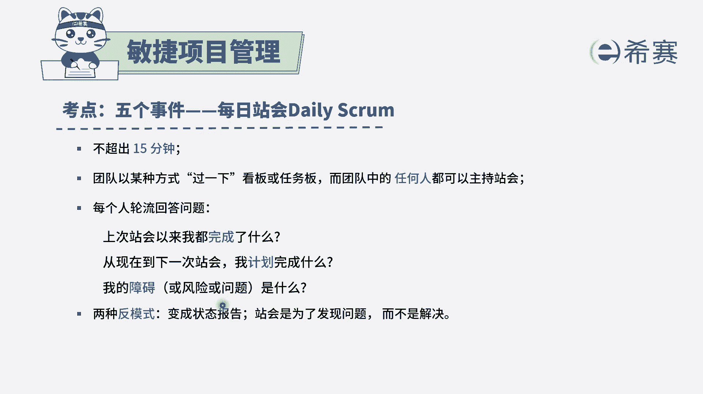
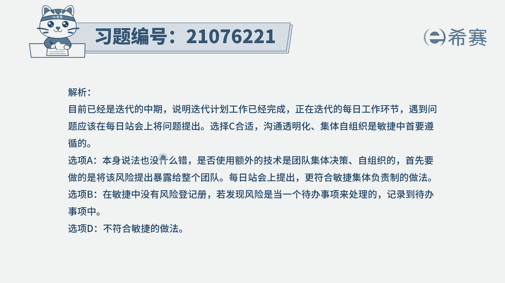

# 24年PMP敏捷-100道零基础付费pmp敏捷模拟题免费观看（答案加解析） - P3：3 - 冬x溪 - BV1Zo4y1G7UP

一个软件项目进行到第五个迭代，中期团队成员已经完成了本次迭代的一个任务，在为下一个任务做准备的时候呢，发现可能需要使用到额外的一项技术，敏捷管理专业人士应该怎么做。

那这里的话我们需要知道一个很重要的信息，如果说你会发现有什么哪些问题，然后当时当当时又不具备的，那我们可以及时去同步，怎么样及时同步呢，有一个很重要的方式，叫daily scrum，我今天要干什么。

那我看看这个事情的过程中，遇到什么困难或挑战，把这个遇到的困难挑战说出来以后，如果别人能够帮助你的话，可能就三言两语就帮助了，如果不行呢，我们后面可以再来去专门看一个专题会议，来讨论会更好一些。

然后来看一下这四个选项，选项a研究，确定使用这项额外技术将会花费的时间，那这里的话题目中只说是发现可能需要，并没有确切，那你就直接去开始研究还不合适，我们先要去确切一下是否真的是需要，对不对。

然后选项并将该发现更新到风险登记册里面来，一般来讲呢呃风险登记册，它是我们未来可能会遇到的，这样一些风险和挑战，那这个不是不可以，但是还没有去面对这个事情去解决，那这种方式呢。

就是在群体中一起来提出这个问题，然后大家有可能会就简单做一个简单讨论，或者是会后以后专门来去做一个简单讨论，都可行，那这种方式是直面问题去应对问题，它比起那种只是把它登记到风险能力线上，要更强一点。

选项d因为没有在计划之内，所以呢应该避免使用额外的技术，这种方式肯定显得太武断了啊，应该是说如果确实是有需要，那就用，如果确实是发现其实不用的话，那就不用，那我们还是要去研究一下。

应该是这个逻辑，他每一天都是干这样一个事情，就说是我都完成了些啥，我接下来要完成啥，我在完成的过程中有什么一些障碍，比方说风险啊，问题呀什么之类的，ok同步这样一些信息以后。

它是一种信息透明的方式，所以这个地方答案呢选第三个会更好一点，但事实上第二个呢我觉得也是可选的，它只是比这个第三个要差一点。

如果没有第三个，你就选第二个。

