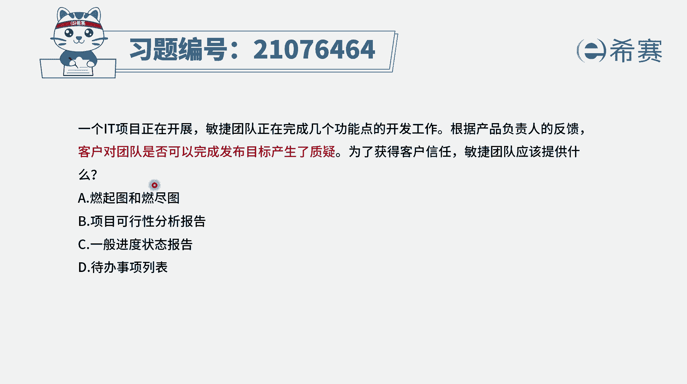
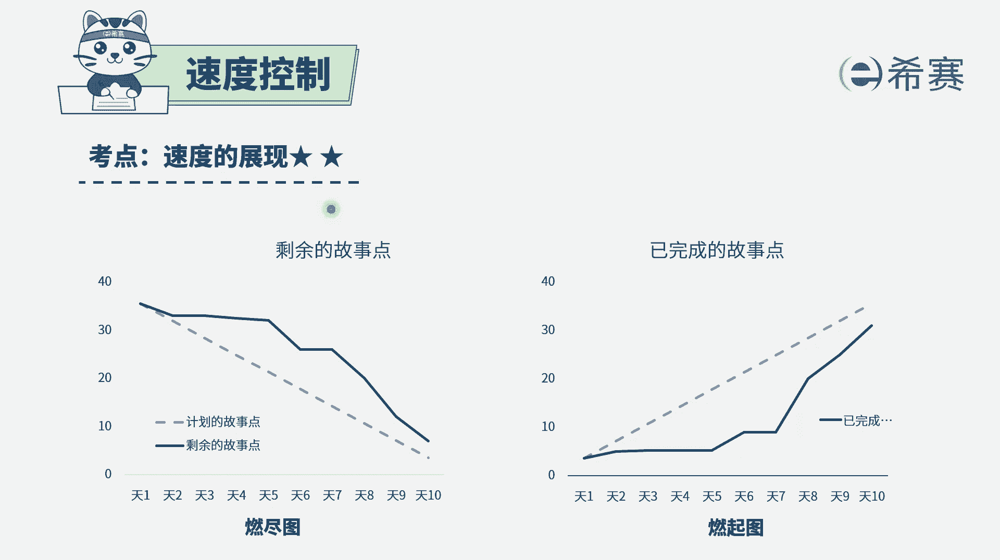
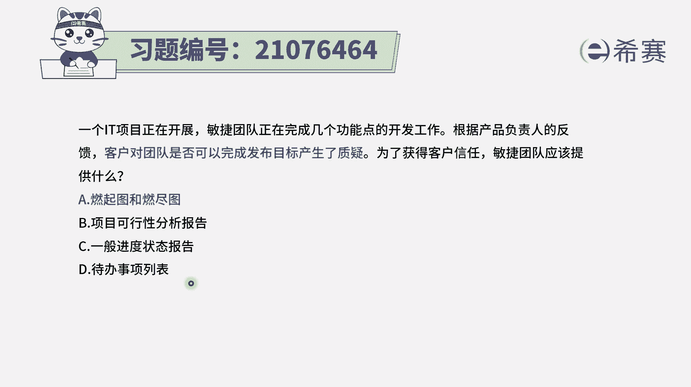
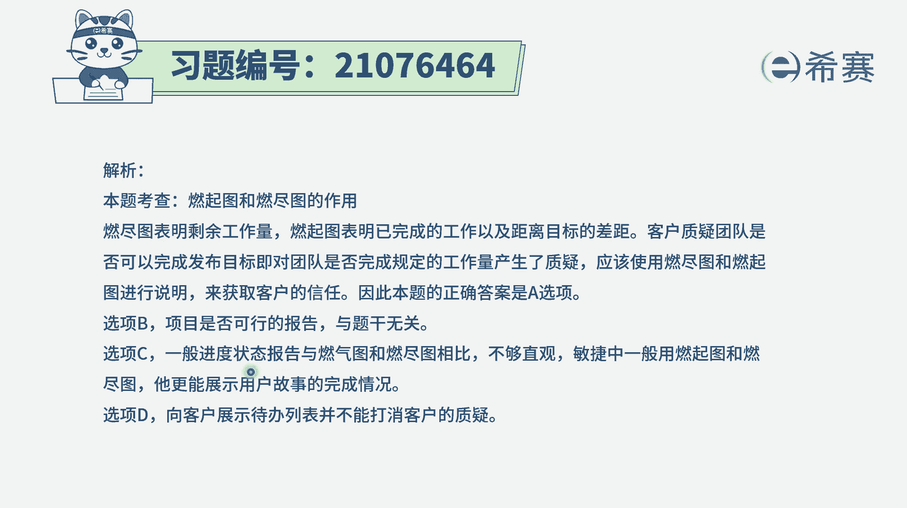

# 24年PMP敏捷-100道零基础付费pmp敏捷模拟题免费观看（答案加解析） - P30：30 - 冬x溪 - BV1Zo4y1G7UP

一个it项目正在开展，敏捷团队正在完成几个功能点的开发工作，根据产品负责人的反馈，客户对团队是否可以完成发布目标产生了质疑，为了获得客户信任，敏捷团队应该提供什么东西，那当客户觉得说。

你可能完成不了我这样一个目标的时候，你可以提供什么东西，你可以你告诉他说我可以完成，这肯定是不够的啊，你可以拿实际数据说话，用我们现在在一个单纯的建议，进展情况来去告诉他，而在敏捷中。

能够直接反映这个进展情况的是什么，那不就是燃尽图燃起图吗。

就燃尽图，燃气图它是我们在做敏捷的过程中，能够直观的看到当前这个迭代，它的一个进展情况的这样一个图示，他用我们这个比方说以燃起图为例啊，燃起图他是说我们在这一轮迭代中，每一天到今天为止。

我已经做完了多少个故事，到今天为止我已经完成了多少用户故事，如果这个燃起图，它的这条线在这个计划线的下面，就表示进度落后，如果它在计划线的上面就表示进度是超前，所以通过这个软体图形式。

能够了解我们在敏捷中的一个进展速度。

进展情况，所以这个题目的答案呢就是选a，至于说第二个选项，可行性分析报告，关于可行性分析报告，这是一个非常在很早前的一个内容，也就是说在这个项目开始之前，我们就要先进行逆向分析，进行商业论证。

得到这样可行性分析，它对于我们具体项目执行的过程中，的这样一个进展速度是没有办法做指导的，学校c一般的进度状态报告，在整个敏捷里面呢是不提倡这样一个东西，敏捷林不提倡这种进度状态报告。

它一般来讲就是用的这个燃镜头，燃起图的方式来去展现他的一个技能情况，而最后一个待办事项列表，那产品待办事项列表backlog呢，它里面只会列出我们要做的事情都有哪些，他没有一个进度的这个标尺。

它只会说是要做东西还剩哪些。

所以这样看来只有a选项是可以选。

