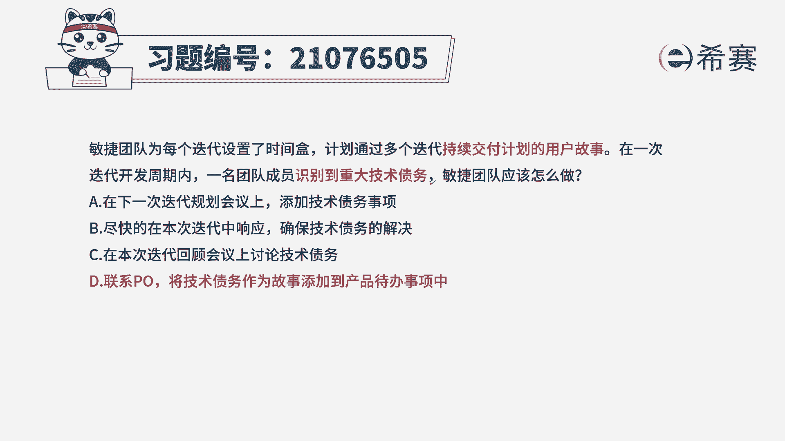
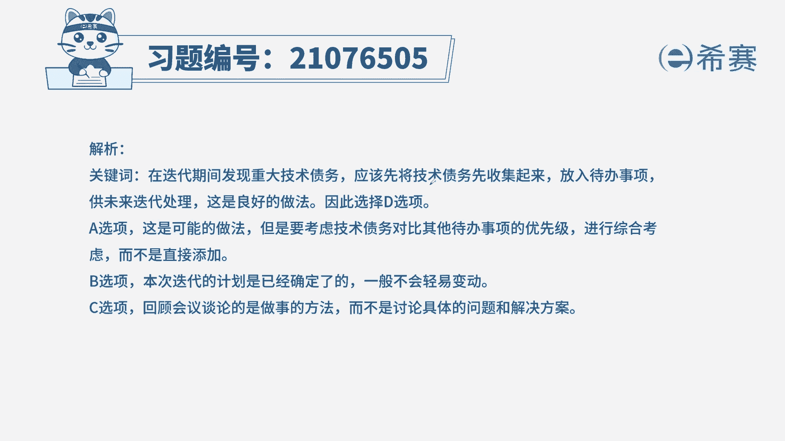
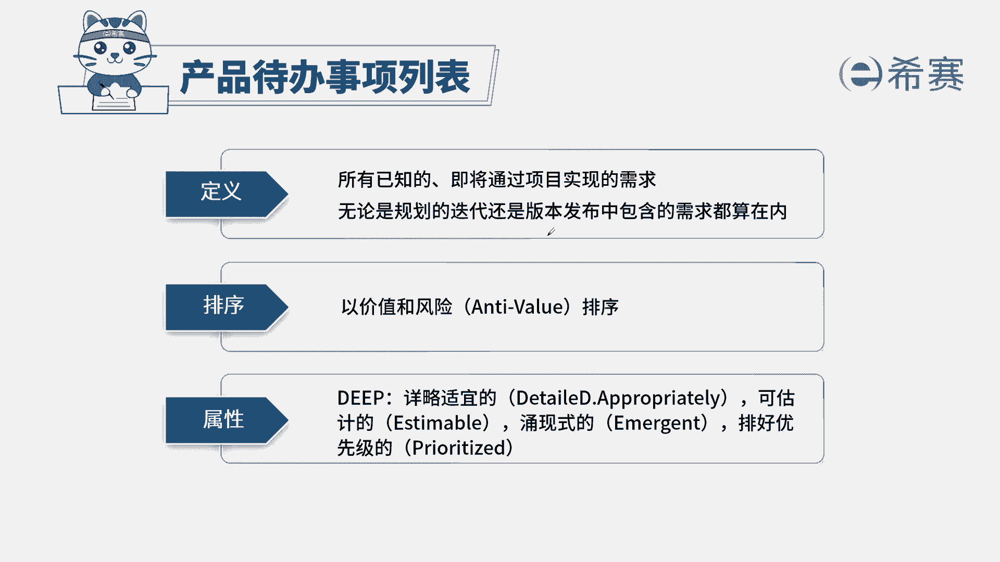

# 24年PMP敏捷-100道零基础付费pmp敏捷模拟题免费观看（答案加解析） - P40：40 - 冬x溪 - BV1Zo4y1G7UP

敏捷团队为每个迭代设置了时间和计划，通过多个迭代持续交付计划的用户故事，在一次迭代开发周期内，一名团队成员识别到重大基础债务，敏捷团队应该怎么做，a在下一次迭代规划会议上添加技术债务事项。

b尽快在本次迭代中响应，确保技术债务的解决，在本次迭代回顾会议上讨论技术债务，d，联系po，将技术债务作为故事添加到产品待办事项中，本题的考法是考概念考内容，首先通过题干找到关键信息，题干告诉我们。

我们在迭代过程中识别到一个重大的技术债务，我来解释一下什么叫技术债务，基础债务是针对于我们软件开发行业，比如说我现在需要一个软件快速上线，因为为了快速获利，那我们就会用一些简单的代码。

或者说过时的代码来进行编制，那这些代码有可能不严谨，会造成未来很多的问题，那这种现象这种问题就叫做技术债务，提前告诉我们有重大基础债务，那这种时候我们应该如何处理呢，我们首先要知道基础债务。

它本身也是一项工作啊，因为我们要把这个债务给解决掉，那至于说这项工作先做还是后做，今天做还是下次，别再做，那我们要根据它的特点了，比方它的价值高不高，它的风险大不大啊，说到这里，我们就应该想到了。

我们要对它进行排序，所以我们选择正确选项为d选项，联系我们的产品负责人，将它作为故事添加到我们的产品待办事项中，我们来看看其他三个选项诶，在下次迭代规划会上添加，首先我们要将基础债务作为工作项。

放到我们的产品待办事项列表中，然后再根据我们优先级的排序确定是否放进去，所以a不选b，本次迭代中响应我们每次迭代的工作内容，是在迭代之前的规划会议中确定的，中途不要随意添加，c本次迭代回顾会议上讨论。

回顾会议是对本次迭代的工作复盘。

不讨论具体的问题。

这是本题的解析，本题的相关知识点，产品待办事项列表，待办事项列表的特点是什么，谁来负责这些内容我们一定要熟知，同时我们要了解迭代，代办事项列表相对应的内容，这么一来。

