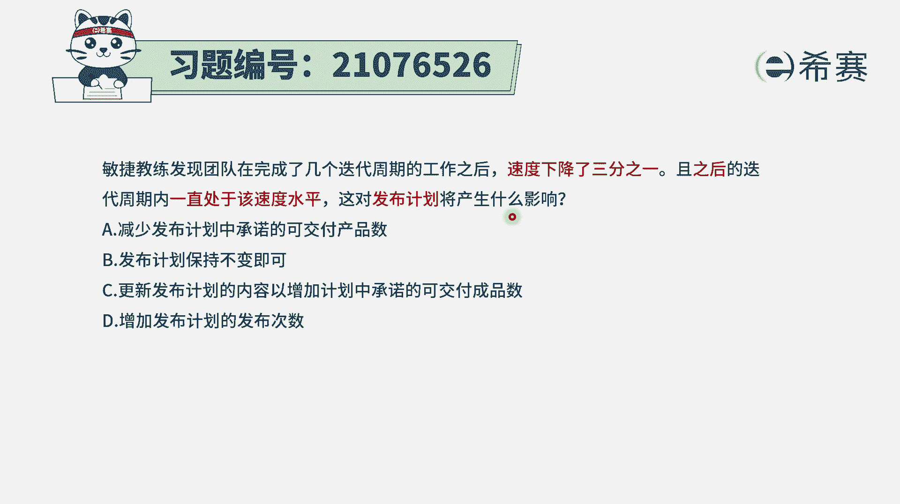
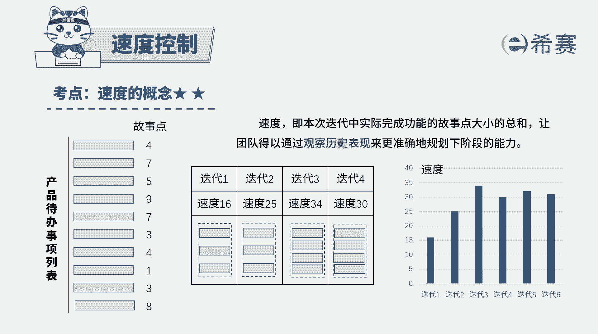
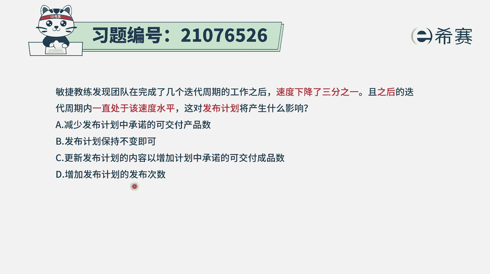
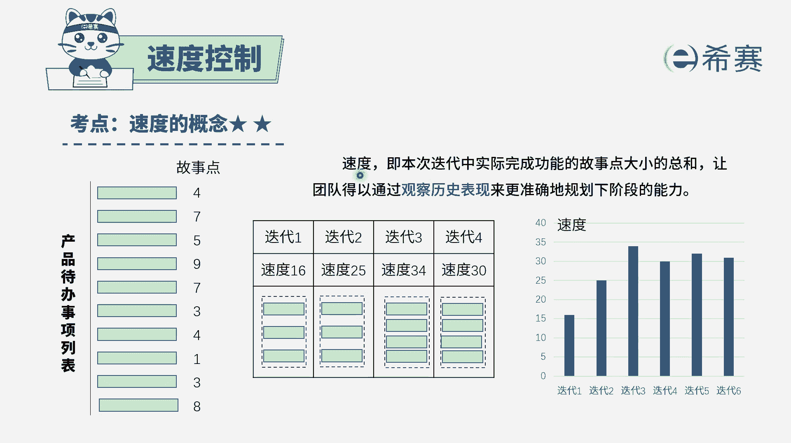
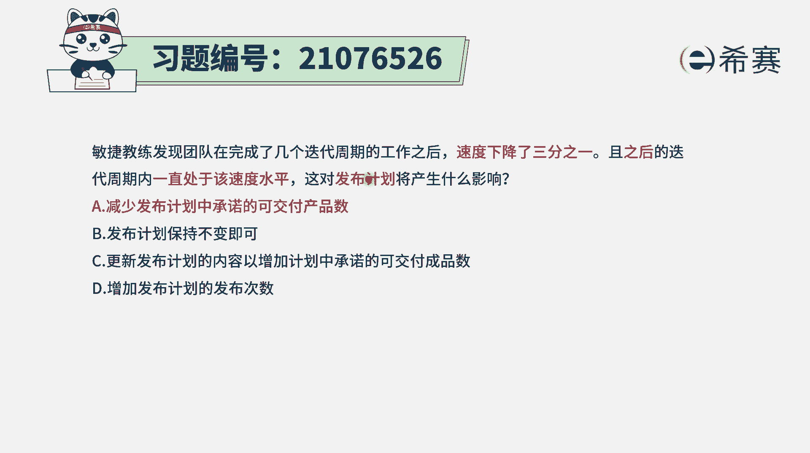
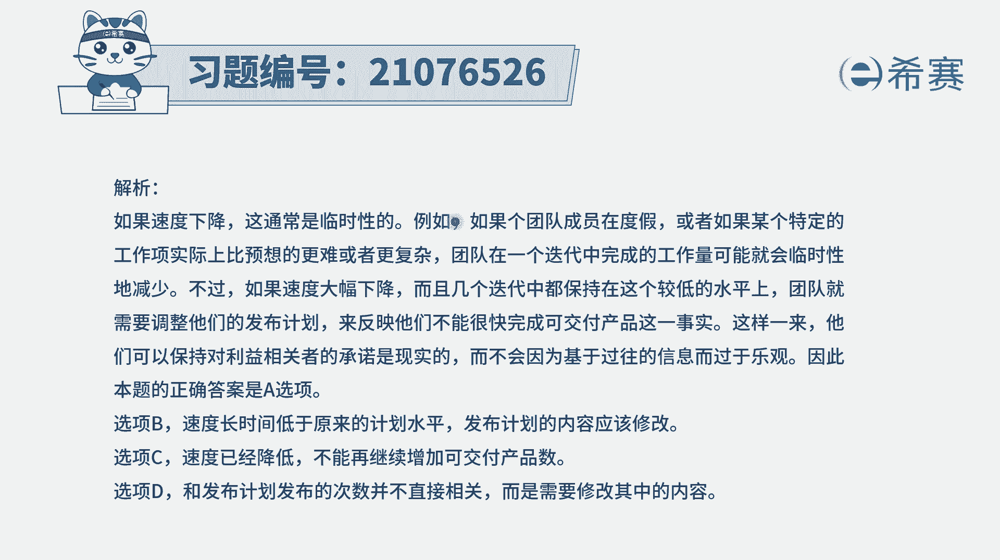

# 24年PMP敏捷-100道零基础付费pmp敏捷模拟题免费观看（答案加解析） - P44：44 - 冬x溪 - BV1Zo4y1G7UP

敏捷教练发现，团队在完成了几个迭代周期的工作之后，速度下降了1/3，且之后的迭代周期内一直是处于该速度水平，而这对于发布计划将产生什么样的影响，呃，首先我们得需要去知道一下。

关于敏捷中的迭代速度这一概念，速度是什么意思呢，就是我们每一个迭代周期中。

大概能够完成多少故事点数，并且呢这样一个速度，一般来讲是通过过往的信息来去预测未来，也就是通过最近正在做的这些像那种迭代，它每一次都完成了多少这样一个故事点数，我们大概能够去推测一下未来这样一个情况。

而从题干里面会给我们一个展示，是单弦的这个速度，发现是比我们预期的下降1/3，并且呢目前一直是这个水平，就基本上是趋于稳定，当这个速度是趋于稳定以后，正常情况下，可能每一个迭代周期能够完成的。

故事点数就是这么多了，这就是代表了团队他的这个能力水平，有了这些信息，我们再来看一下，题目中，问的是说，这种情况对于发布计划会产生什么影响，那到底对于发布计划会产生什么影响呢，先看四个选项。

我们再来说可能会更好一点，您看一下选项，一说是减少发布计划中承诺的可交付产品数，也就是说，我们原计划在这个发布时间之内，要完成多少东西，现在呢我的速度只有2/3，所以呢可能就做不了那么多。

我们就减少一些，好像这个算是一种可行的，我们再看一下其他选项，选项b发布计划呢保持不变，也就是说原来说是多少，现在还是多少，可是提高中已经明确告诉你，它的那个速度是减降低了，然后其实是完不成那么多东西。

只能完成2/3，减少了1/3，所以如果说是发布计划不变的话，应该是完不成，选项c更新发布计划的内容，来增加计划中所承诺的可交付产品数量，请注意，这就是本来按原计划你可能都完不成的，你还要再加更多。

更加完不成啊，选项d增加发布计划的发布次数，那这个题目的话跟那个发布次数没什么关系，它可能主要是跟发布的内容有关系，内容会减少1/3，只剩2/3，所以这样看起来的话，只有a选项是合适的。

就是我们已经明确了项目的这个速度，以后，制造项目，它每一个迭代中能够完成多少故事点数以后，那么如果说明确知道。

速度其实比预期的下降了1/3，那我们就只能是说，减少一些要发布的这样一个产品的数量，或者是减少这些故事点数，减少这些用户故事，这答案是选a。

