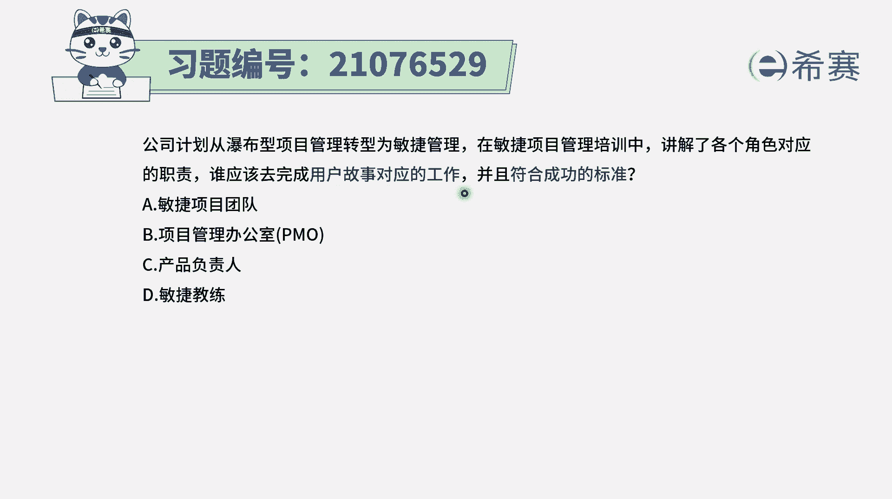
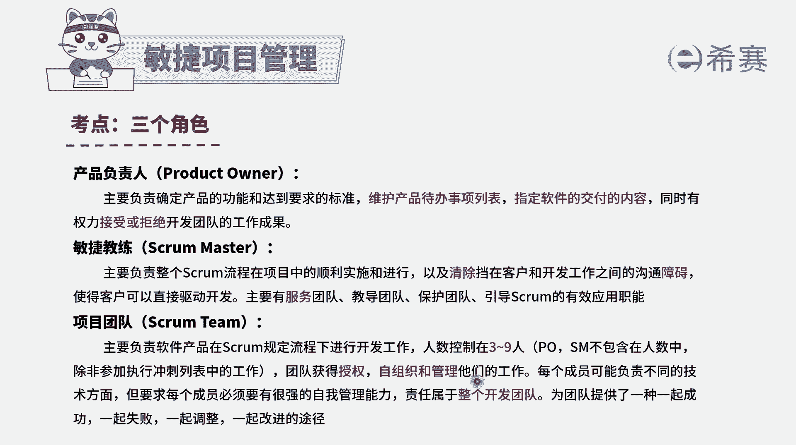
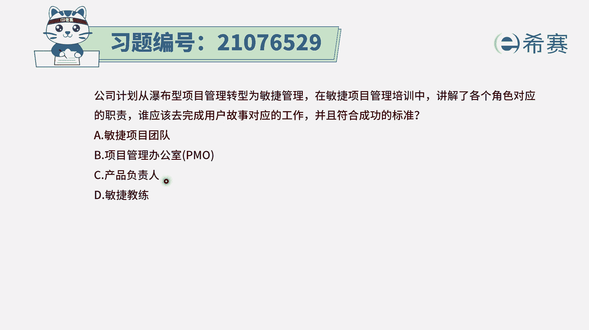
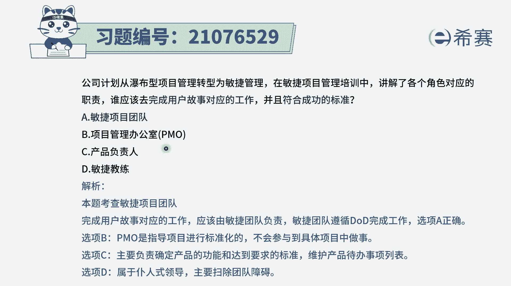

# 24年PMP敏捷-100道零基础付费pmp敏捷模拟题免费观看（答案加解析） - P45：45 - 冬x溪 - BV1Zo4y1G7UP

公司计划从瀑布型项目管理，转型为敏捷项目管理，在敏捷项目管理培训中，讲解各个角色对应的职责，那么问题是，谁应该去完成用户故事对应的工作呢，并且是符合成功的标准，也就是说是谁应该去完成这些用户故事里面。

对应的工作，并且是按照符合成功标准的方式来去完成，那谁去完成，那当然是项目团队成员嘛，对不对，所以这个题目的答案呢，其实没有什么好犹豫的啊，直接是a选项，就是敏捷项目团队，因为是团队去负责去执行。

去完成这样一些事情呃，如果说是问谁去安排大家做呢，其实还是团队团队是自我认领任务。

去完成项目的事情，这个试题它所涉及到的知识点，其实就是自组织团队，就是我们的项目团队，是一个自我组织做管理的团队，那大家是有事情有问题商量着来解决。

然后自我去认领任务，所以谁去完成这些用户故事里面对应的工作，那当然就是项目团队成员，而p m o在整个敏捷度其实比较少，提到这样一个概念，但是我们知道po，它是对于整个公司的这些资源进行协调。

以及比较良好的这种项目管理实践来进行总结，然后收集整理，能够去给大家提供这些资源库的这个单位，而产品负责人，他是对于产品待办事项列表来去负责的人。

而敏捷教练呢是为团队去清除障碍的这个角色，他们各自有各自的这样一个重要任务啊，而敏捷项目团队成员是去完成工作内容。

