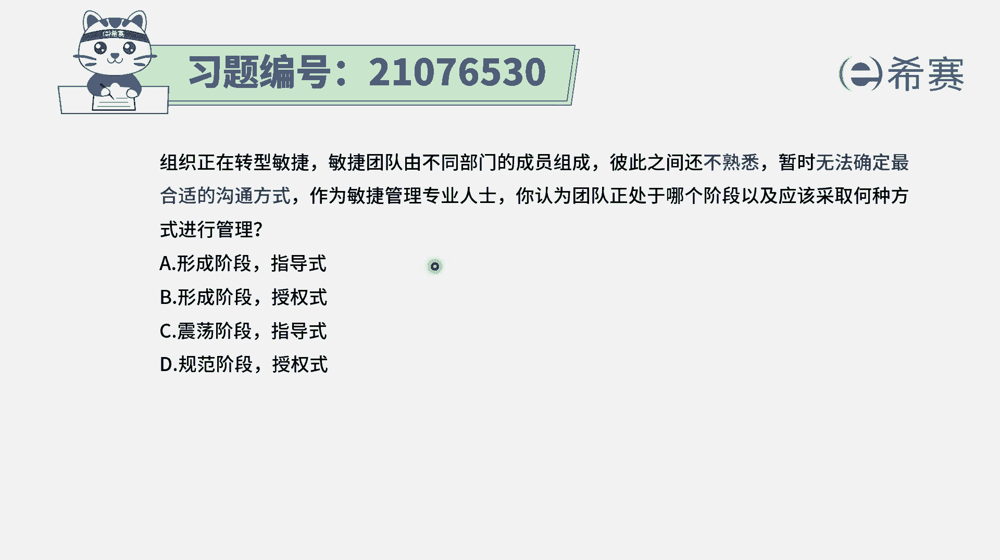
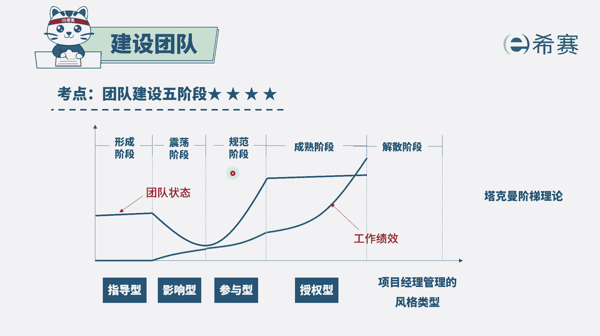
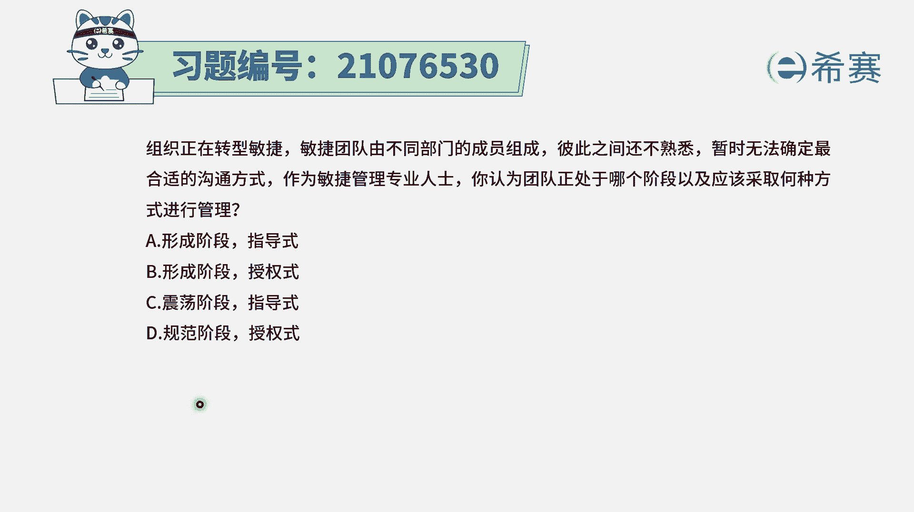
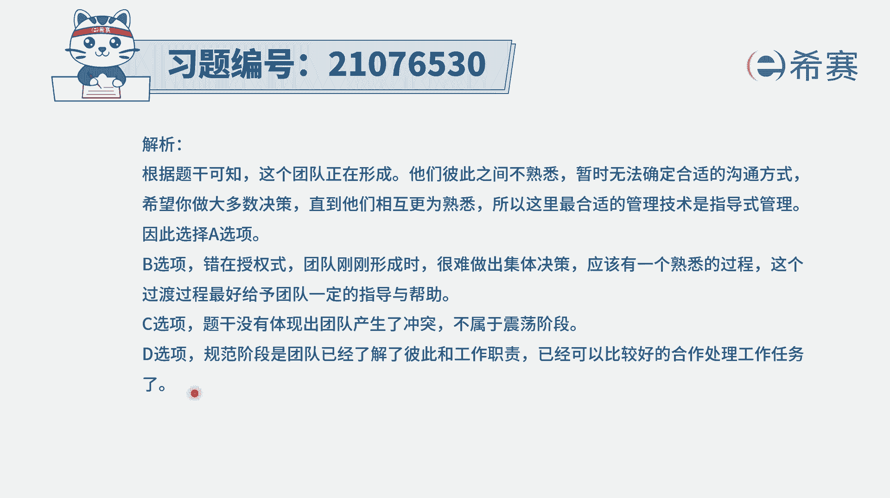
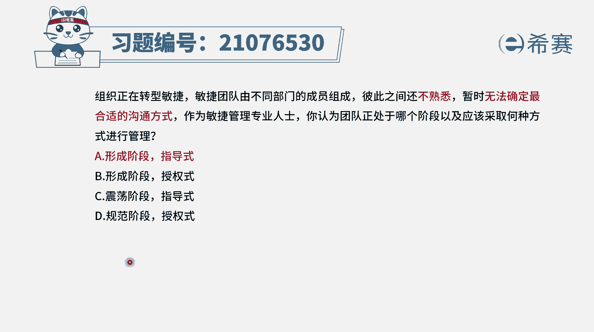

# 24年PMP敏捷-100道零基础付费pmp敏捷模拟题免费观看（答案加解析） - P46：46 - 冬x溪 - BV1Zo4y1G7UP

组织正在转型，敏捷敏捷团队由不同部门的成员组成，彼此之间还不熟悉，暂时无法确定最合适的沟通方式，作为敏捷管理专业人士，你认为团队正处在哪一个阶段，以及应该采取何种方式进行管理。

那这里我们需要去制造一个很重要的信息，它其实就是卡特曼团队的建设，五阶段的这个内容，就是团队。

它一般来讲会历经这样的五个阶段，从形成阶段到震荡阶段，到规范到成熟到解散的阶段，一般在形成阶段呢，这个时候大家还相互不熟悉，不了解，想要去找到各自的定位，这个时候是以指导的这种方式来管理为主。

然后接下来过一段时间以后呢，但相互可能会有一些呃不一样的，这种工作方式也好呀，有一些冲突也好呀，就到了一个叫震荡的阶段，在这样一个震荡阶段的时候呢，我们要想办法去影响团队成员。

让他知道诶正确的方式可能是什么样的方式，来跟团队相处，一起去共同做事情，然后到后面震荡摩擦到一定程度，已经磨合好了，就开始逐渐地去形成这种比较，尝试着相互信任到规范阶段，那么在规范阶段呢。

这个时候呢团队成员他已经能够做一些事情，那领导呢，你可能就是要去参与到他们的一些事情就好，不必要那么那么亲密亲为的去做很多很多，而到了最后面成熟阶段，就是团队已经是相互配合，非常默契了。

已经能够良性运转的高效的运转，这个时候呢，项目经理才可以放心的把团队授权出去，让他们自己来自我管理，当然还有最后一个阶段的是解散阶段，就是当工作完成以后呢，下面就可以解散，或者是当工作提前终止呢。

团队就可以解散好，我们知道了，有这样的五个阶段，也知道了他前面四个阶段所对应的这种项目，管理类型以后。

那其实我们就比较好选了，题目中已经是明确的告诉你，团队现在是什么情况，彼此不熟悉，还暂时无法去确定这样一些合适的沟通方式，那很显然团队目前是处在一个形成的阶段，而在形成阶段的时候呢。

我们肯定是用指导的方式来去管理团队，会比较好一点，而授权是在什么时候，授权，是团队已经是达到一个非常成熟的阶段的时候，我们才能够去授权，所以答案选a，其他几个呢，就是其实这个解释就已经很明确了啊。

那关于其他几个选项呢，其实很明显啊，震荡的阶段就是有冲突，题干都没有展现出冲突，而规范的阶段是开始尝试着去信任，尝试着去调整自己状态，所以答案只有a，就是他目前确确实实就在形成阶段。

而在形成阶段就是用指导的方式来去管理解析。

