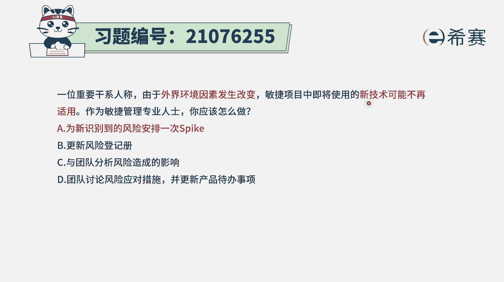

# 24年PMP敏捷-100道零基础付费pmp敏捷模拟题免费观看（答案加解析） - P5：5 - 冬x溪 - BV1Zo4y1G7UP

一位重要干系人称，由于外界环境因素发生改变，敏捷项目中即将使用的新技术可能不再适用，作为敏捷管理专业人士，你应该怎么做，选项a为新识别到的风险安排一次，spark是刺探选项b更新风险登记册。

选项c与团队分析风险造成的影响，学下力团队讨论风险应对措施，并更新产品待办事项，那这里的话呢我们首先要知道一个特殊情况，在敏捷中，它对于风险的这种处理方式，跟传统的项目管理的处理方式是不完全相同。

在预测行中，通常识别风险以后呢，我们都要先更新到风险的预测中，也是b选项这种做法，然后再去识别风险，它可能造成的影响，我们可能会对这样一个风险进行定性的分析，做定量的分析以及去规划风险应对。

但是在敏捷中呢，对于风险通常情况下，但如果说我们能够非常清晰的知道，那就直接是采取相应的这些应对措施就更好，但如果说有一些不确定性，那可以怎么办呢，有一个专门的技术叫刺探，它是用来去应对风险的。

通过刺探的这些工具能够去降低风险，它是怎么降低的呢，市场首先它是一种尝试，是一种技术的尝试，通过这种快速试错的方式，来知道在某一种变化的情况下，来了解现在这些东西的可行性。

那当然这个刺探呢既包括说架构性的刺痛，也包括说基于风险的刺痛，比如说像本题中，它就会是遇到了某个风险，原有的东西不能用，那是否就有可能不能用，到底能用还是不能用呢，我们可能试一试会更好一点，你看呃。

在基于风险的刺探中，有这样一句说，在深入采用这种技术之前，试探的结果能够避免陷入太深，用于去消除项目风险，也就是说当我们做一个大的决定之前，我们先刺探一下，先去尝试测试一下，是这个意思。

那有了这个认识以后呢，我们再来看四个选项，选项a为新识别大的风险，安排一次spark安排一件一次刺痛，那他刚好就是符合敏捷的这种一贯的做法，所以呢答案是选a选项，而选项b刚刚有讲过。

它是一种预测型的项目管理的方式，它不那么再适合敏捷选项，c与团队来分析风险造成的影响呃，要不要分析，其实也是要分析的，只是说在敏捷中，这个敏捷它并不是快，它是灵活应对这种突发的情况的时候呢，灵活去应对。

怎么样去应对呢，最好的方式就是我们去试一试这种事的方式的，结果，比我们这种单纯的分析会要来得更直接一点，也就是说有点像这种意思，传统的方式来去做项目，更多的是先去做规划，然后去思考。

然后才有后续的一些事情，而敏捷的是直接上手，更多的是倾向于去上手去做尝试选项，d团队讨论风险的应对措施，这个也是一种传统的方式来去做事情，所以当在项目中遇到这样一些风险挑战的时候。

遇到一些比方说像本题设置的是啊，这种原有的技术呢已经是不可以再试用，就有可能不能再试用，那我们就要去试探一下，看你可以用什么东西，所以答案是选a选项。

