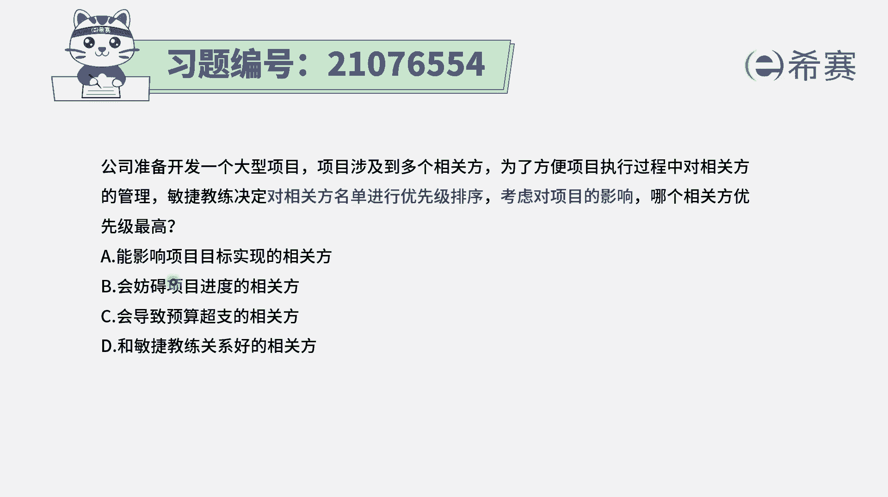
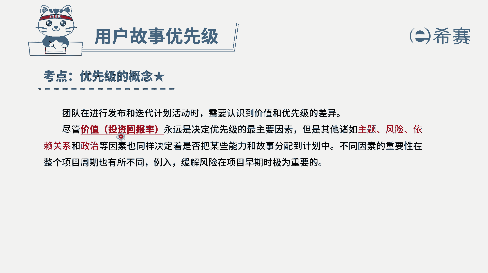
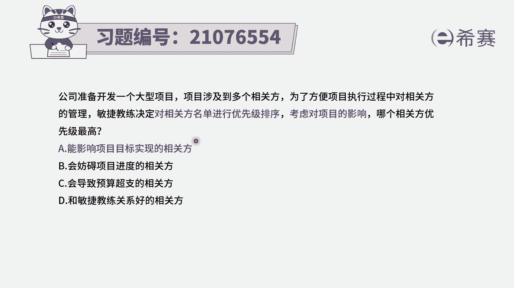
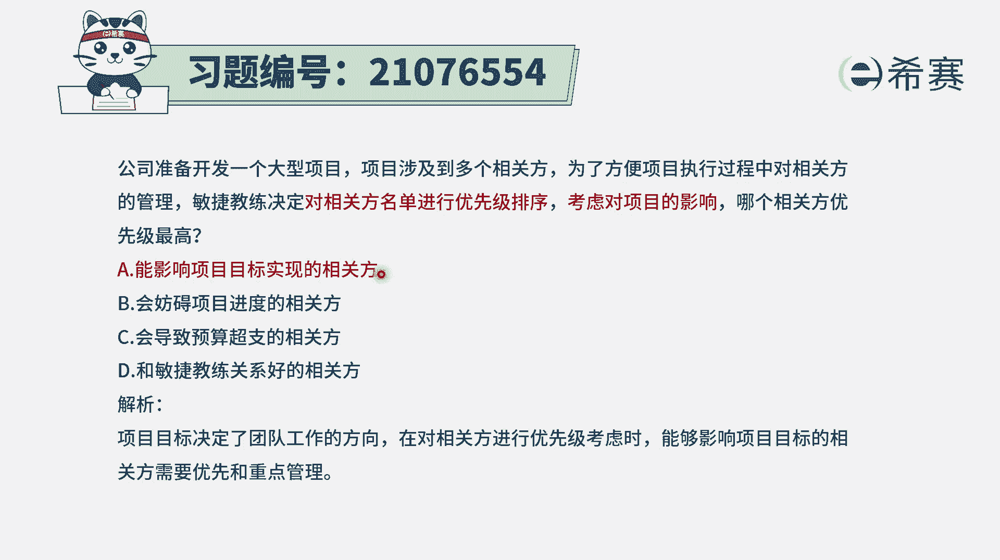

# 24年PMP敏捷-100道零基础付费pmp敏捷模拟题免费观看（答案加解析） - P52：52 - 冬x溪 - BV1Zo4y1G7UP

公司准备开发一个大型项目，项目涉及到多个相关方，为了方便项目执行过程中对相关方的管理，敏捷教练决定对相关方名单进行优先级排序，那考虑对项目的影响，每个相关方优先级应该是最高的哇。

这个题目其实是很不好选的啊，因为大家都很重要，四个选项里面都很重要，但是我们还是来看一下，既然是要对相关方的这样一个名单来进行排序，那我们看一下选项a，说是能够影响项目目标实现的相关方。

如果这个项目目标都不能实现的话，那一切都是白搭，对不对，所以这肯定是重要的啊，项目的目标的实现，它才能够影响我们整个项目的进展的方向啊，然后努力的方向啊，所以他肯定是很重要的。

选项b会妨碍项目进度的相关范围，它只是在进度上面有可能会有一点延误，但是比起目标实现这个事情来讲的话，电进度延误最后能够达成目标也是可行的，所以这个的影响力没有那么大，选项c能够导致预算超支。

那预算稍微超一点点也没关系，只要能上能办成选项d和敏捷教练关系好的，你都和敏捷教练关系好的，这些人的话，那他其实应该会更加支持这个项目，对不对，所以这里更关注的重点，应该是去。

对于这种能够影响这个项目目标实现的。

这些相关方，才是我最重要的相关方，那我们需要去了解一下，其实关于优先级排序这个事情啊，整个在敏捷中，它其实会提倡的是什么呢，是价值驱动交付，也就是按照价值来进行排序，虽然说其他很多信息都很重要。

但是第一重要的就是价值，如果说会阻碍这个项目能够去提供价值的，那它都是重要的。

而只有a选项，它是最为直接的，你想项目目标的实现，这就是交付价值的这一个很直接的展现了对吧，所以答案是a选项。

