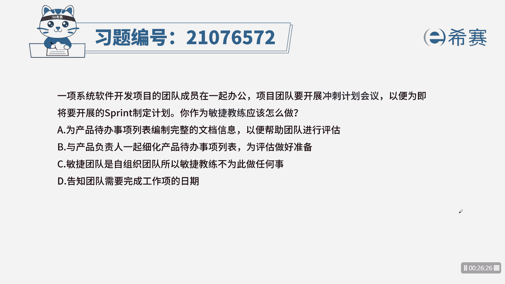

# 24年PMP敏捷-100道零基础付费pmp敏捷模拟题免费观看（答案加解析） - P56：56 - 冬x溪 - BV1Zo4y1G7UP

已向系统软件开发项目的团队成员在一起办公，项目团队要开展冲刺计划会议，以便为即将开展的spring制定计划，你作为敏捷教练应该做什么，为产品待办事项列表编制完整的文档信息，以便帮助团队进行评估。

b与产品负责人一起细化产品待办事项列表，为评估做好准备，c敏捷团队是自组织团队，所以敏捷教练不为此做任何事情，第告知团队需要完成工作项目日期，本题的考法是最佳实践，首先通过题干找到关键信息。

我们的团队要开冲刺计划会议，那我们要知道冲刺计划会议要做哪些事情，谁参加以及何时召开，接着你的定位是敏捷教练，也就是说我们要开冲刺计划会议，要为本次迭代做好规划工作，好我们来看四个选项诶。

为产品代办事项列表编制完整的文档，我们的敏捷教练是帮助团队践行敏捷原则，以及排除组织障碍，具体的工作是由团队自己完成，所以a不选b，与产品负责人一起细化产品代办时尚列表，为评估做好准备好b项。

我们敏捷药也是作为一个辅助的角色，比如说我们在开会之前有一些问题，那我们的敏捷教练是有义务去帮助他们，把这些障碍去排除掉，从而推进项目进行下去，所以b的表述没有问题，好我们来看c敏捷团队是自组织团队。

所以敏捷教练不会只做任何事情，我们敏捷教练一定要是帮助团队，排除组织障碍的啊，所以并不代表说他什么都不做，还是要做的，d告知团队需要完成工作项目的日期，针对于工作上的日期，是由我们团队自己组织。

自己确定自己执行的，而不是由我们的敏捷教练告知，所以我们选出最佳答案b选项。

这是本题的解析，大家可以暂停看一下本题的相关知识点，冲刺计划会议，针对这个知识点，我们要从内容上下手，要明确知道这个会议要做哪些事情，谁参加，何时召开，我们还要了解其他三个会议的内容，如迭代评审会议。

迭代回顾会议，这四个会议的内容我们全部熟悉之后。

针对此类型的题目。