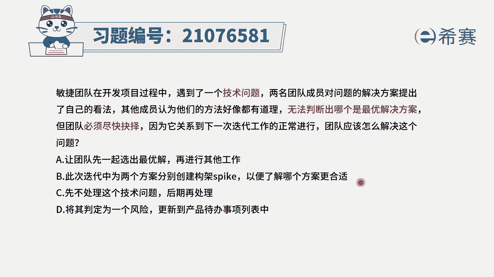
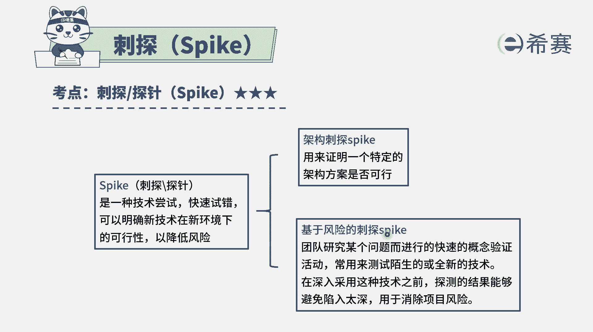
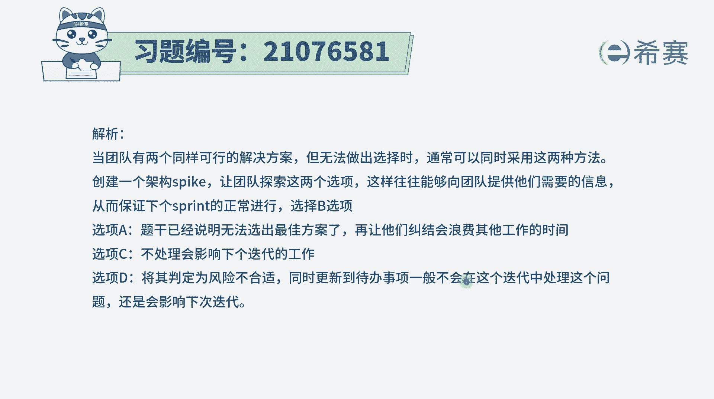
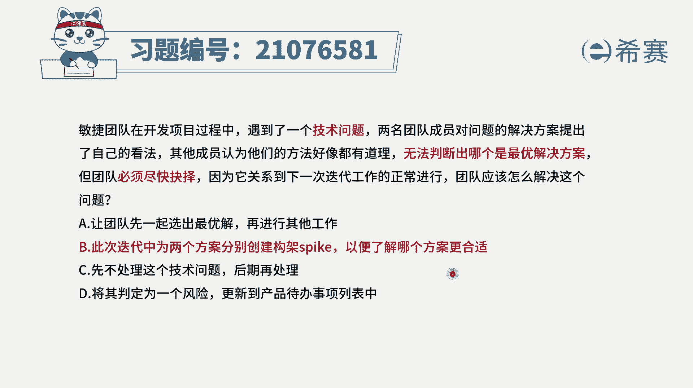

# 24年PMP敏捷-100道零基础付费pmp敏捷模拟题免费观看（答案加解析） - P58：58 - 冬x溪 - BV1Zo4y1G7UP

敏捷团队在开发项目过程中，遇到了一个技术问题，两名团的成员对问题的解决方案，提出了自己的看法，其他成员认为他们的方法好像都有道理，无法判断哪一个是最优解决方案，但是团队必须要尽快做出抉择。

因为它关系到下一次迭代工作的正常开展，那团队应该怎么样去解决这个问题呢，那这里面其实告诉我们说是两种方案，其实都有可能会是可选的，但是不知道要选哪一个都在纠结，那么这种情况下，我们来看一下四个选项。

选项a说让团队先选出优先解，然后再进行工作，可是题干中已经告诉我们，大家觉得说好像两种方法都是有道理的，无法给出最优解，所以继续选的话，继续在纠结，也没有办法直接去推进这个事情，所以它其实是有难度的。

选项b此次迭代中的两个方案，分别来构建一个架构，spike就是构建这样一个架构的刺探，以便了解哪一个方案更合适，那这就是一种可行的方案，也就是说既然两种方案都可选，那我们就试一试，看哪一种是更优的吧。

我每一种都试一试，ok选项c先不处理这个问题，然后后期再处理，这就是一种回避的方式，那你回避最后还是要去解决的，而整个在敏捷中也好，整个在pmi的这一套体系中也好，其实都提倡的是遇到问题我们要去引导。

而是要去解决问题，要积极主动去解决问题，它不符合整个那个pm的价值观选项，d将其判定为一个风险，更新到产品待办事项列表中来啊，在敏捷里面呢其实是能动手去解决它，能够动手去处理它，我们就要去处理它。

而不是要去放在这个文档中的这种方式，他完全是不符合敏捷的这一套思路，所以这样看起来只有第二个选项是合适，说给两种方案都来分别创建架构，spark看了一个更合适。

那到底spk刺探是什么意思呢，我们来看一下啊，刺探他是说一种技术尝试，通过快速试错的这样一个思路来去做，来了解某种新技术在新环境下是否可行，那不管说是用这种架构刺探也好，还是风险次贷也好。

都是在做尝试架构资产，就是说我们来去尝试一下，看哪一种架构的方案是更加可行。

所以答案是选b选项啊，解析在这边需要的同学可以自行查看他的思路。

就是当两种方案都非常好的时候，都觉得有可能的时候，那我们就去都试一试。

