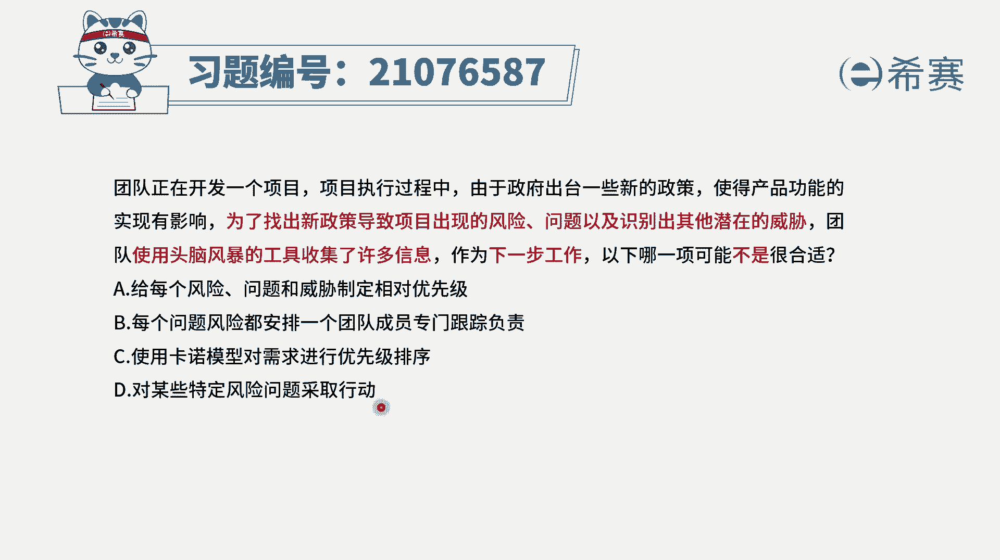
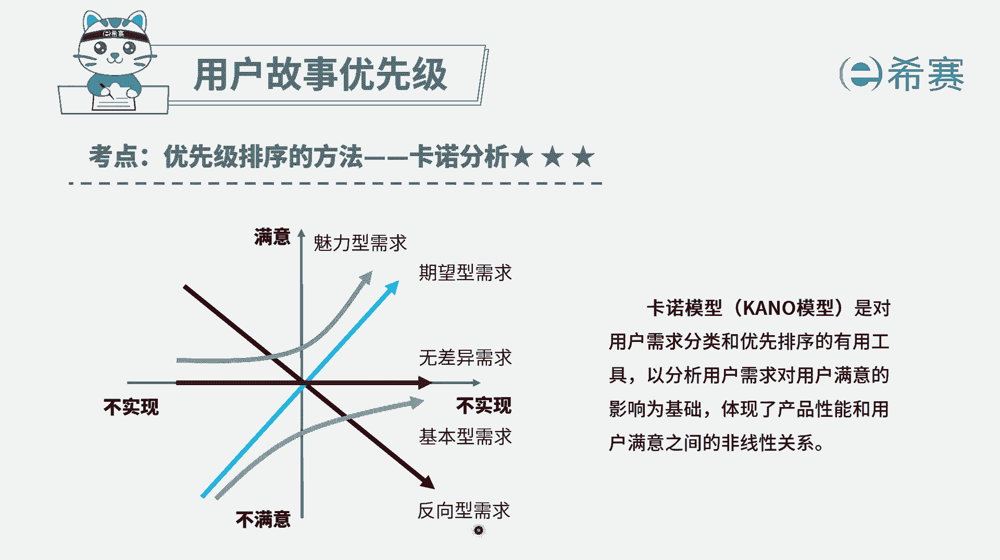
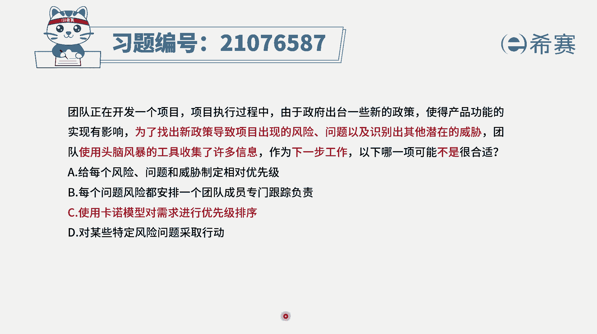

# 24年PMP敏捷-100道零基础付费pmp敏捷模拟题免费观看（答案加解析） - P62：62 - 冬x溪 - BV1Zo4y1G7UP

团队正在开发一个项目，项目执行过程中，由于政府出台一些新的政策，使得产品功能的实现有影响，为了找出新政策导致项目出现的风险问题，以及识别出其他的潜在的威胁，团队使用头脑风暴的工具，收集了许多的信息。

作为下一步工作，下列哪一项可能不是很合适，请注意他说的不是很合适，而题干中给到的信息是，因为新政策导致有很多风险问题，以及其他企业的威胁，而这都是关于识别到的风险，而对于识别到的风险。

我们应对的方式是什么呢，四个选项来看一下选项a，给每一个风险问题威胁，来制定相对的优先级排序，这就是我们的那个叫定性风险分析要干的事情，这完全是可行的，选项b，每一个问题风险都安排一个团队成员。

专门跟踪负责，这也是可行的，其实我们对于很多风险，我们如果说有专门的风险责任人的话呢，就有人去盯，如果没有安排风险，真人有可能这个风险就没有人去专门盯他，选项c使用卡洛模型来对需求进行优先级排序。

请注意，一般来讲，卡罗模型它本身也是对于需求，或者用户故事来进行优先级排序，而本题中明确给的是关于这样一些风险的应对，所以这个是完全不相关，答案就是选它了啊，题目中说的是哪项，是不是很合适。

选项d对某一些特定的风险问题采取行动，这是可行的，就有一些风险它是会有一些呃叫触发的因素，那如果说我们提前知道了以后呢，我们可以对这些触发因素来去采取措施，或者整个对这个风险来去提前做一些。

预防性的东西是可行的，所以这些题目的答案就是选c叫卡洛模型，这种卡洛模型对需要分析，它跟这个题干没有什么关系。

它不是一个合适的选项，关于卡洛模型，它是会把需求分到这样的五大类，魅力型需求，期望型需求，无差异需求，基本需求以及反向需求，那我们会重点去关注，是基本需求以及那个期望需求，然后如果还有力量的话。

就再做一些魅力型的需求，至于无差异需求，最好是不要做浪费时间，而反信息却是绝对不要做，就是越做越让人反感，这是所以它是对于需求分析的工具，跟题干中我们所谓的这样一个对风险来去响。

应，该去处理，完全没有关系，所以答案是选c，那解析在后面。

