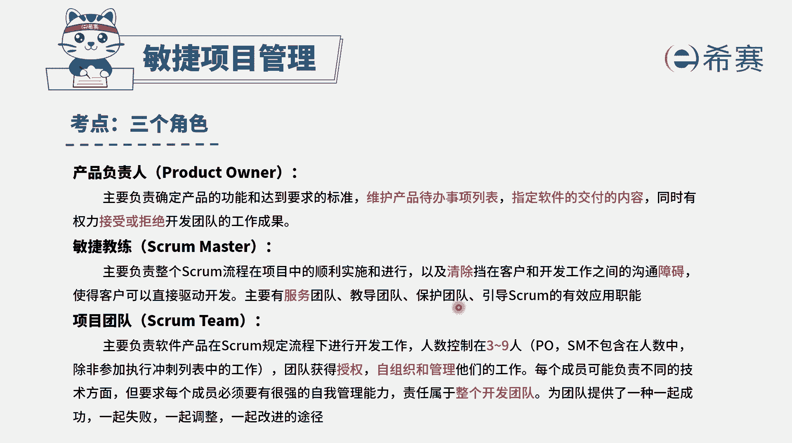
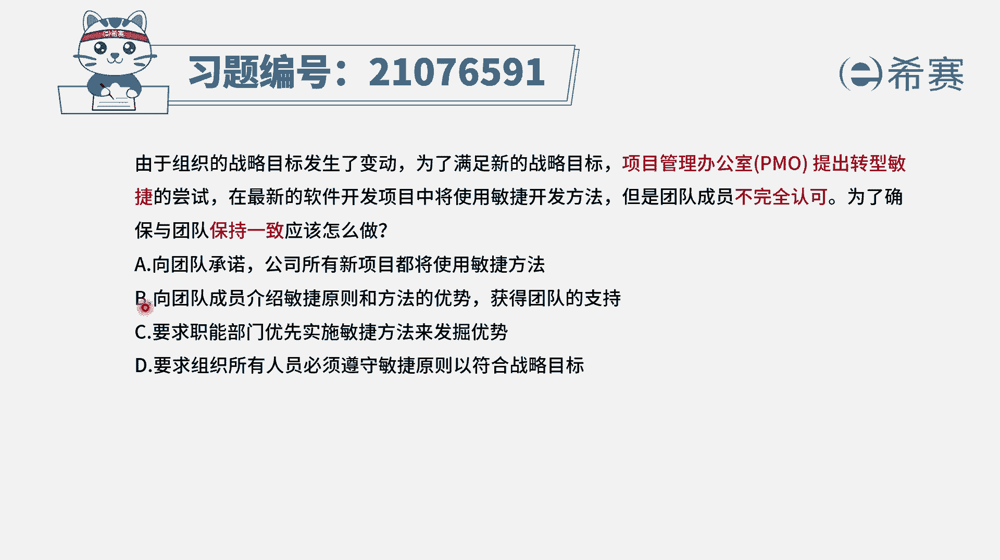
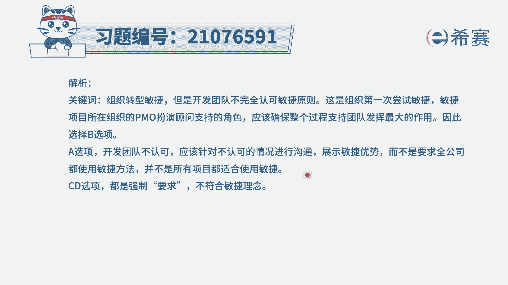
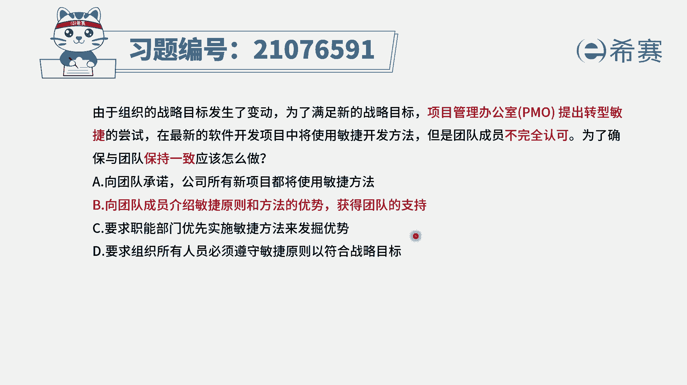

# 24年PMP敏捷-100道零基础付费pmp敏捷模拟题免费观看（答案加解析） - P64：64 - 冬x溪 - BV1Zo4y1G7UP

由于组织的战略目标发生了变化，为了满足新的战略目标，项目管理办公室提出转型敏捷的尝试，在最新的软件开发项目中将使用敏捷开发方法，但是团队成员不完全认可，为了确保与团队保持一致，应该怎么做，那这个题目呢。

它其实用的这个角色叫项目管理办公室，但他要做的事情你会发现跟谁很相似，他其实跟敏捷教练是很相似的，就是要去推行这一套敏捷敏捷的方式，但是团队还不支持，不认可，那怎么办呢。

我们应该要想办法让团队去支持和认可，有了这样一个思路以后，我们再来看选项a向团队承诺，公司所有新项目都将使用敏捷的方法，这个方法不对吧，虽然说我们有可能会往敏捷的方向去转，但是并不是代表所有的项目。

它都是这种，其实也只有软件类的项目，软件开发中变更特别频繁的项目，才适合于敏捷的方法，所以这种表达方式其实是还是有失偏颇的啊，选项b向团队成员介绍敏捷原则和方法的优势，获得团队知识。

这句话一看就是对的啊，一看就是对的，他没有任何的毛病，事实上很多时候我们之所以不认可，是因为对他不够了解，当我们对他有更多的了解的时候，也就会认可起来，选项c要求职能部门优先实施敏捷方法，来发掘优势。

那这种要求职能部门就是这种强压的方式，和引导它的方式是不一样的，就整个我们刚才有讲过，在这个题目中给的是叫项目管理办公室，当其实这里面的话。

他会充当的是这个敏捷教练角色，那敏捷教练这个角色，他应该更多的是去帮助团队，去服务团队，教导团队，而不是这种强制的方式。

最后一个选项要求，所有的人员都必须遵循敏捷原则，以符合战略目标，这个跟c选项其实还是一回事，就是这种方非常强制的方式，所以答案其实只有一个选项是可选的，就是b选项，向团队成员介绍敏捷原则和方法的优势。

来获得团队支持，那解析呢在这边需要的同学可以自行查看一下，我们在这道题中其实做了一个事情，就是把po这个角色我们替换成敏捷教练，因为本身他的意图就这么一个意图，他的意图就是想办法让团队成员来去支持。

这个敏捷的方式，而大家是不认可。

