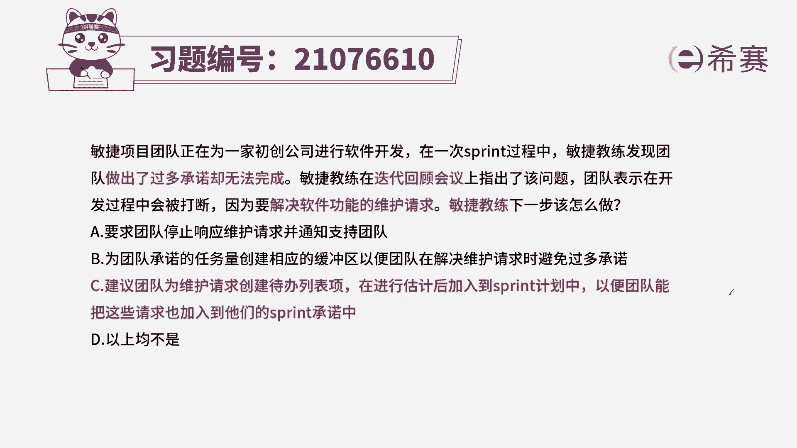
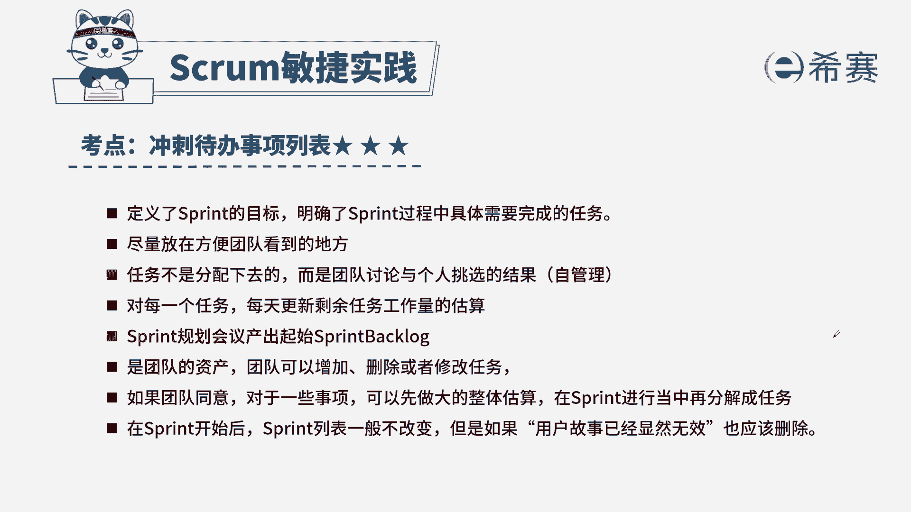

# 24年PMP敏捷-100道零基础付费pmp敏捷模拟题免费观看（答案加解析） - P69：69 - 冬x溪 - BV1Zo4y1G7UP

敏捷项目团队正在为一家初创公司，进行软件开发，在一次spring的过程中，敏捷教练发现团队做出了过多的承诺，却无法完成，敏捷教练在迭代回顾会上指出，该问题，团队表示在开发过程中会被打断。

因为要解决软件功能的维护请求，敏捷教练下一步该怎么做，a要求团队停止响应维护请求，并通知支持团队，b为团队承诺的任务量创建相应的缓冲区，以便团队在解决维护请求时避免过多的承诺。

c建议团队为维护请求创建待办事项，在进行估算后加入到sprint计划中，以便团队能把这些请求，也加入到他们的spring承诺中，d以上均不是本题考法最佳实践，首先通过题干找到关键信息。

题干告诉我们有一个维护请求，也就是有一个相关方的需求啊，让我们的团队的速度有所下降，没有完成之前的承诺，这是在我们的迭代会议上，迭代会议首先是进行我们团队的工作，总结复盘，哪些地方做得好。

哪些地方做得不好，唉这是一个相关的知识点，那问题问的是我们敏捷教练下一步该做什么，既然有下一步这个词，那就代表着我们的选项里面会出现顺序，谁先谁后好，我们来看一下，a要求团队停止响应我们的维护需求。

它也是一个相关方的需求啊，我们不能忽略相关方的需求啊，所以a的表述是不正确的，b为团队承诺的工作量建立缓冲区，来避免过多的承诺，建立缓冲区，也没有办法从根本上解决这个问题，因为你的缓冲区不可能无限长。

所以b表述不妥，c让团队去创建一个待办列表，把我们的相关方的需求作为一个工作项，放入到我们的列表中，唉这样的操作是吻合我们敏捷项目的，因为我们敏捷项目的待办列表里面，就将所有的工作进行排序。

那根据价值和风险的排序来确定一下哪些先做，哪些后座，而从这样的方式里面，我们就能很好地解决题干中给出了这种问题，所以我们选择正确选项是c选项。

这是本题的解析，大家可以暂停看一下相关知识点，冲刺待办事项列表，针对这个知识点，我们一定要知道这个表是在哪个阶段创建的，由谁来负责创建，那列表它的特点是什么，同时我们要熟悉产品待办事项列表。

它对应的内容是哪些，那这样针对此类型的题目。

