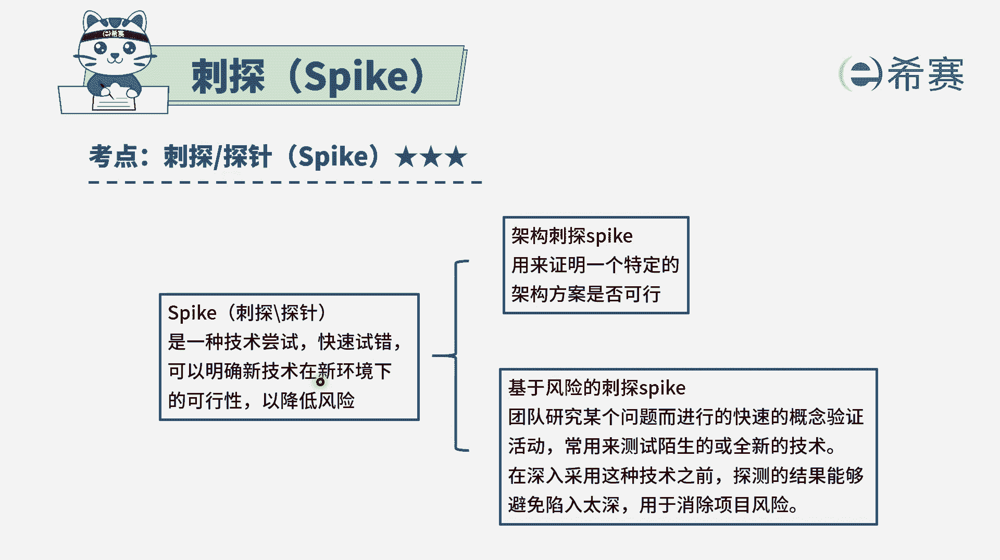
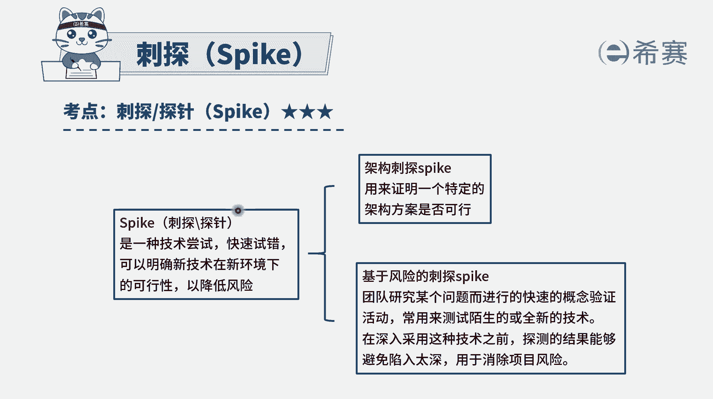

# 24年PMP敏捷-100道零基础付费pmp敏捷模拟题免费观看（答案加解析） - P71：71 - 冬x溪 - BV1Zo4y1G7UP

为了尽快占领市场领域，组织管理层要求，每日团队开发一个创新型软件程序，并希望制定一个详细计划，提供给关键相关方，作为敏捷管理专业人士，首先应该怎么做，那首先应该怎么做呢，我们先把四个选项都看完啊。

学相当于说是创建一个项目章程，来确定大致的目标和里程碑取向，壁是建议敏捷团队进行一次刺探，来确定项目的可行性选项，c是按照管理层的要求，来制定一个非常详细的计划，而选项d是对于该程序可能包含的这些功能。

来进行估算，那我们需要去知道一下，其实呃，管理层他想要这样一个敏捷团队，来去做一个新的事情，而这个新的事情如果说已经有项目章程以后，接下来就是直接去做，如果说还没有项目章程的话。

那就是我们可能需要去做这个项目章程，但是项目章程一定是会是基于一个可行性分析，才来做的，道理可行不可行，我们可能是需要去做这一个呃，逆向分析或是可行性分析，怎么做呢，刚好有一个工具叫刺探。

他能够去帮助我们来去确定一下能否可行，也就是说在a和b这两个选项中创建项目章程，它不是作为民间管理专业人士要去做的事情，敏捷管理专业人士，他其实类比到这个预测型项目中的一个，项目经理的角色。

那项目经理是被授权被任命的，而这个项目战神是谁来去监理的，所以不应该是由这个项目经理来去做这个事情，而事实上呢，如果说是没有项目章程要去做这个东西的话，我们前提是先要去确定一下能否可行。

而b选项刚好是在能否可行，这个事情上做了一次努力，说建议团队进行一次刺探，来确定项目的可行性。

刺探是什么意思呢，试探它是指做一种新的技术尝试来快速试错，充分了解这种新的东西是否可行，而题干中告诉我们说。

要去开发一个创新型的软件程序，那建一个创新型的软件程序，它们可能就包含了一些新的东西，我们是否能够做到呢，我们可以去刺探一下，所以这是一个可选项，答案选b，至于说c选项。

按照管理层的要求去制定一个详细的计划，它是不符合敏捷啊，敏捷里面还是不提倡这种详细的计划，他更要的是可用的软件，可以运行的软件，有价值软件胜过了这些详细的计划，并且本身在做敏捷的过程中。

它就会产生大量的变更，会是拥抱变化的这种方式，所以你的计划再怎么做，其实后面还是要去做很多调整的，所以只能是大致的做一个计划就够了啊，选项d对该程序可能包含的功能来进行估算，一般来。

这都是已经到了后面具体去落实的时候了，并且估算的时候呢，也不是一次就能够全部都估算完，一开始的时候，对于整个这些产品的发布的计划中的估算，是大致的估算，后面在每一轮迭代中才会去做更加细致的估算。

就是这一轮迭代里面要完成哪一些用户故事，会做一个更加细致的估算，所以这个题目呢它根本不是。

我们在先做一个试探来试一试，看能不能够搞定这件事情。

这个项目能不能做啊，能做了以后呢，我们可能再去请领导来去。

我们来去签发这样一个项目章程，我们才有后续的这件事情的发生解析。

