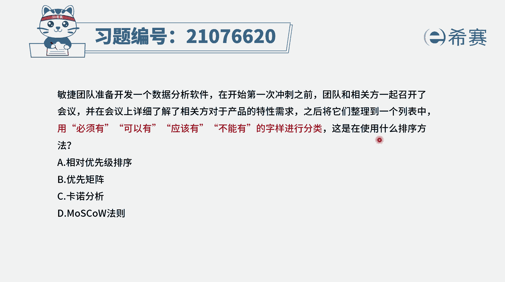
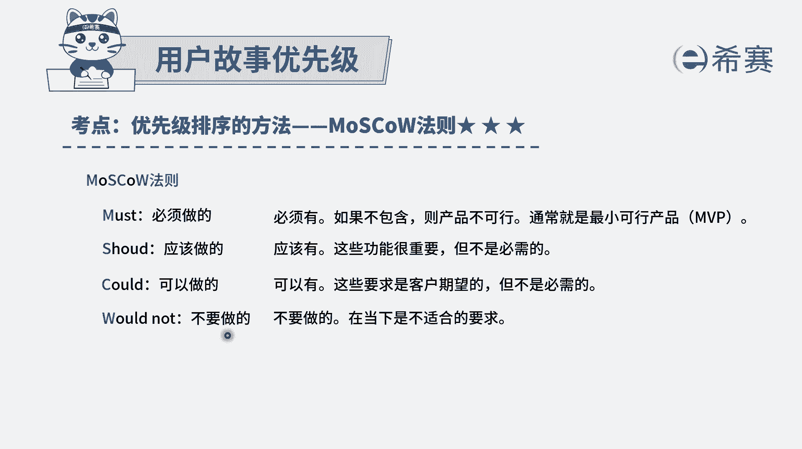

# 24年PMP敏捷-100道零基础付费pmp敏捷模拟题免费观看（答案加解析） - P73：73 - 冬x溪 - BV1Zo4y1G7UP

敏捷团队准备开发一个数据分析软件，在开始第一次充值之前，团队和相关方一起召开了会议，并在会议上详细地了解了相关方，对于产品的特性需求之后，将它们整理成一个列表中，用必须有可以有。

应该有不能有的这些字样来进行分类，这是要干什么呢，这些是直接是告诉你这个啊，相当于是一个呃定义它的那个解释。

解释是这个定义呢就是叫莫斯科法，莫斯科法，它就是对优先级进行排序的一种方式，关于这些用户故事会把它分到必须有must呃，应该有should，然后可以有could和不能有wen。

所以这就是一个叫优先级排序的方法，所以答案就是选最后一个了，至于选项c卡洛分析，那卡洛分析通常是会把需求按照啊，包括像魅力型需求，期望型需求，无差异需求，基本需求和反向需求。

这五种需求的方式来对需求进行排序，它是另外一种排序的方式，它会给到这些性能和用户满意度之间的关系，然后至于说优先举证呃，这个呢我们在整个敏捷中其实很少看到，没有看到这个内容，选项一相对优先排序。

那整个排序它其实都是相对优先排序，所以这是一个很笼统的，而事实上莫斯科法则它就是这样一个关于，必须有可以有应该有和不能有。

