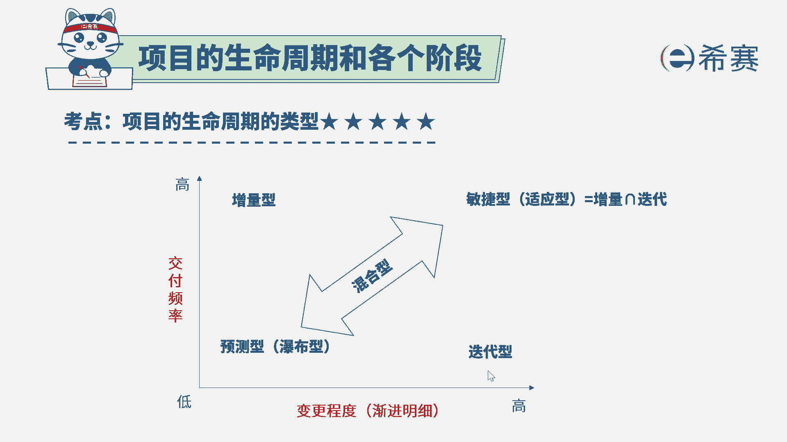

# 24年PMP敏捷-100道零基础付费pmp敏捷模拟题免费观看（答案加解析） - P74：74 - 冬x溪 - BV1Zo4y1G7UP

某项目经理接手了公司的一个软件开发项目，它所在的项目必须要按照不同的阶段来完成，项目工作，先要进行收集需求，然后进行设计阶段，然后是运行和测试阶段，在前阶段工作任务完成之前，通常会有一些代码相关的工作。

但是不会进行除此以外的其他工作，那项目经理所从事的这样一个项目，它的类型是什么类型，迭代型，scrum破不行，适应型，很显然，我们从题干的描述中能够看到，他做事情是怎么做的。

是一个阶段做完再做下一个阶段，下一个阶段做完再做下一个阶段，它是按部就班一步一步往前进的，这种方式呢就是适合与众瀑布模型，瀑布就是像水流一样的，从上往下一步一步的去进行，是先完成收集需求。

然后再进行设计。

然后再开发，然后再测试，也就是他的需求范围都是很清晰和明确的，所以它不需要太多的变化，同时他是一步一步做。

