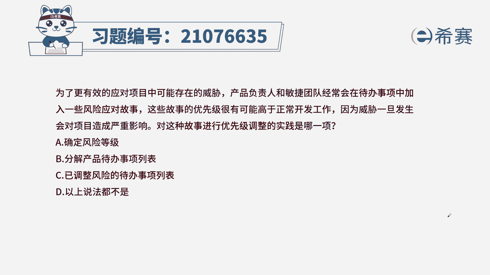
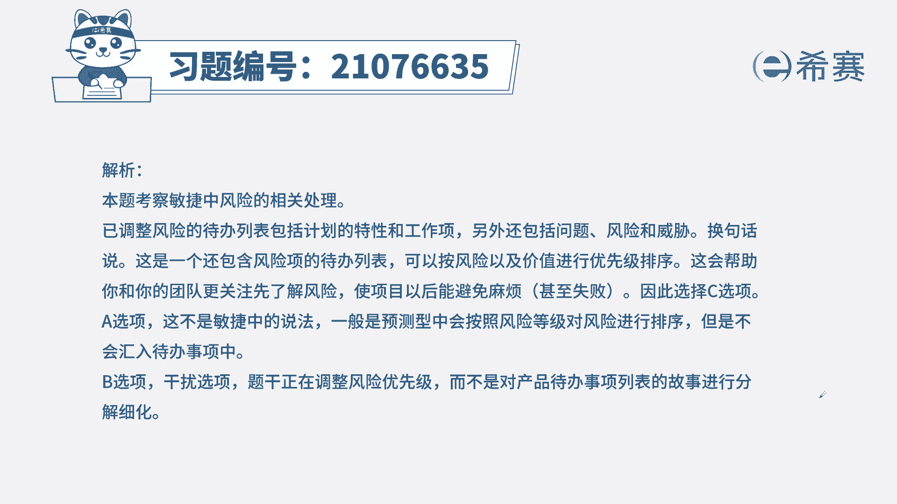
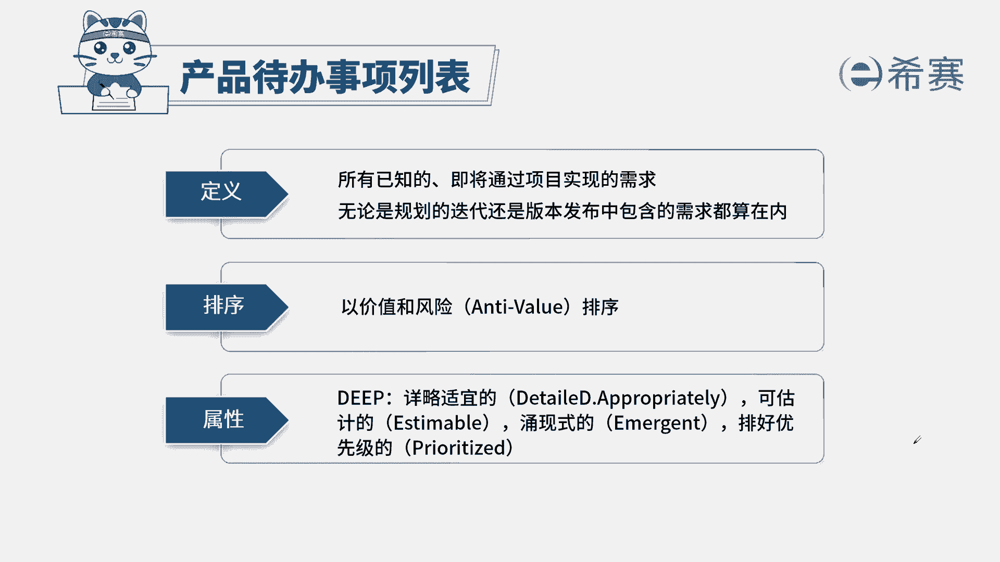

# 24年PMP敏捷-100道零基础付费pmp敏捷模拟题免费观看（答案加解析） - P76：76 - 冬x溪 - BV1Zo4y1G7UP

为了更有效地应对项目中可能存在的威胁，产品负责人和敏捷团队，经常会在待办事项中加入一些风险应对故事，这些故事的优先级很可能高于正常开发工作，因为威胁一旦发生，会对项目造成严重影响。

对这种故事进行优先级调整的实践是哪一项，a确定风险等级，b分解产品待办事项列表，c已调整风险的待办事项列表，d以上说法都不对，本题的考法是考概念，首先通过题干找到关键信息，题干告诉我们。

在待办事项列表中会加入分选项，那问题问的是我们的故事的优先级，应该如何去排列呢，我们知道在产品待办事项列表中，我们的优先级分成两个方面来排序，一个是价值，一个是风险的高低，所以把风险放进来。

我们也要将风险分成高低之分，从而我们选出最佳实践答案c选项，以调整风险的待办事项列表，就是说将我们的风险也作为一个工作项排列，工作顺序排列优先级，从而让我们团队能更加有效的推进，我们的项目的进行。

来看一下其他三个选项，a确定风险等级，此项是我们在预测性项目中来确定的，敏捷项目里面不确定它的等级，b分解，我们的代表市场列表，此项内容和题干没有关系。

这是本题的解析，大家可以暂停看一下。

本期的相关知识点，产品待办事项列表，针对于待办事项列表，我们一定要清楚它的规则排序，以及谁来负责，什么时候创建它和哪些工作有关系，还有我们要了解迭代代办事项列表，这样一来我们针对此类型的题目啊。

