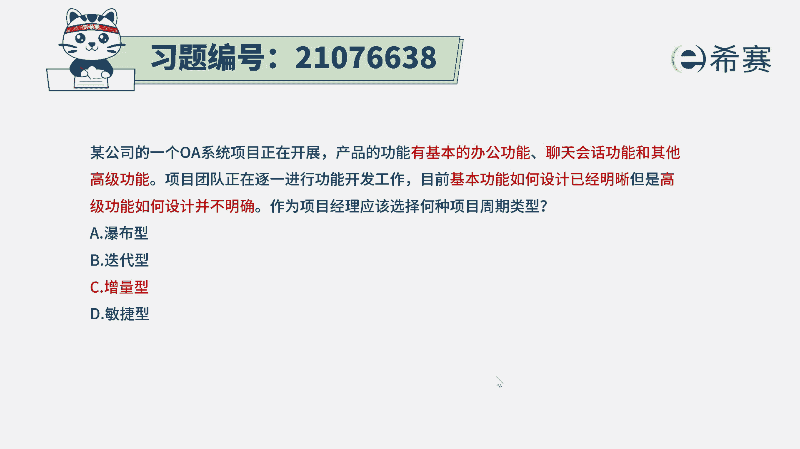
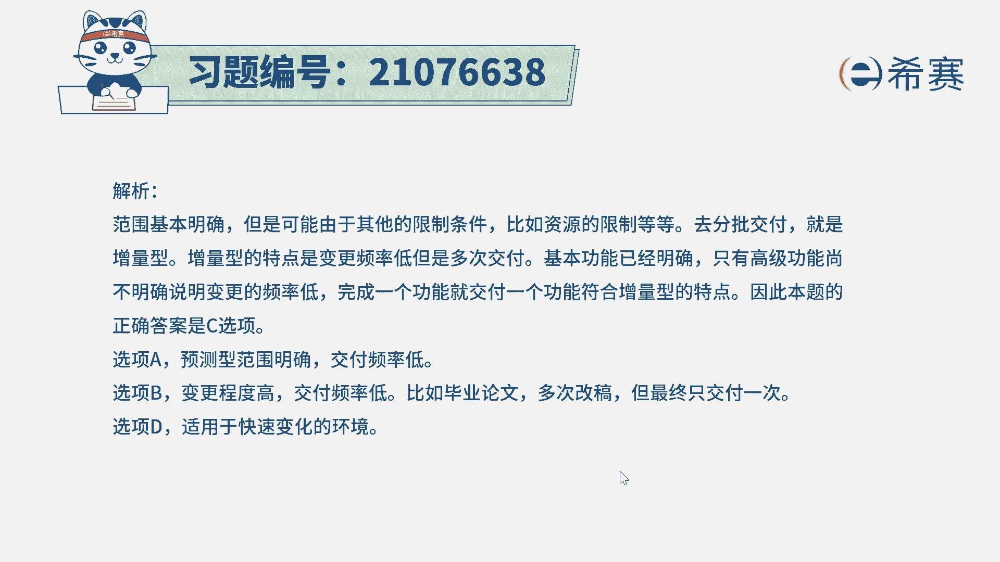
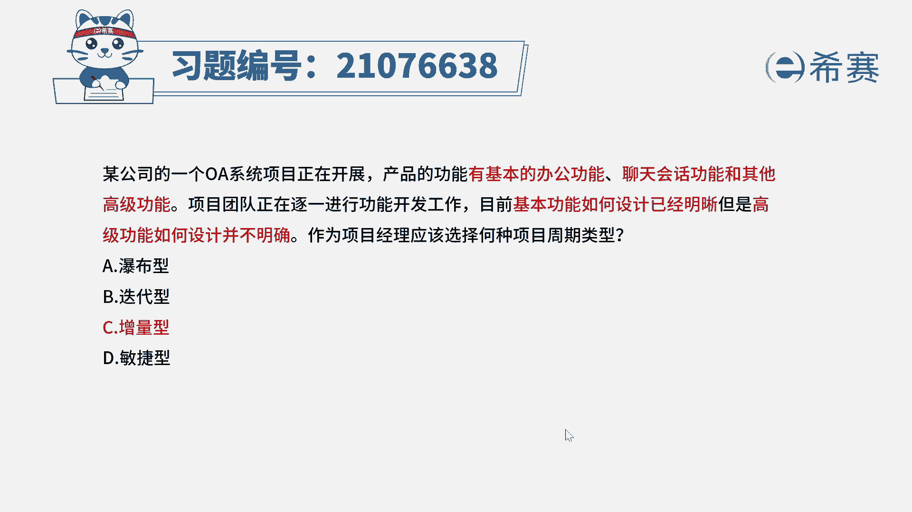

# 24年PMP敏捷-100道零基础付费pmp敏捷模拟题免费观看（答案加解析） - P79：79 - 冬x溪 - BV1Zo4y1G7UP

某公司的一个oa系统项目正在开展产品的功能，有基本的办公功能，聊天绘画功能和其他高级功能，项目团队正在逐一进行功能的开发工作，目前基本功能如何设计已经明晰，但是高级功能如何设计还并不明确。

作为项目经理应该选择何种项目，生命周期类型，瀑布型，迭代型，增量型和敏捷型，那我们来分析一下这样一道题目，他其实会告诉你，我们要做的事情可能有三大块，一块呢是基本的办公功能，一块是聊天绘画的功能。

还有一块呢是高级的功能，现在已经告诉我们，某一些功能已经是非常清晰，也知道该怎么做，还有一些功能呢我们暂时还不明确，所以我们可以怎么做，先把能做的部分做完以后交付出去，然后再做下一部分。

这种方式呢就是增量型，这道题目本身你说能不能选敏捷型，肯定也是可以选，因为敏捷形式包括了增量，但我们在pmi的考试中有这样一个特点，就是尽量选那个包含正确答案的最小包围。

也就是这个题目中，他已经明明确确告诉你呃，我们要做的事情有三大件，第一件已经清晰再做，第二件已经清晰，也可以再做，那我们先做完第一件江湖，第二件交付，第三件事暂时还不清晰，但是我在做的时候应该是会清晰。

所以这种增量的方式，它是适合于我们把一个部分做清楚，交付出去，下一部分做清楚交付出去。

虽然说它争论也是属于敏捷的一部分。

