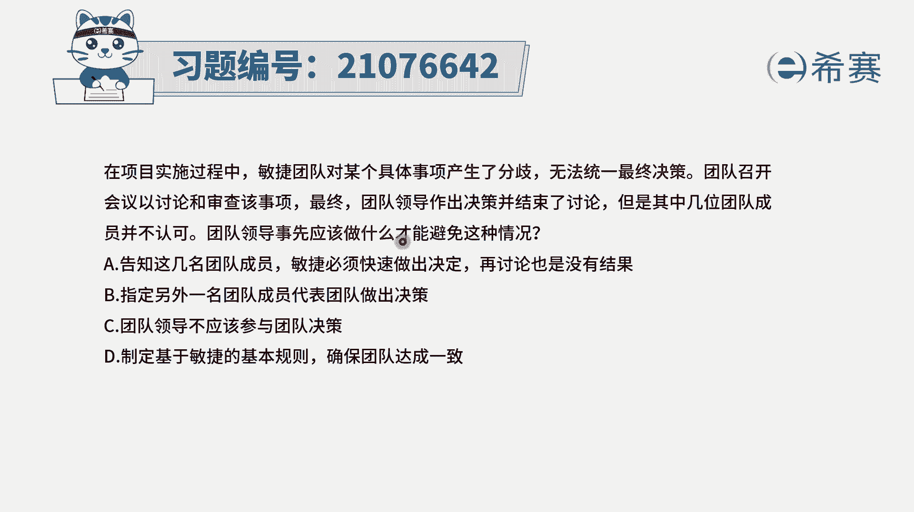
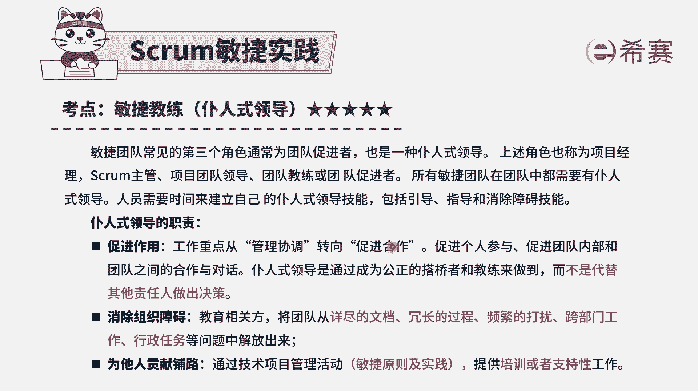
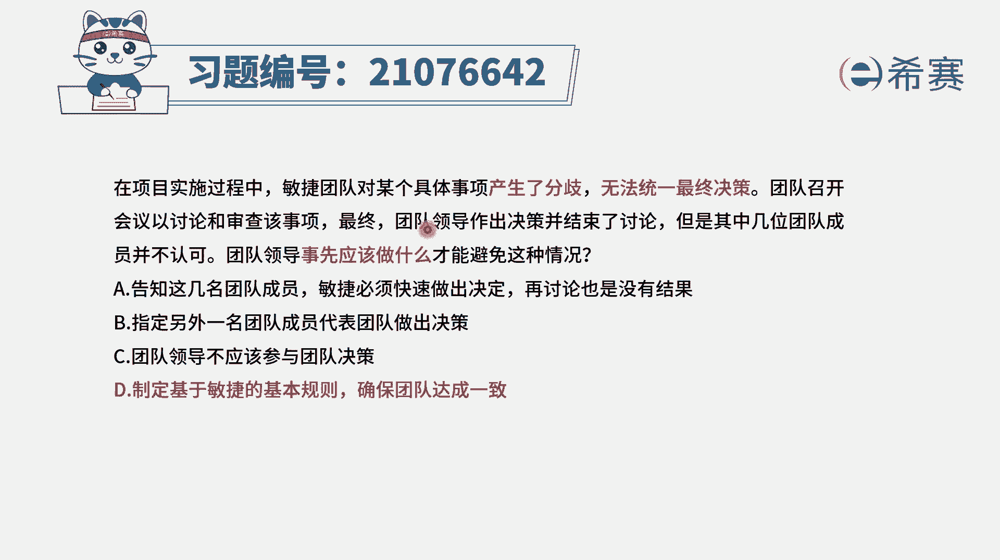
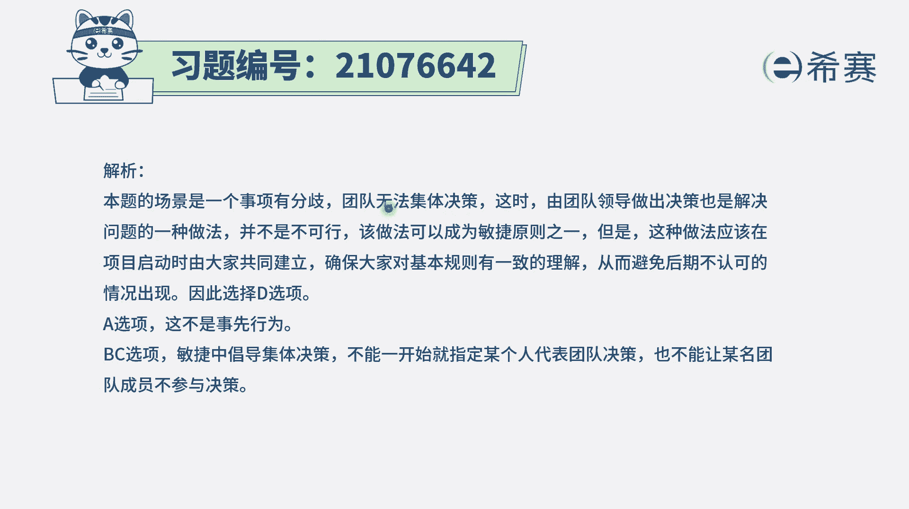
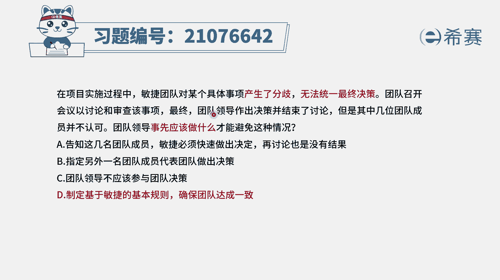

# 24年PMP敏捷-100道零基础付费pmp敏捷模拟题免费观看（答案加解析） - P80：80 - 冬x溪 - BV1Zo4y1G7UP

在项目实施过程中，敏捷团队对某个具体事项产生了分歧，无法统一，最终决策团队召开会议，以讨论和审查该事项，最终团队领导做出决策并结束了讨论，但是其中几位团的成员是并不认可，那团队领导事先应该做什么。

才能够避免这种情况，呃其实我们在整个敏捷中，你需要知道一个点啊，团队是一个自组织团队最牛逼的架构，需求设计，这些都是出自于自组织团队，那么有一些主意应该也是由团队来拿，而不是由领导来了。

领导是个什么样的角色。

领导更多的是一个辅助的角色，是帮助大家去消除障碍，去促进，ok不再去从管理协调，而是去起到一个促进的作用，是这样的一个角色，他是要去为团队的成功来铺路的，这个角色有了这个认知以后。

我们再来看一下选项a告知警民团成员敏捷，必须要快速的做出决定再讨论，请注意啊，敏捷说的不是重点，不是快，敏捷重点是灵活，并且呢敏捷的决策呢也是由团队来去拿，而不是由领导来去拿，选项b。

指定另外一名团队成员来去代表团队做出决策，你开玩笑，一个人来代表团队做决策吗，当然是大家一起来共同做决策啊，选项c团队领导不应该参与团队决策，这个说法那就错了，只是说团队领导不应该拿决策。

但是还是可以参与讨论的，最后的这个决策呢，应该是由团队共同做出的决策，好选项d制定基于敏捷的基本规则，确保团队达成一致，虽然说这个话语，其实跟这个题干中好像没有那么切中要害。

但是他的意思是要团队共同认可了才能够认可，所以这就是他的正确答案了，所以答案选d，就如果说团队产生分歧的时候，大家没有达成共识的时候，领导做了决策，但也不同意，那么应该怎么办呢，应该是提前就说好。

应该是由团队一起来达成决策才算是ok。

所以是答案d选项，要确保团队达成一致解析。

在这边需要的同学可以自行查看一下，并且团队领导，你是一个促进者，你是一个协调员，你是一个消除障碍的人。

