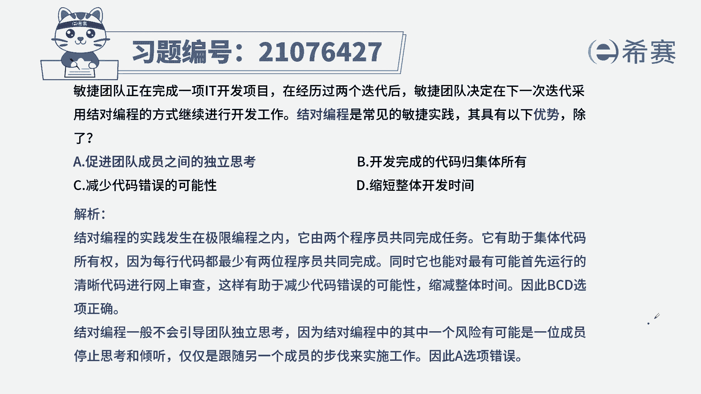
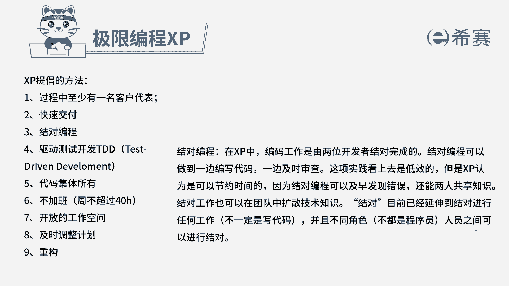

# 24年PMP敏捷-100道零基础付费pmp敏捷模拟题免费观看（答案加解析） - P19：19 - 冬x溪 - BV1Zo4y1G7UP

敏捷团队正在完成一项it开发项目，在经历过两个迭代后，敏捷团队决定在下一次迭代，采用结对编程的方式继续进行开发工作，结对编程是常见的敏捷实践，其具有以下优势，除了哪一项，b开发完成代码归集体所有。

c减少代码错误的可能性，d缩短整体开发时间，本题的考法是考内容和概念，通过题干找到关键信息，结对编程的优势有哪些，这里一定要看清楚，题目是选错了就选错误的一项，结对编程就是两个人同时进行编程工作。

一个人写代码，一个人在旁边看，也就是进行审查，这样一种方式可以提高工作效率，减少错误的出现，因为一旦出现错误，另外一个人就发现了，还有的优势是共享知识，共享技能也能帮助团队成员相互学习。

而两个人一起共同编出来的代码，属于两个人共同所有，出现问题，两个互相讨论，一起来看一下四个选项，而是互相通过交流来解决问题，所以a项不属于结对编程的优势，b开发完成的代码归集体所有，就是大家一起所有。

而不是归属于某一个人，c减少错误，d缩短开发的时间，所以bcd都是绝对编程的优势，从而选出a选项。

这是本题的解析，大家可以暂停看一下本题的相关知识点。

极限编程的特点，针对这个知识点，一定是从内容上下手，要了解九个特点的含义有哪些。

