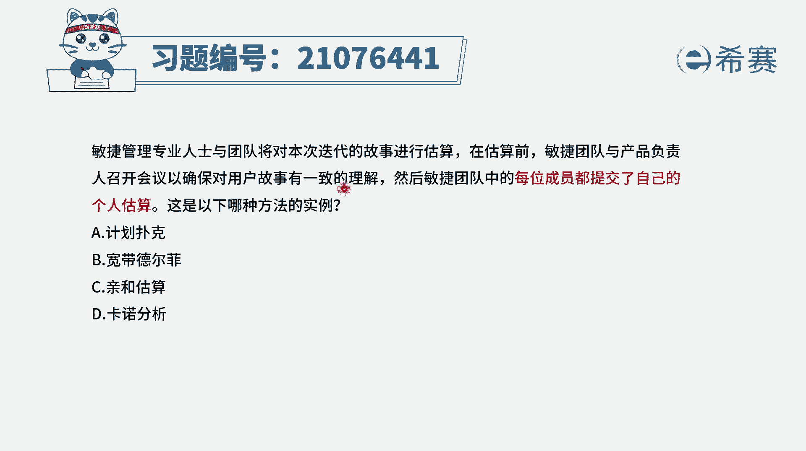
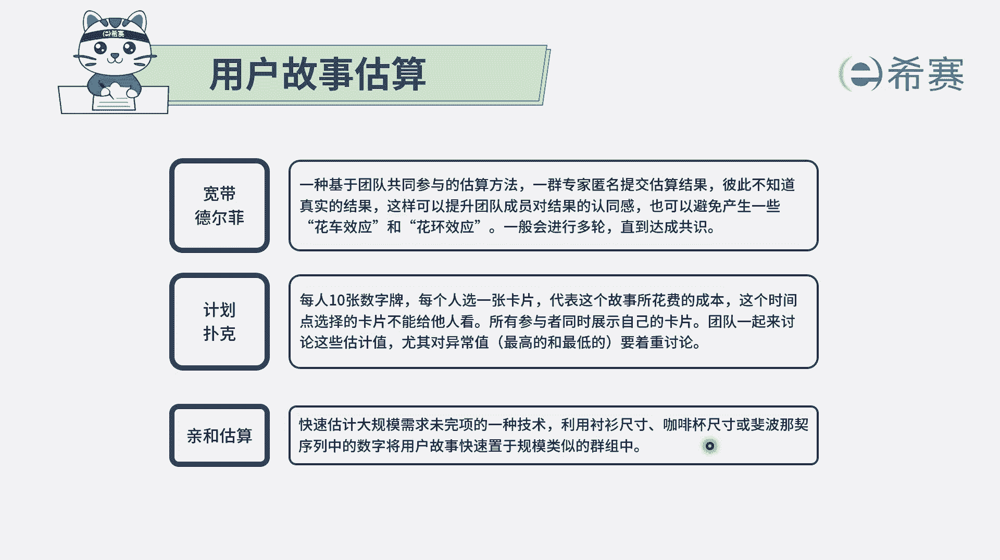
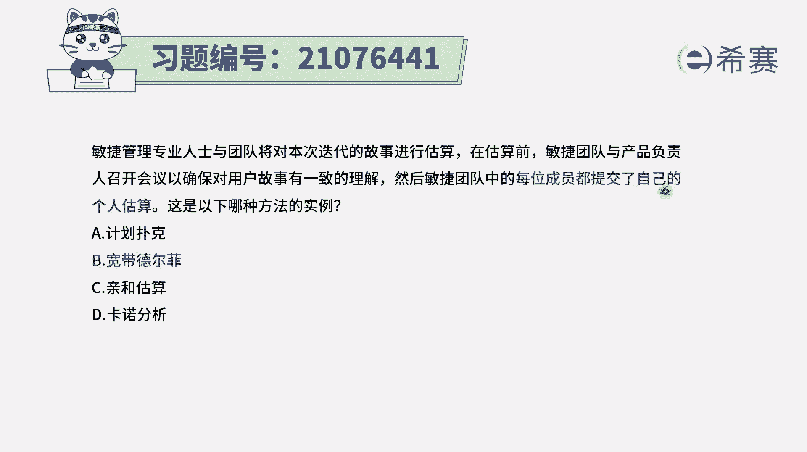
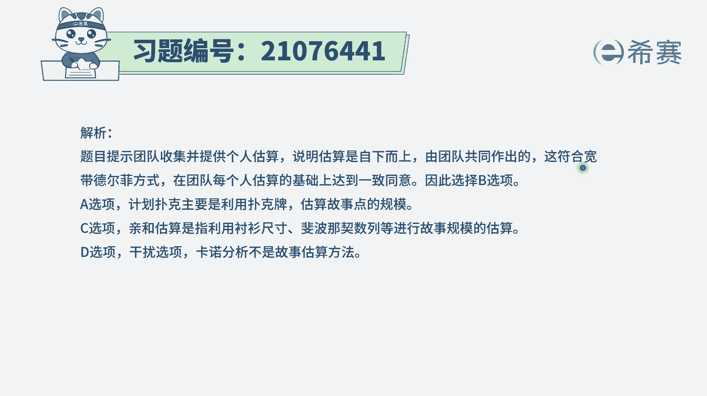

# 24年PMP敏捷-100道零基础付费pmp敏捷模拟题免费观看（答案加解析） - P22：22 - 冬x溪 - BV1Zo4y1G7UP

敏捷管理专业人士与团队，将对本次迭代的故事进行估算，在估算前，敏捷团队与产品负责人召开了会议，以确保对用户故事有一致的理解，然后敏捷团队中的每一位成员，都提交了自己的个人估算，这是以下哪种方法的实力。

那我们需要去知道一下啊，就是这个估算的方式呢，它下面四个选项说叫计划扑克宽带，德尔酚氢和硅酸和卡洛分析，我们都需要稍微了解一下对吧，稍微了解一下，而事实上呢这个题目中啊非常有意思，它就是首先看来一会议。

让大家让我们所有人都对于这些用户故事，有比较一致的理解，然后呢，再来每一个人单独去交付自己的这个估算结果，我们再有后续的讨论，而这种方式每个人交付自己的东西，这就是属于一种叫德尔菲的方式。

然后呢我们在德尔菲之前先来开会讨论，让大家对这些东西有更多的理解，这就属于这种所谓的宽带的方式，也就是信息会更加的同步，信息会更加一致，有讨论有交流，然后再来做这种匿名投票的方式。

所以这个题目答案呢其实选宽带德尔菲啊，关于宽带，德尔菲来认识一下，是一种团队共同参与的估算方式，一群专家来匿名估算，但是宽带得非它跟德妃不相同的地方，就是加了这个宽带，这个词是我们在做宽带的过程中。

还有很多讨论和交流，有很多讨论和交流啊，至于其他几个选项来认识一下计划扑克呢，它通常是我们每一个人手上都有一副扑克牌，然后对于这些个用户故事，每一个人都来去当面来去出牌的这种方式，来给出结果。

然后再如果出牌的人数，有一些人，他出的牌他的值特别高或特别低，叫异常值，那他就需要去解释一下他为什么会出这个值，我们再来讨论下一步就是一种计划，不会就是同步单面来去出牌的这种方式。

而氢和估算呢通常是一种归类的方式，或是聚类的方式，我们会把这些故事大概的分成几个等级，分成是大中小啊，超大超小之类的方式，它会用到什么，用到比方说要叫寸伤尺寸，村长尺寸有什么，有m吗，有s吗。

有l有叉l有叉叉l对吧，还有一个叫咖啡杯尺寸，比方说会给它是呃小杯中杯大杯超大杯，所以他是会把这些故事的这样一些复杂程度，直接是按照分了几个等级的方式来做估算。

这个呢叫亲和估算，所以说还有另外一个叫卡洛分析，那卡洛分析，它通常是指我们会对于这样一些需求，觉得这些需求它是人，它的实现，对于客户的满意程度来讲是怎么样的呢，它的实现是越实现客户越满意。

他说他越实现客户越不满意，他说不管实现不实现，客户没有什么感觉，我们会通过专门有一个卡洛分析来去了解，他跟这个故事点数本身没有什么关系，但是它对于用户故事的排序，或者说是对于这种需求的排序是非常管用的。

那这题目中，但是开会讨论有一致的认识和理解以后，然后在每个人各自交付自己的这样一个估算，这种方式就符合宽带德尔菲那解析。

