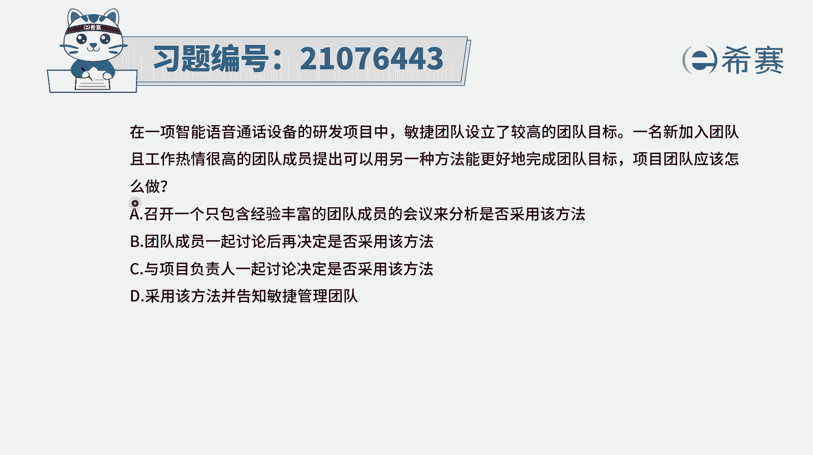
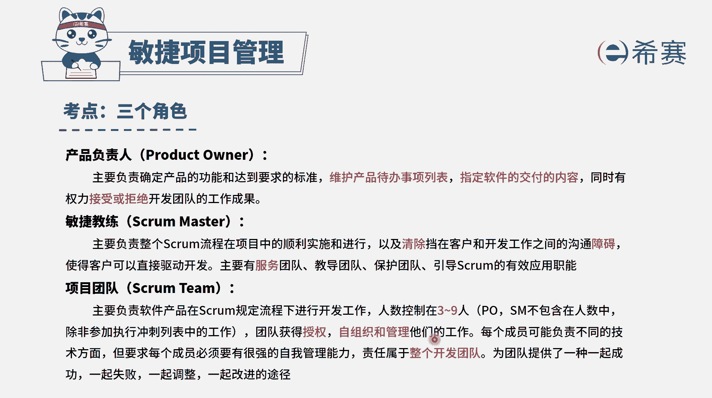
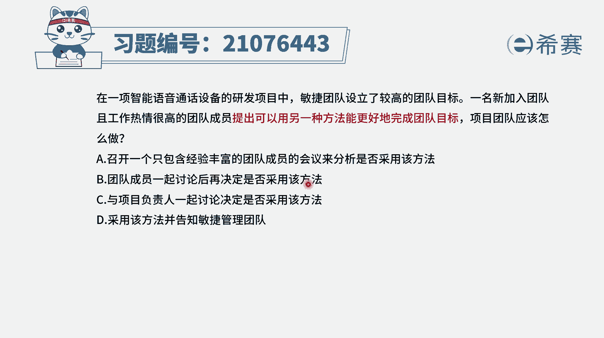
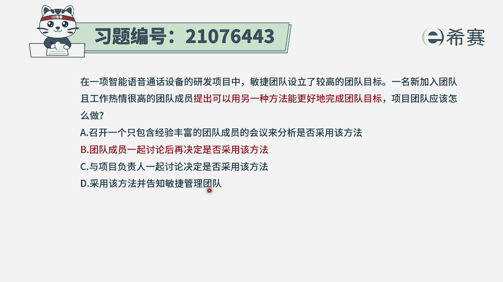
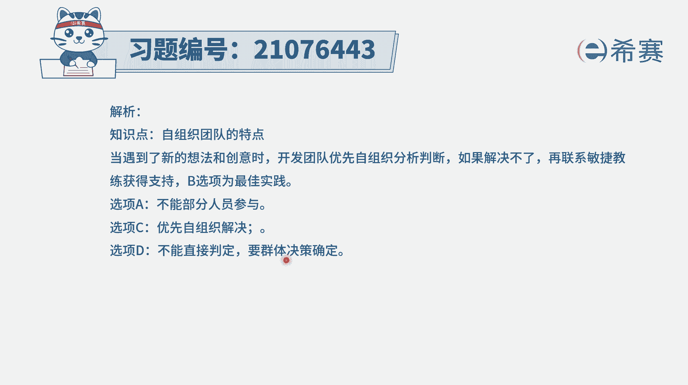
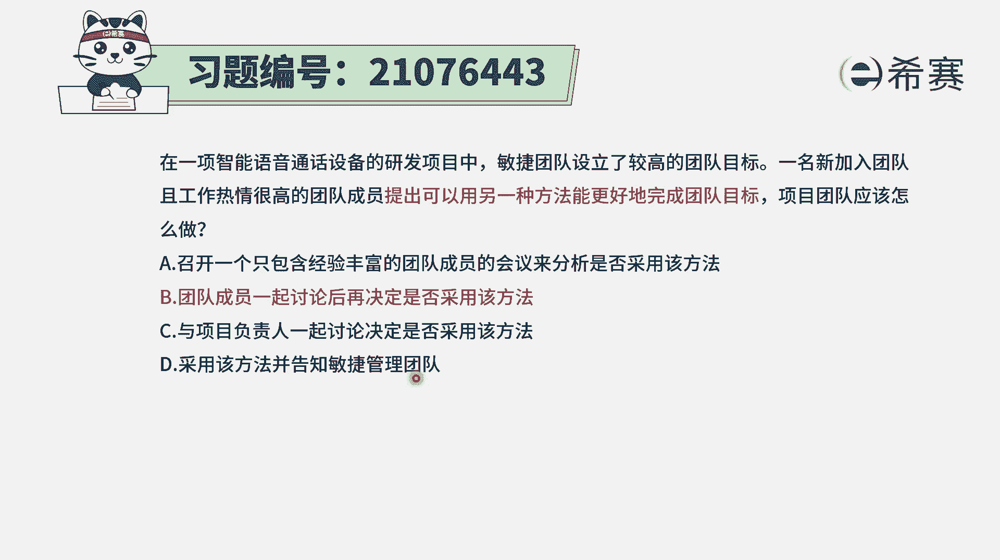

# 24年PMP敏捷-100道零基础付费pmp敏捷模拟题免费观看（答案加解析） - P23：23 - 冬x溪 - BV1Zo4y1G7UP

在一项智能语音通话设备的研发项目中，敏捷团队设立了一个较高的团队目标，一名新加入团队且工作热情很高的团队成员，提出，可以用另外一种方法能更好的完成团队目标，项目团队应该怎么做。

那这里的话其实是一个很典型的，就是说我们当下所处在的这样一个情况，也不是说不可以，但是有更好的方式，那对于更好的方式到底是用还是不用呢，那肯定是要讨论以后才能用，对不对，那就是奔着讨论以后才能用的。

这样一个逻辑去做，另外我们要知道一下。

既然是团队共同去工作的这件事情，那我们的团队呢又是一个自组织团队，就整个在敏捷里面，他是一个自我组织，自我管理的团队，所以相对来讲。

那一定是团队自己讨论以后再去决定，会更好一点好，有了这样一个信息以后呢，我们再来看四个选项，选项，一召开一个只包含经验丰富的团队成员的会议，那这肯定不合适嘛对吧，你还区别对待了，在敏捷中。

他会要求去尊重尊重团队所有成员，选项b团队成员一起讨论后再决定是否采用唉，这就是一种很典型的做法啊。

它就符合了这一种自组织结构，并且也符合说有问题。

我们先去分析讨论，再解决问题，所以b选项就是正确答案了，选项c与项目负责人一起讨论，决定是否采用该方法，那能否与项目负责人一起讨论呢，当然不是不可以，但是关键的重点是一定有团队成员参加。

而c选项里面没有表现出，有团队成员参加的这个意思，所以不选他啊，然后最后一个选项采用该方法，并告知敏捷管理团队，这就是显得太过于武断，就没有很好的去分析研究，就直接下结论。

一般来讲这种方式肯定都不合适啊。

所以这个题目的答案呢解析在这里，就是我们需要去自己来讨论判断。

然后如果可行就用。

