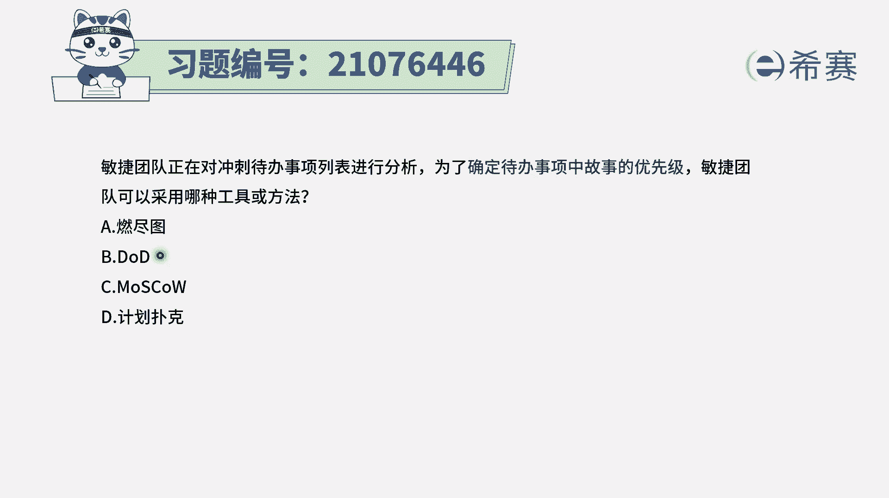
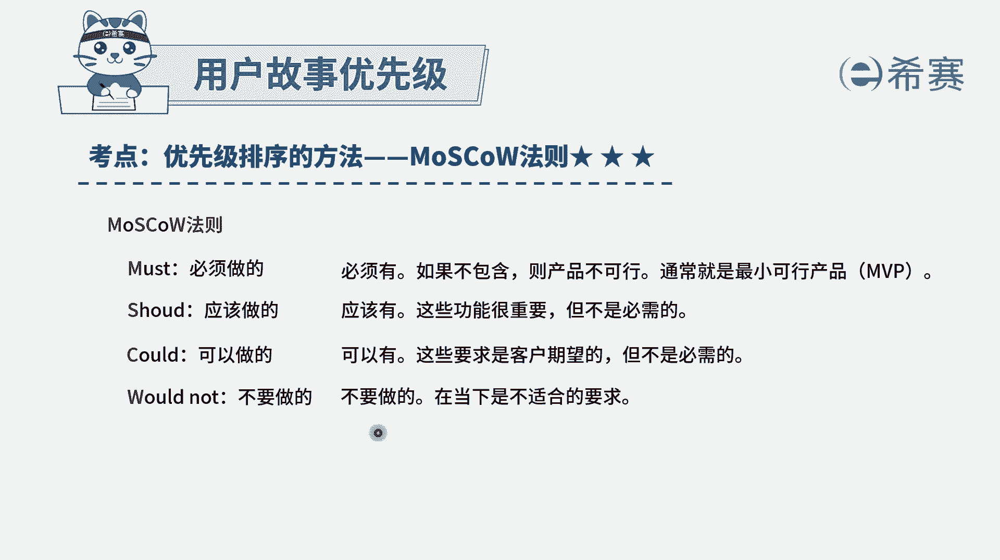
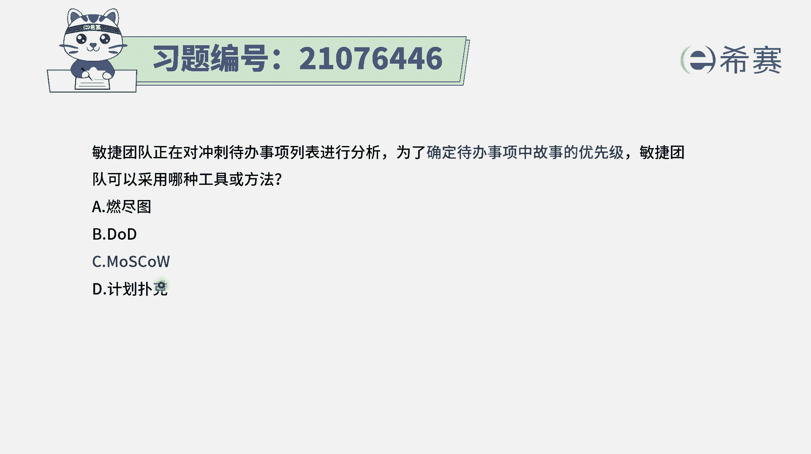
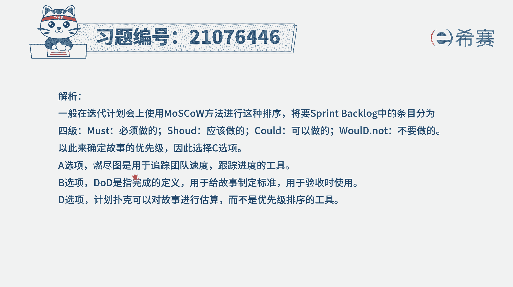

# 24年PMP敏捷-100道零基础付费pmp敏捷模拟题免费观看（答案加解析） - P25：25 - 冬x溪 - BV1Zo4y1G7UP

敏捷团队正在对冲刺待办事项列表进行分析，为了确定待办事项中故事的优先级，敏捷团队可以采用下列哪一种工具或方法啊，这个的话其实就是告诉你，以下工具中，哪一种工具是可以用来做这个待办事项中的。

故事的优先级排序的，那我们简单认识一下，首先第一个燃尽图，燃尽图呢它通常是我们在项目执行的过程中，去跟进项目的进展情况的一个工具，然后选项b d d d d呢它是叫完成的，定义是对于这样一些用户故事。

他做到什么程度就算完成呢，会专门有一个完成定义是放在用户故事的背面，一般来讲它会给到是在什么样的情境下，当我们做什么操作的时候呢，这个系统就会给出什么样的反应，如果能够满足。

说明这个用户故事就算是验收通过了，如果不能满足，说明这个用户故事没有通过啊，这是一个关于用户故事的一个验收的定义，他也不会对这些用户故事的优先级排序。

产生任何影响，而第三个莫斯科，那莫斯科呢它刚好就是一个优先级排序的方法，它是什么意思呢，它其实是四个单词的一个缩写呃，首先m呢是must，是必须做的，也就是说在产品中有一些功能是必须做。

如果这一次迭代中你不做的话呢，那客户就是不接受不答应的啊，这一部分功能一般来讲会占到60%，然后第二部分呢是s s呢是应该做的，should它是指最好我们做这个东西，做了以后还是蛮好的。

但是不是说非得做，一般这部分功能会降到20%，第三个是c c是could，could是说啊可以做的，那么可以做，当然也可以不做，对不对啊，做肯定是最好的，不做呢也没那么大的关系。

一般这一部分也占了20%左右，还有最后一个w呢是w或者would not是不要做的，就是如果这些东西你做的话，可能就是产生反作用，那么就不要做，为什么非的是在这一部分占到60%，这部分加到20%。

这部分占了20%呢，是因为我们敏捷有一个叫拥抱变化，如果说有一些东西，你会发现在这一轮的整个发布中，有一些新的东西加进来，那我们可以去置换的方式，去把原有的东西给替换掉对吧，替换哪些呢。

就优先替换这个could，如果还有东西加进来，还要再替换一些，那就替换这个should，所以是给到我们一点点，自由的活动的这样一个空间来做这个事情，但它的总体就是通过这个莫斯科的这种法则。

来对需求进行排序，这是最重要的，must是最重要的，然后才是should，然后才是could，最后才是wen，wen是不要放进来的，所以这个题目答案就是选莫斯科法。

而最后一个叫计划扑克，那计划扑克呢，通常是对于用户故事的故事点数来进行，估算的一种工具，他会是每一个人手上都拿了一张，拿了一些些扑克，然后对于某一个用户故事，我们自己心里面都想到一个故事点数以后。

但一起来出牌，然后看一下，看大家整个初始牌的这个情况是否比较匹配，如果有一些比较差异的呢，他需要去做一些解释，我们再来做下一轮，通过这种方式来去对用户故事的大小进行匹配，所以题目中问到的时候。

是哪一个是能够确定待办事项列表中，用户故事优先级的，那就只有一个叫莫斯科法。

叫莫斯科好解析。

