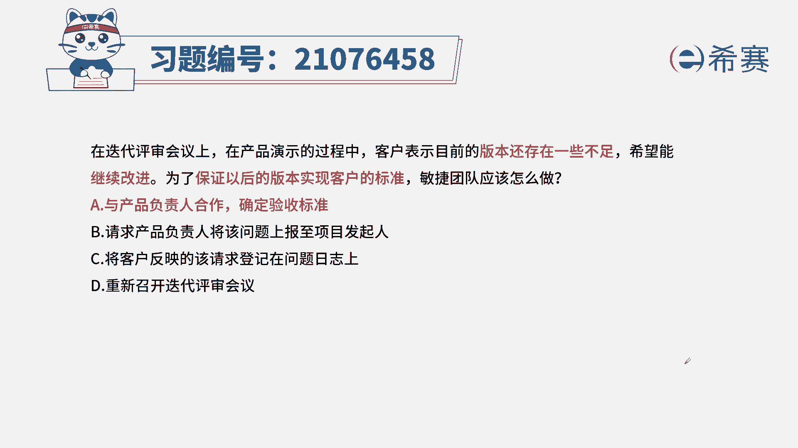
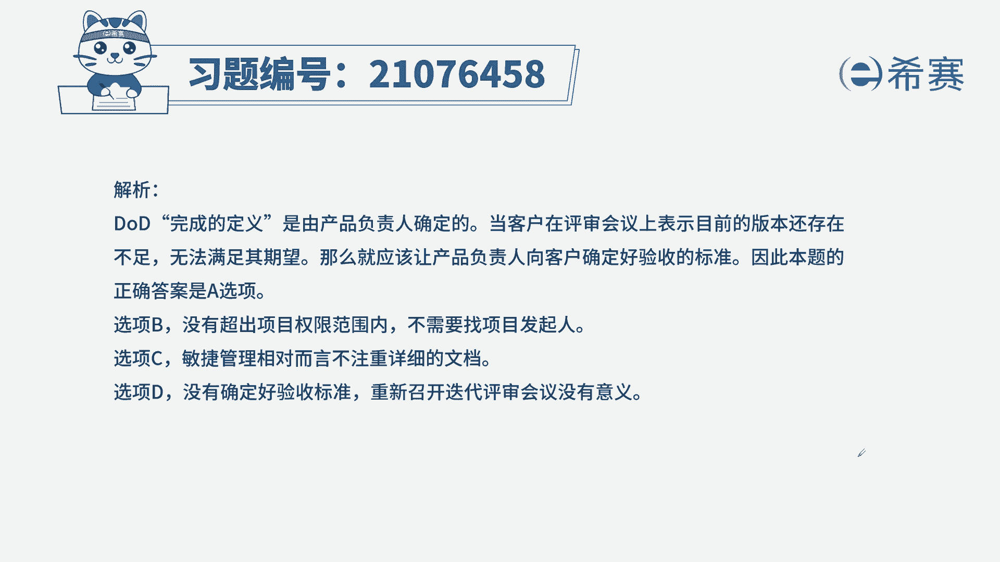
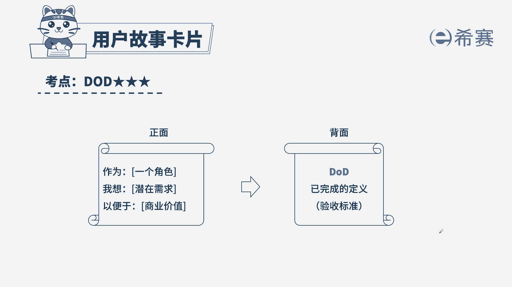

# 24年PMP敏捷-100道零基础付费pmp敏捷模拟题免费观看（答案加解析） - P28：28 - 冬x溪 - BV1Zo4y1G7UP

在迭代评审会议上，在产品演示的过程中，客户表示目前的版本还存在一些不足，希望能继续改进，为了保证以后的版本实现客户的标准，顶尖团队应该怎么做，a与产品负责人合作确定验收标准。

b请求产品负责人将问题上报至项目发起人，c将客户反映的该请求登记在问题日志上，d重新召开迭代评审回应解题思路，首先我们要看一下本题的关键词，本题告诉我们版本存在不足，需要继续改进。

也就代表了我们客户对于本次的验收不满意，那问题问的是，为了确保以后的版本实现客户的标准，我们应该怎么办，我们要思考现在目前的版本不足，我们又召开了迭代评审会议，也就代表着客户的预期。

与我们团队的标准不一致，那从而我们需要清楚，我们应该确定统一一个验收标准，而针对于产品需求的验收标准，我们应该找谁呢，客户但是我们是敏捷团队，我们必须找到产品负责人一起确定一下，所以我们要选出正确。

答案是a与产品负责人合作确定验收标准，我们来看看其他几个选项，b请求产品负责人将该问题上报至项目发起，首先我们的题干给的信息，没有超出我们的项目范围，所以不需要联系项目发起。

c将客户反映的该请求登记在问题之上，敏捷项目的价值观是为客户创造更大的价值，所以相对于文档来说，我们会弱化文档，那在本题里面选a b选c更合适啊，更符合我们敏捷项目的价值观，d重新召开迭代评审会议。

我们的验收标准没有确定，你重新召开几次也都没有用好。

这是本题的解析，大家可以暂停看一下。

至本题的考点doo d，大家记得d o d就是已经完成的定义，其实就是验收标准，这是我们在用户故事里面明确会标注的标准，如果没有标注，那我们就需要确定这个验收标准。

