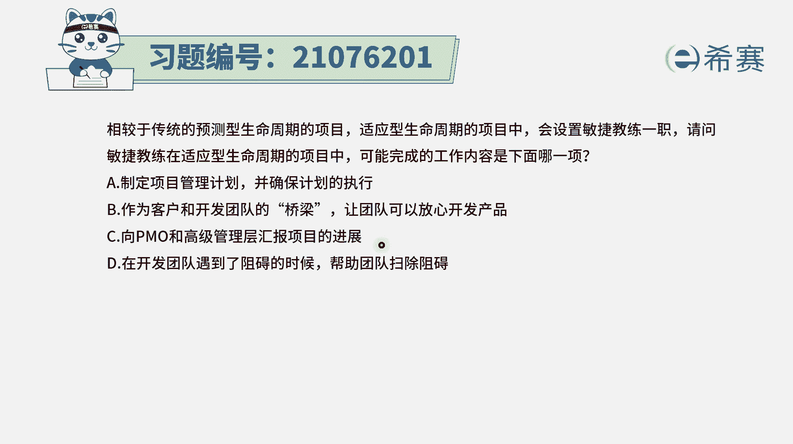
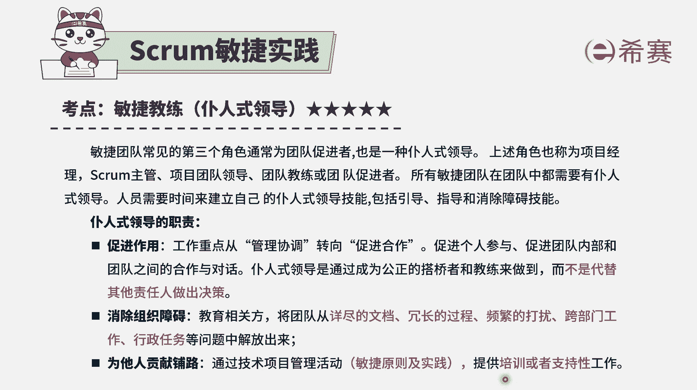
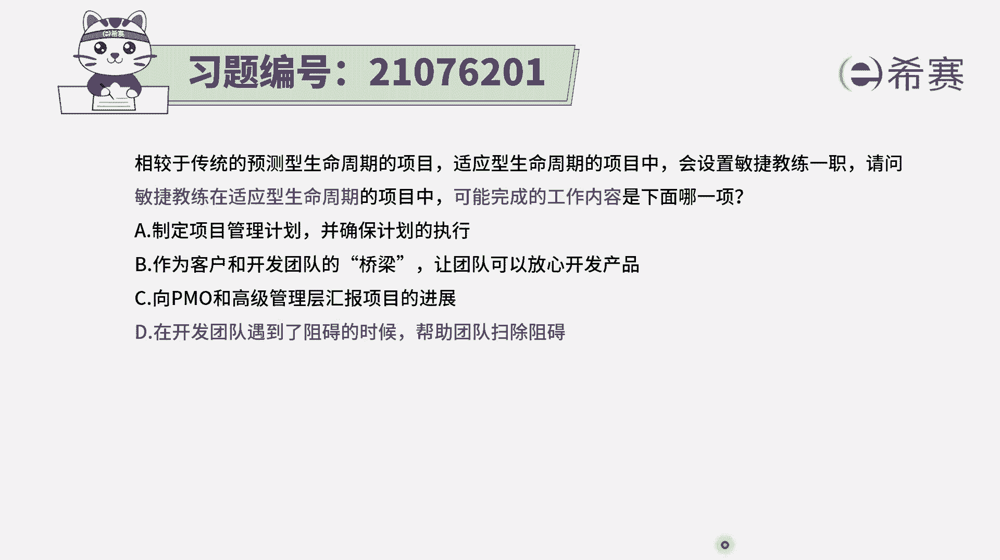
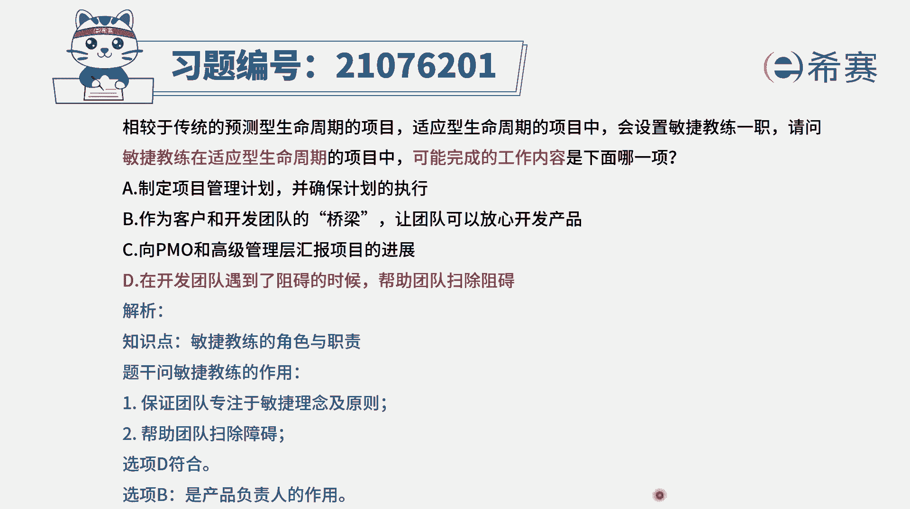

# 24年PMP敏捷-100道零基础付费pmp敏捷模拟题免费观看（答案加解析） - P2：2 - 冬x溪 - BV1Zo4y1G7UP

相较于传统的预测型生命周期的项目，适应型生命周期的项目中，会设置敏捷教练这一职，请问敏捷教练在适应型生命周期的项目中，可能完成的工作内容是下面的哪一项，其实这就是在问关于敏捷教练。

他在这种适应性的项目中，或者说是叫敏捷型的项目中，他主要是负责一些什么样的工作，选项a制定项目管理计划，确保项目执行，这是在预测型的项目中，不是在敏捷型的项目中，在敏捷中。

他会强调的是拥抱变化胜过了遵循计划，所以没有办法完全是按照原计划来进行，选项b作为客户和开发团队的桥梁，让团队可以放心开发产品，这是由product owner，由产品负责人来充当这个桥梁。

他是去直接跟客户交互，去获取客户需求，并且能够去代表客户，来对于这样一个用户故事进行排序，以及产品完成以后，对于这样一个工作内容进行验收，这都是产品负责人broada owner，他的这个作用。

它是这个桥梁，而不是敏捷教练，选项c向po和高级管理层来汇报项目进展，那这里其实没有一个严格意义上的汇报，整个在敏捷中呢，这些信息它都是同步的，它会是有这个信息发射器或者信息发射源，比方说用看板的方式。

或者用一个群聊的方式啊，通过看板呢来去同步信息，所以没有一个特别严格意义上的这种方式，来去要求汇报进展，一般来讲它是一目了然，一看就清楚，并且其实在每一次迭代完成以后呢，都会有一个迭代评审会议。

那这样一个迭代评审会议也会能够去同步，这一个迭代周期都完成了哪些东西，还还差了一些东西，选项d在开发团队遇到阻碍的时候。

帮助团队扫除阻碍，哎这刚好就是敏捷教练要干的事情之一，整个敏捷教练呢它一个是要去做促进作用，把管理转向为促进项目合作，第二个就是要去消除障碍，消除各方的障碍，包括说啊为团队来消除障碍。

为整个这样一个做软做敏捷项目来去消除障碍，还有第三个就是去培训团的成员，以及去支持团的成员，还有就是给一些其他的相关方来去做一些支持，关于敏捷方式。

敏捷原则，敏捷实践的支持，所以这个题目的答案呢就是选最后一个。

就是在开发团队遇到阻碍的时候，去帮助团队来扫除障碍。

