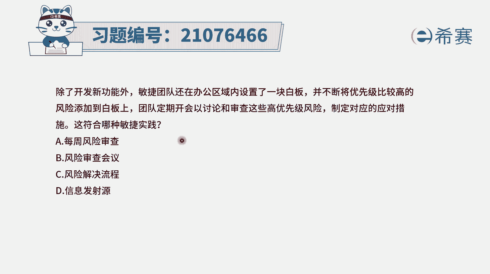
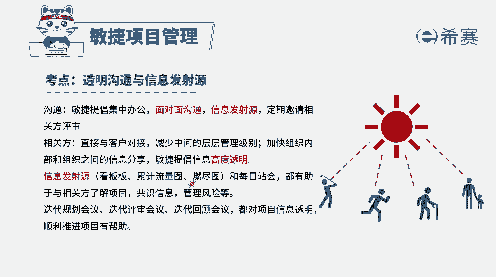
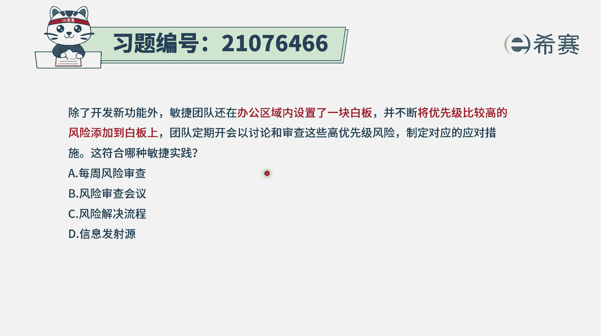
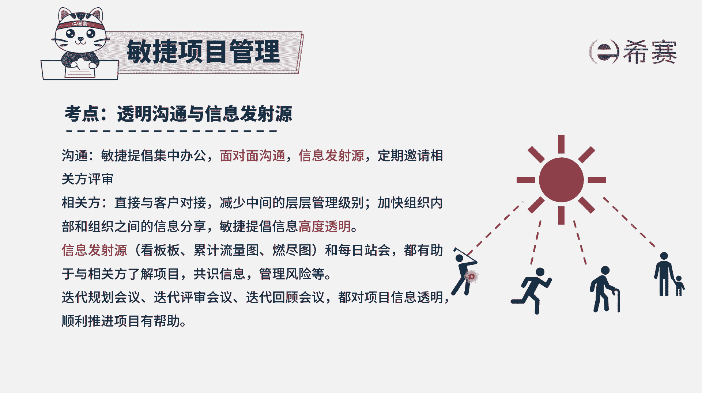
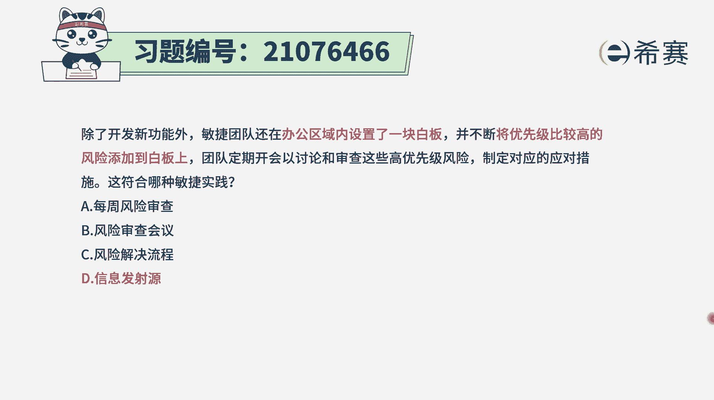
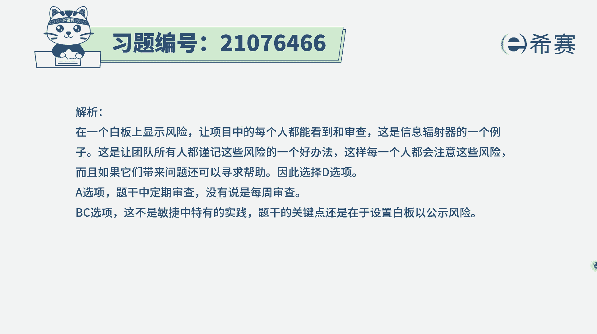

# 24年PMP敏捷-100道零基础付费pmp敏捷模拟题免费观看（答案加解析） - P31：31 - 冬x溪 - BV1Zo4y1G7UP

除了开发新功能外，敏捷团队还在办公区内设置了一个大白板，并不断地将优先级较高的这些风险，添加到了白板上，团队定期开会，以讨论和审查这些高优先级的风险，制定对应的应对措施，这符合哪一种敏捷实践。

那这个我们需要知道啊，一看就知道是他做一个大白板，把一些信息能够去同步。

让大家都能看到，这就是属于叫什么叫信息发射源，或叫信息发射器，就信息发射源，信息发射器它是要干一件什么事情呢，就是敏捷中会提倡信息的透明，那怎么样去做到信息透明，我就把这些重要信息都放在这里面。

放在看板上面，或者放在一个什么风险软件图上面，那这样的话需要的人他随时都可以看得到，当然如果说不是线下的方式呢。

我们也可以用在线的方式来去做这些事情，也是可行的啊，那这个题目答案呢其实就直接可以选出来，就是d选项了啊，其他几个我们也可以看一下，那符合哪个时间，选项a说是每周风险审查，它是每周风险审查吗，它不是啊。

它是不断的优化，所以并不是说每一周来干这个事情，选项b风险审查会议，这不是风险审查会议，包括说将识别到的风险也放上去，然后以及对风险来进行讨论，所以不仅仅只是对风险进行审查，它包括识别新风险。

然后把它放上来，选项c风险解决流程，那这还真不算是一个风险解决流程，他重点关注的是说，要把这些东西放在一个显眼的地方，既然大家都去关注这些东西，当把一些东西放在显眼的地方，让大家去关注方式方式呢。

这个就叫信息发射源，也就像我们把信息放在这里的话，他也能看到每一个人都可以看到。

就是这个意思啊，所以这个题目的答案呢就选最后一个了解析。

