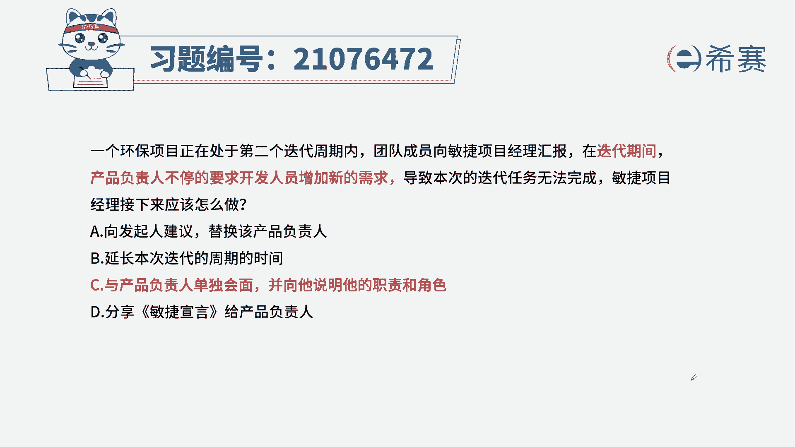
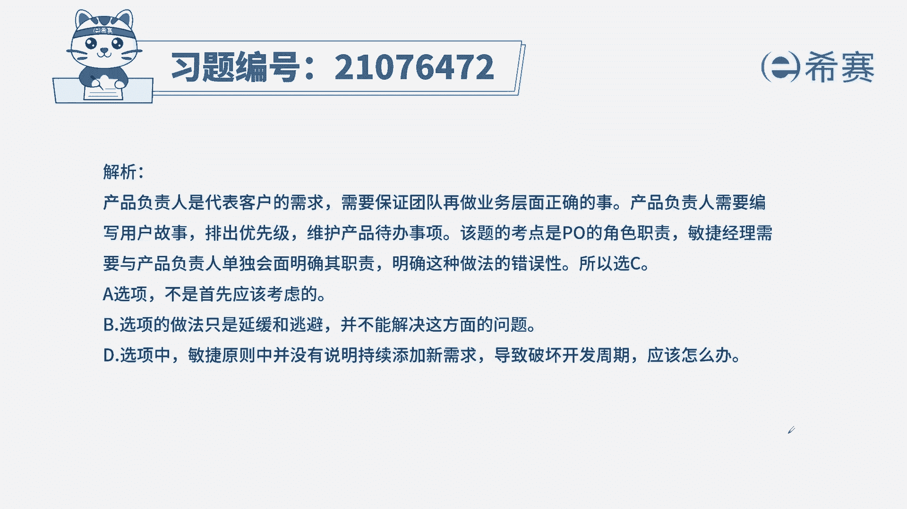
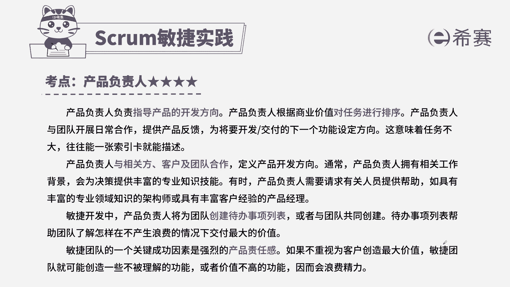
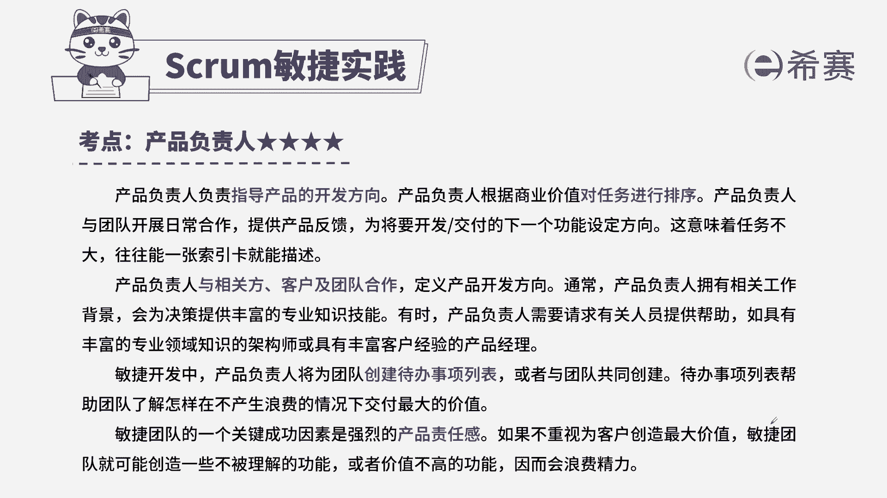

# 24年PMP敏捷-100道零基础付费pmp敏捷模拟题免费观看（答案加解析） - P32：32 - 冬x溪 - BV1Zo4y1G7UP

一个环保项目正处在第二个迭代周期内，团队成员向敏捷项目经理汇报，在迭代期间，产品负责人不停地要求开发人员增加新的需求，导致本次的迭代任务无法完成，敏捷项目经理接下来应该怎么做。

a向发起人建议替换该产品负责人，b延长本次迭代的周期时间，c与产品负责人单独会面，并向他说明他的职责和角色，d分享敏捷宣言给产品负责人解题思路，首先来看一下我们题干中给到的关键信息，一般在迭代期内。

我们的需求，也就是说我们的用户故事是不变的啊，如果要变，你可以放到下一次迭代中，那本题告诉我们，在迭代期内，产品负责不停的要求开发人员增加新的需求，所以我们要思考。

产品负责人是不是违背了我们的一个基本规则，这是一点，第二点，增加需求，迭代期内增加需求不是产品负责人要做的事情，这是开发人员来决定的，从而我们选出正确选项，c与产品负责人单独会面。

并向他说明他的职责和角色，来看一下其他几个选项，向发起人建议替换该产品负责人，不是我们的最佳实践，相对于c来说，a不合适，b延长本次迭代的周期时间，b选项的内容也不是从正面去解决问题，比较消极。

而且无法从根本上解决掉，d分享敏捷宣言给产品负责人，也，宣言里面没有提到，题目所代表的这种场景也不合适。

所以本题的考法是最佳实践，这是本题解析。

大家可以暂停仔细看一下，那本题的考点呢。

其实核心是在于产品负责人的岗位职责，此类题目如果我们想快速做对，第一要清晰的知道，产品负责人的岗位职责是哪些，第二我们要知道开发团队的岗位职责有哪些。

