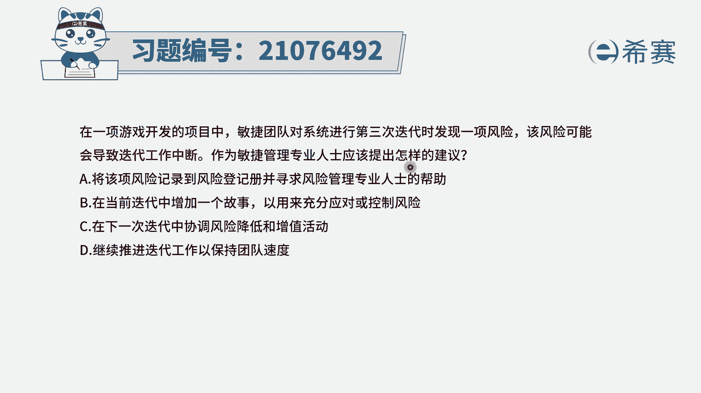
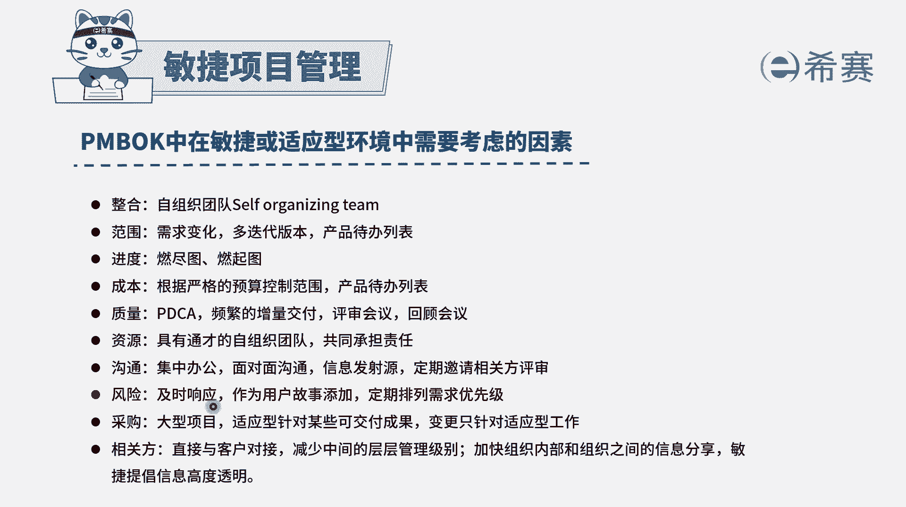
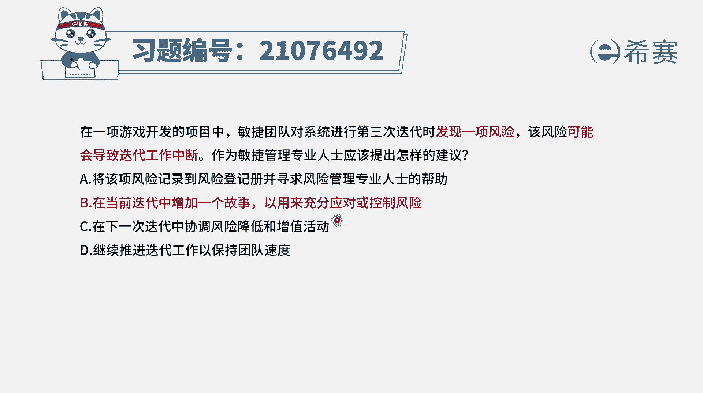
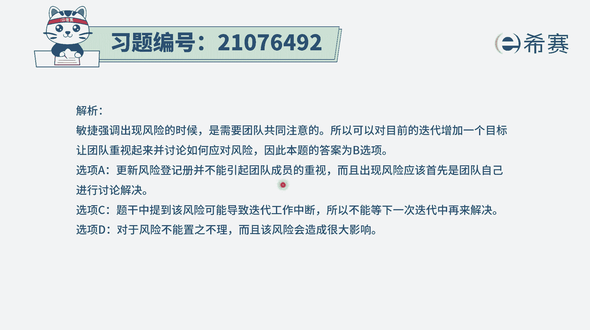

# 24年PMP敏捷-100道零基础付费pmp敏捷模拟题免费观看（答案加解析） - P37：37 - 冬x溪 - BV1Zo4y1G7UP

在一项游戏开发的项目中，敏捷团队对系统进行第三次迭代时，发现一项风险，该风险可能会导致迭代工作中断，作为民间管理专业人士，应该提出怎样的建议，那如果说我们在做事情的过程中，发现了一项风险。

而这项风险有可能会导致，这一轮迭代都做不下去，那你要怎么办，那你肯定是要马上要去解决它，对不对，你马上要去响应它，解决它。

其实整个在敏捷中，对于风险的应对措施也是这样的，如果说有一些风险它真的是很大的话呢，我们是需要去及时响应的，以及是可以把它作为一个用户故事。

添加到产品待办事项列表中来，而对于题干中说的是，它有可能会影响本轮的迭代，那对于这一轮给大都有影响，那我们就是马上就要去做事情，有一个工具呢叫刺探，我们快速去做刺探，来了解他这些风险的应对的方式。

可行不可行，有了这些基本认识以后呢，我们再来看这四个选项啊，选项a将该项风险记录到风险登记册中，并且去寻求风险管理专业人士的帮助，也不是不可以，就是会显得不够那么的积极主动，另外呢一般来讲。

风险应对是我们团队自己来搞定，因为敏捷团队，他跟那个传统的预测型的项目是不相同的，它是一个自组织团队，最牛逼的架构需求设计，最牛逼的，这一次测试，都应该是出自于这样一个自组织团队，所以面对这种风险呢。

也是我们自己去搞定会更好一点，并且呢把这个东西记录到风险的册中，他还没有直接去应对这个风险，而敏捷更关心的是直接去应对这个风险，好，我们看一下选项b在当前迭代中增加一个故事。

以用来去充分的应对或是控制风险，这个呢它的本意就是说做一个这个风险，故事的这个刺探，然后来去试探一下，看这个风险它到底在什么情况，然后可能影响有多大，我们可能能否去解决它。

所以它是一个可选项选项c在下一轮迭代中，你想这一轮都有可能会中断了，你还得到下一轮，开玩笑，那肯定是来不及了啊，已经来不及了，选项d继续推进迭代工作，以确保团队速度，那这个继续推进迭代工作。

以确保团队速度，还是有点像是对这一项风险视而不见，你当我是空气呀对吧，那肯定是不行的，所以这样看起来只有第二个选项可以选，也就是说是在当前的迭代中，增加这样一个用户故事。

以用来去充分的去对这个风险进行应对，或者是控制，它的本意就是做一个刺探，就对这个风险进行刺探。

整个关于风险的话，一般来讲你要理解就是我们要快速去响应它。

要快速去响应它，积极主动去响应它好了。

