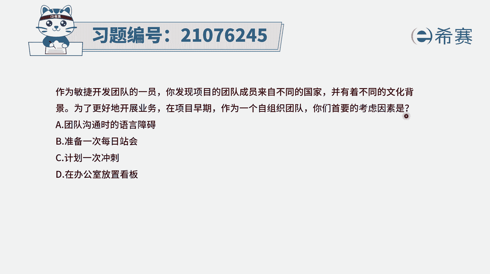
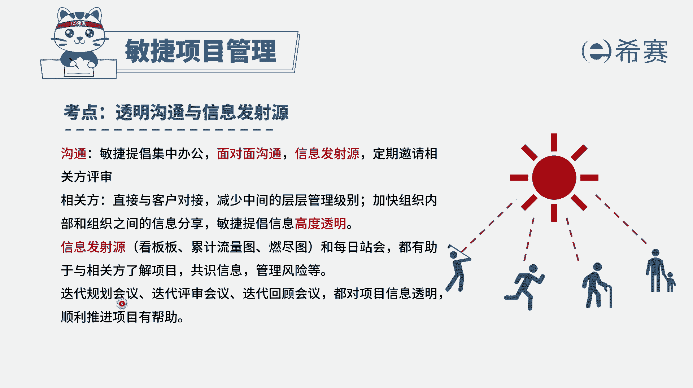
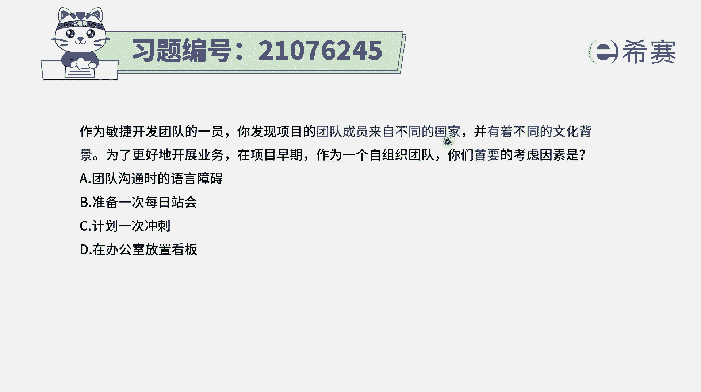
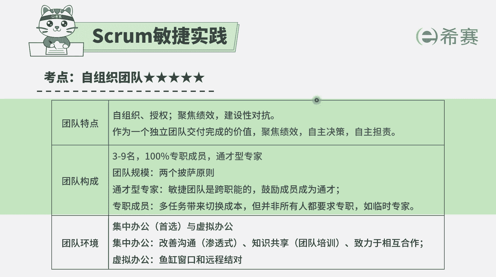
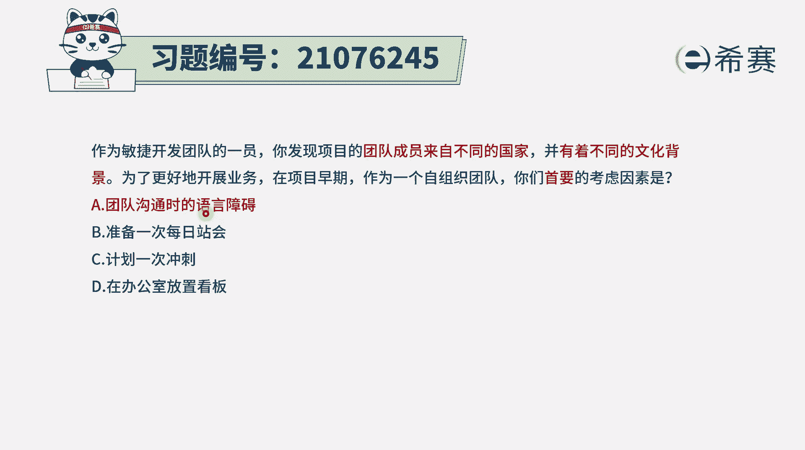
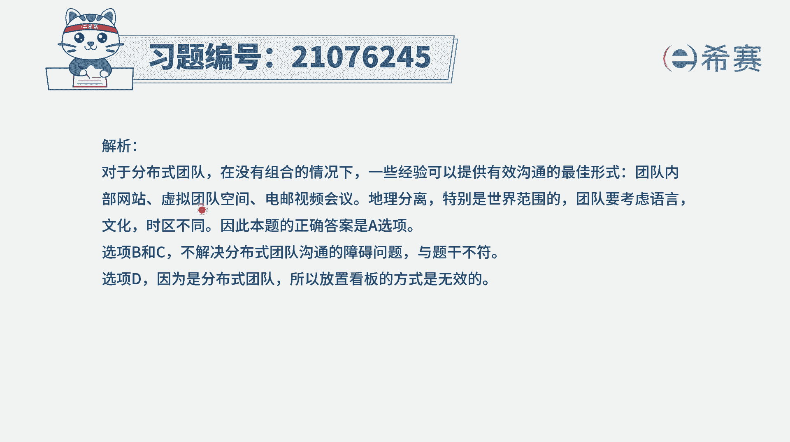

# 24年PMP敏捷-100道零基础付费pmp敏捷模拟题免费观看（答案加解析） - P4：4 - 冬x溪 - BV1Zo4y1G7UP

作为敏捷开发团队的一员，你发现项目的团队成员是来自于不同的国家，有着不同的文化背景，为了更好的开展业务，在项目早期作为一个自组织团队，那首要考虑的因素是什么啊，这里面其实有一个很重要的点是什么呢。

就是当大家来自于不同的国家，那有不同的这样一些文化背景的时候，沟通上面多多少少会存在一些障碍。

而在敏捷中非常强调关于沟通，敏捷会希望是呃，首先第一个是提倡这种集中办公的方式，能够面对面的沟通，说最高效的沟通方式是面对面，另外呢敏捷中他会提倡的是，团队成员之间沟通是高度透明的，也说是信息透明。

而怎么样去做到信息透明，包括像信息发射源啊，然后还有一种各种这种迭代规划会议。

迭代评审会议等等，那在这个题干中，他重点考虑的其实就是有不同的文化背景，来自不同国家，他们可能沟通会有障碍，我们怎么样才能够去让大家沟通，能够达到这种一致的效果，所以有了这个信息以后。

我们来看一下四个选项，选项a团队沟通时候的语言障碍，那这可能就会是其中的之一，因为是来自于不同的国家，难道是要把这样一个信息同步出去，就开会，它只是一种形式，而目的是要去通过这种沟通的方式。

来做信息同步，所以它不会是一个重要的选项，选项c计划一次冲刺，就冲刺肯定是要去做的，就是只要是自组织团队，都需要有冲刺选项，d在办公室放置看板，放置看板可以放，关键是大家是否能够看得懂来自不同的国家。

所以这个题目中。

他其实重点关注是在沟通这一块可能有难度，所以答案呢是选a选项。

就是我们作为一个来自不同国家，和不同文化背景的这样一个团队的话，你要首先考虑的就是大家的这种沟通障碍，包括语言的障碍呀，也包括这种文化的这种障碍呀等这样一些东西，但是我们会希望是能够比较友好的。

去往前推进这些项目。

