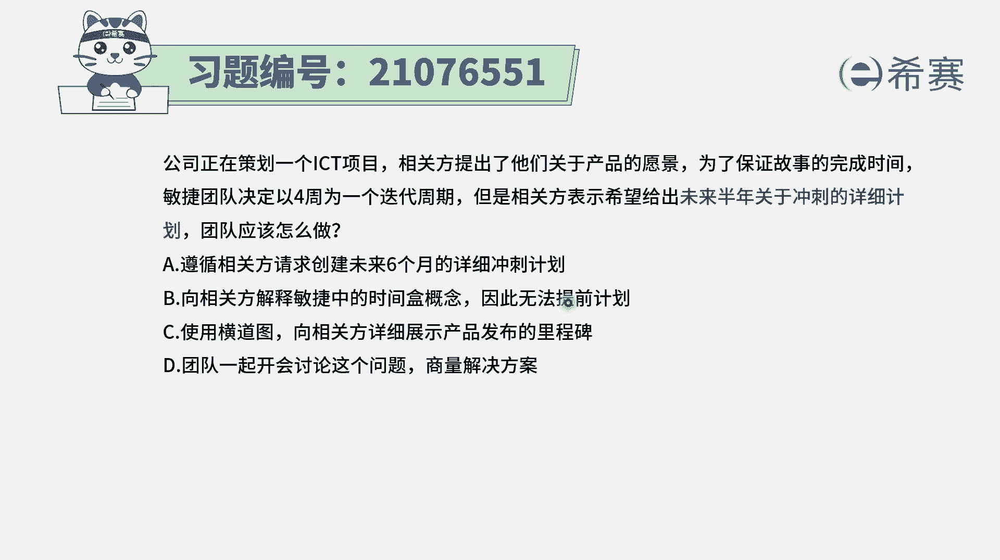
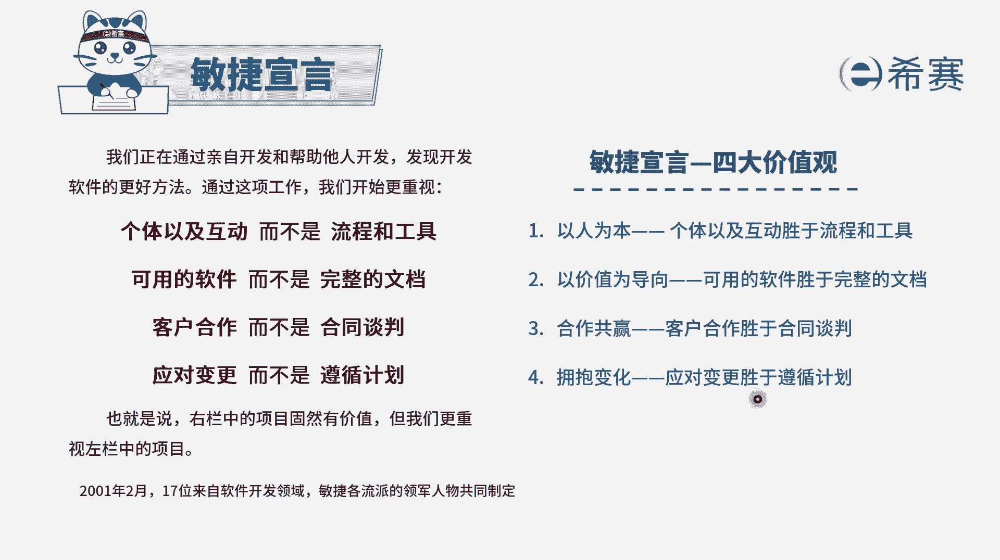
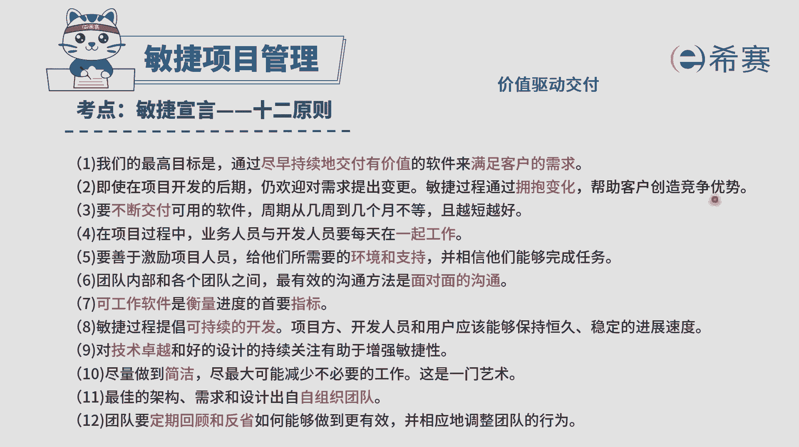
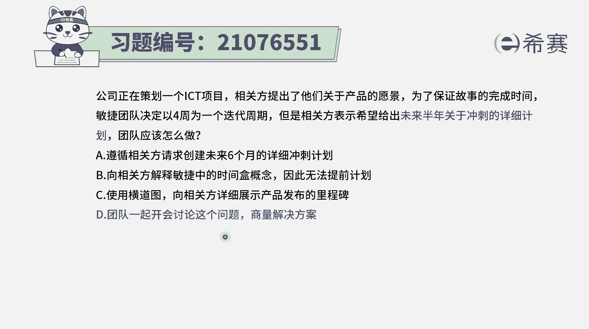

# 24年PMP敏捷-100道零基础付费pmp敏捷模拟题免费观看（答案加解析） - P50：50 - 冬x溪 - BV1Zo4y1G7UP

公司正在策划1个ICT项目。相关方提出了他们关于产品的愿景。为了保证故事的完成时间，敏捷团队决定以四周为一个迭代周期，但是相关方表示希望给出未来半年关于冲刺的详细计划。那团队应该怎么做。

请注意本身这个项目呢，它是一个敏捷性的项目，然后我们也已经是计划按照四周为一个迭代周期来进行。但是相关方他希望能够给出半年的这样详细计划。我们知道敏捷中，它其实有个什么样的特点，它就是在拥抱变化呀。

就是可能不断的会有很多变更请求的产生。如果都没有什么变化的话，那就用结构化的方式来去管理就好了，就用瀑布模型来去管理就好了。这种方式呢还更加简单，并且所有的东西都是在掌控之中。

而题干中告诉我们之所以用敏捷，那一定是会有很多变化，所以能不能做出这一个关于半年的详细的冲刺计划，几乎是不可能。有了这一个基本信息以后，我们再来看一下这四个选项。

选项A遵循相关方他请求的未来创建6个月的详细计划，这个肯肯定是不合适的啊。因为你做不出来的，本身敏捷中它有会大量的变化。那你做的是无用功。选项B向相关方解释敏捷中的时间和的概念，因此无法提前计划。

请注意是因为时间和的概念，所以无法计划吗？不是啊，其实是因为变化的原因，就是整个在敏捷中呢会有一条说是我们会开始更重视应对变更，而不是遵循计划，会说是应对变更更胜过了遵循计划。

敏捷它这样一个价值观就是拥抱变化，并且呢在敏捷的12原则中有这样一条说即使在开发的后期仍然欢迎对需求提出变更。敏捷通过拥抱变化来帮助客户创造竞争优势，说以他一直在提倡什么？一直在提倡关于变化这个事情。

B选项中说是因为时间和的概念无法计划。不是的啊，其实是因为有大量变更，所以才无法计划的，所以B选项也是错误。选项C使用横道图向。😊。

等相关方详细展示产品发布的里程碑。那横道图首先你得要知道一下，横道图是用来干什么的那它通常就是一个很详细的进度计划。那它其实就跟那个A选项其实又回到一个事情上去。而我们现在是做不了的。所以只能是告诉他。

我们在敏捷的这种方式没有办法用这种方式来进行。那以上三个学员都不能选，那就只能选D了，对吧？那我们来看一下D一选项，团队一起开会讨论这个问题，商量解决方案。哎，这是一个很其实怎么说呢？

他是一个万金油的一个选项，他没有给出具体的解决方案，但他会告诉你，我们团队可以一起来共同讨论这样一个问题。那这就是正确答案。因为其他三个都实在是没有办法选，只有他了，他实然没有给出真的具体方案是什么。

但是他会说到是我们一起来讨论。因为整个在敏捷中呢，我们的团队是一个自我组织做管理的团队。那遇到了问题，这个问题就是我们用敏捷的方式，对方却需要我们给出一个半年的详细计划。面对这样一个问题。

我们来一起讨论去解决答案选D啊。解析呢，大家可以自行查看。

