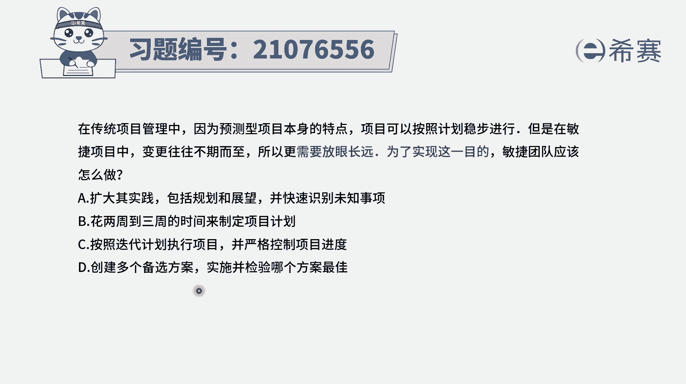
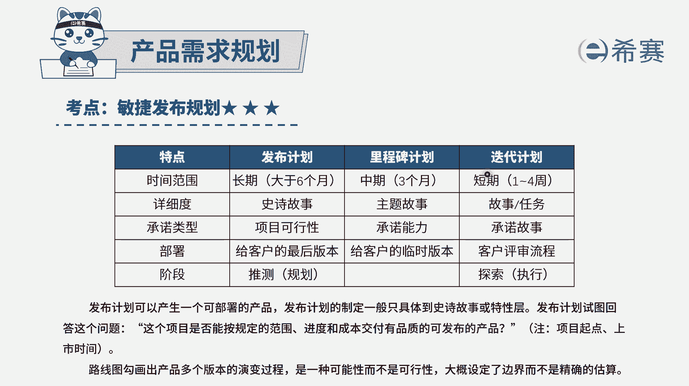
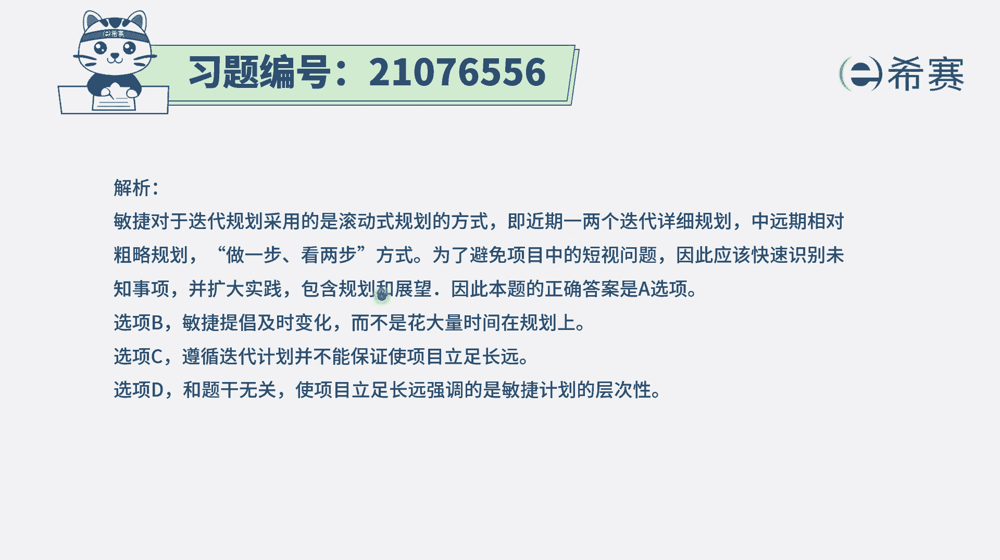
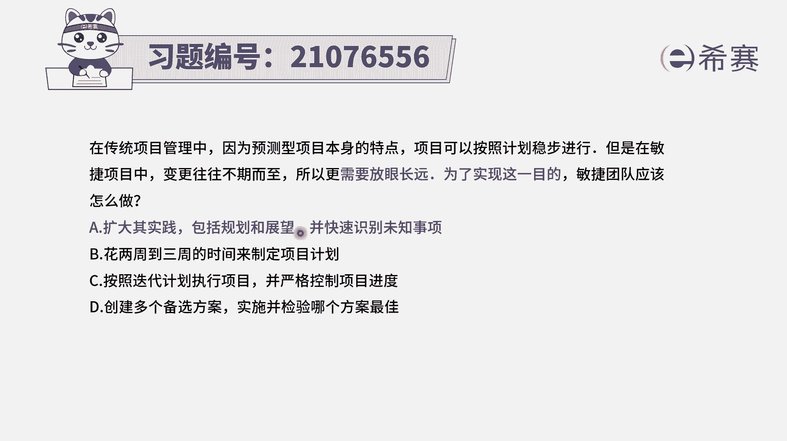

# 24年PMP敏捷-100道零基础付费pmp敏捷模拟题免费观看（答案加解析） - P53：53 - 冬x溪 - BV1Zo4y1G7UP

在传统项目管理中，因为预测型的项目本身的特点，项目可以按照计划来稳步进行，但是敏捷项目中变更往往不期而至，所以更需要放眼长远未来实现这一目标，敏捷团队应该怎么做。

那这个说法呢其实是一个非常概括的一个说法，就是在结构化项目管理中，我们会是按部就班的来去做事情，提前规划好以后，一步一步来进行，但是在敏捷里面本身就是拥抱变化的方式，只能是走一步看一步的这种方式。

那到底该怎么做呢，这个内容表大，所以我们要把四个选项都看完再说啊，选项a扩大，其实践包括规划和展望，并且是快速识别位置事项呃，这个说的也有道理，但是呢也不知道他到底是有多贴切，只能是说他没有错好。

我们看一下其他选项，选项b花两周到三周的时间来制定项目计划，你会发现这是什么情况，这就是用那种预测型的方式来管理项目，用那种传统的方式来管理项目的方式对吧，他就不符合这样一个敏捷的方式。

敏捷本身就是要拥抱变化，我们可能会有一个大的一个发布计划，然后在每一轮迭代中，还会有一个具体的建一个迭代计划，所以b选项是不符合敏捷啊，选项c按照迭代计划来执行项目，并严格控制项目进度。

你能严格控制项目进度吗，其实还是有难度的啊，另外呢关于值，就是按照这个迭代计划的这种方式来执行，它就是每一轮迭代，每一轮迭代它并没有讲到更大的，我们整个敏捷中其实还是有一个大方向的。

先有这样一个产品的愿景，就是客户的需求到底大方向是什么，得这个产品愿景，然后再去做出一个发布规划，然后再细分到每一轮迭代中，能增加迭代规划，所以这个选项呢就是显得格局小了，选项d创建多个备选方案。

实施并检验哪一个方案是最佳的，在敏捷中，它并不是这种方式来搞事情的，它是过程中随时都有可能会发生变化，所以才会叫拥抱变化，而不是提前，我做了几个方案以后，有一个方案就是可行的，一直走一条一条路走到底。

那这一条路走到底，他跟我前面在这里的，说是做一个三周的时间来做一个计划，有什么差别呢，没有什么本质差别啊，它是不对的，所以这样看下来的话，b c都不太合适，那就只有a选项了。

而实际上这里的这个知识点内容呢。

就是我们需要去知道在做敏捷的时候呢，首先是有一个大的一个产品愿景，然后基于这个产品愿景，我们会做一个发布规划，这个发布规划中会列出大方向来讲，我们需要去搞什么事情，然后有了这些发布规划以后呢。

我们做的时候其实也是铁头且看每一轮迭代，就每一个小的一个周期，我们也会是在周期开始的时候才明确，我们这一轮迭代到底要做什么东西，都是走着走着往前看的这样一个方式。

所以这个什么答案只有a选项是合适，虽然说它其实你也没有觉得，这个句子有多么的贴切，但确确实实是我们需要有一个大的规划和展望，但是呢要快速去识别未知事项，就每一个过程中。

每一个迭代中又会有一些新的东西进来，我们要去识别，并且是要去考虑要放到这一轮迭代里面吗。

这样的，那解析呢，在这边需要的同学可以自己查看一下关键词，就是要走一步看一步。

