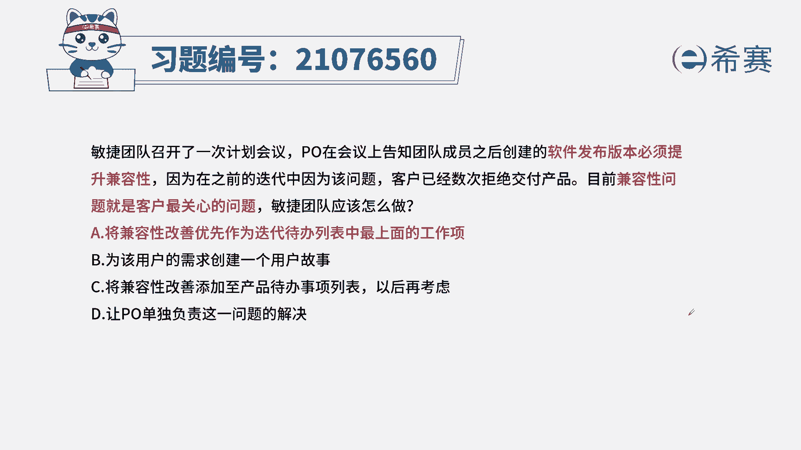
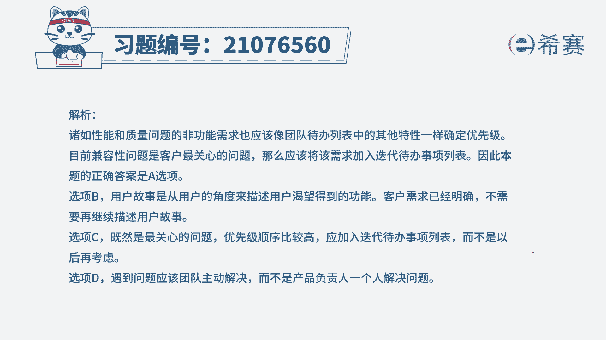
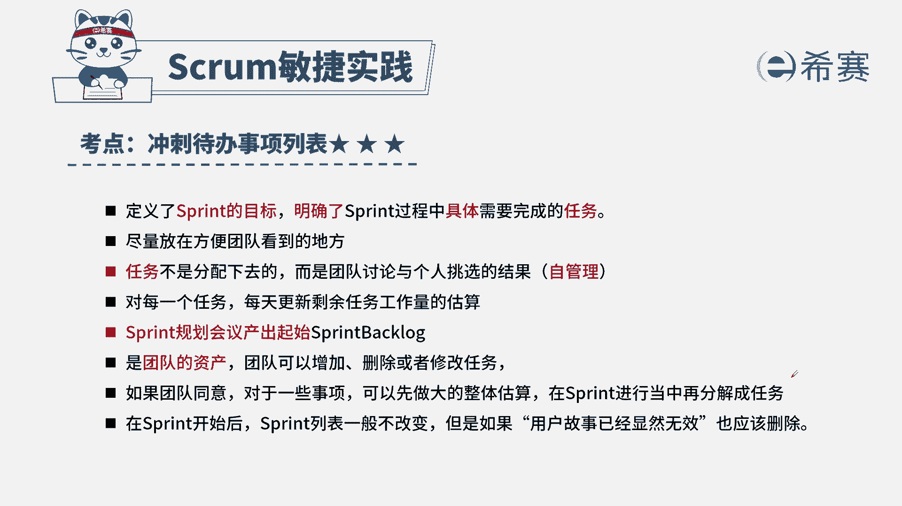

# 24年PMP敏捷-100道零基础付费pmp敏捷模拟题免费观看（答案加解析） - P55：55 - 冬x溪 - BV1Zo4y1G7UP

敏捷团队召开了一次计划会议，po在会议上告知团队成员，之后创建的软件发布版本必须提升兼容性，因为在之前的迭代中，因为此问题客户已经数次拒绝交付产品，目前兼容性问题是客户最关心的问题，敏捷团队应该怎么做。

a将兼容性改善优先作为迭代待办事项列表上，最上面的工作项，b为该用户的需求创建一个用户故事，c，将兼容性改善添加到产品待办事项列表以后，再考虑，d让po单独负责这个问题的解决，本题的考法是最佳实践。

通过题干找到关键信息，题干告诉我们，我们有一个新需求叫提升软件的兼容性，它是我们客户最关心的问题，代表着他对客户来说价值是最高的，既然价值最高的，我们的优先级一定是最高的，好我们来看一下四个选项，a。

将我们的优先级调整到迭代代办事项，列表上的最上面，我们提前告诉我们是计划会议，也就是我们在讨论本次迭代要做哪些事情，而这个时候的需求来了，那很明显，要确定，我们一定是将兼容性问题作为高优先级。

纳入到本次迭代中啊，所以a比较符合我们刚才的分析，b为该用户的需求创建一个用户故事啊，此项描述也没有问题，但是不如a更贴合题意，c，将兼容性改善，放到我们的产品待办事项列表中以后再考虑。

题干中已经告诉我们是最关心的问题，那它的优先级一定是最高的，你以后再考虑就不符合我们的提议了，d让po单独负责这个问题，这本来是我们团队一个技术问题，他已经作为一个工作项放进来了。

而且po已经告诉我们优先级是最高的，那这种时候就没有必要再让po再去单独处理了，所以正确选项是a选项。

这是本题的解析，大家可以暂停看一下。

这是本题的相关知识点，针对于这个知识点，我们一定要结合另外一个叫做产品代办，时尚列表，这两个知识点我们一起去记忆，首先我们要知道这两个表谁负责，第二这两个表里的特点是什么，这样一来针对此类型的题目。

