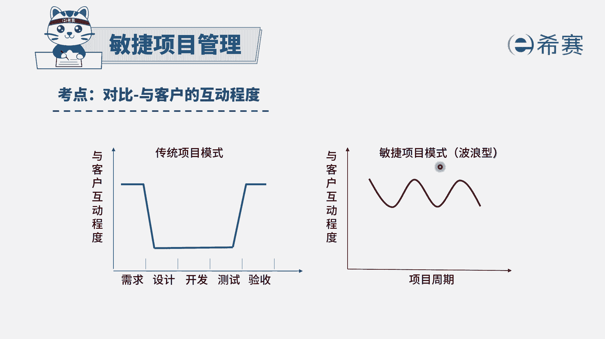
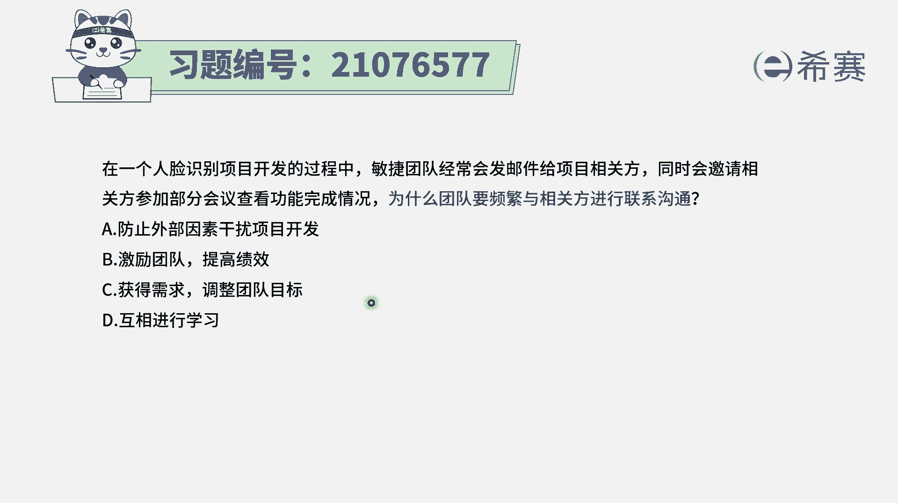
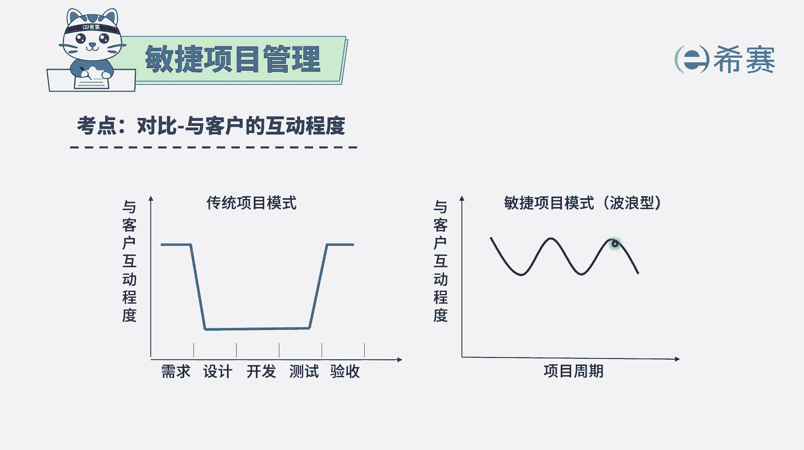
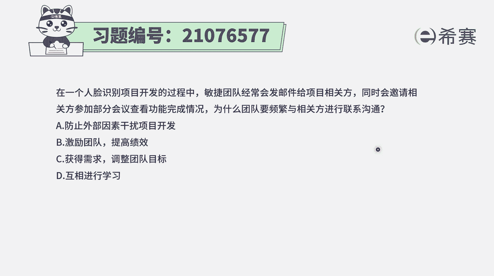
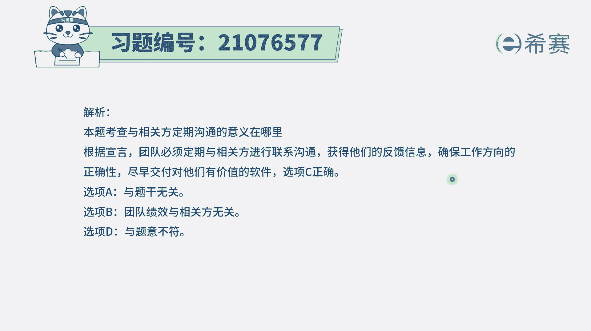

# 24年PMP敏捷-100道零基础付费pmp敏捷模拟题免费观看（答案加解析） - P57：57 - 冬x溪 - BV1Zo4y1G7UP

在一个人脸识别项目的开发过程中，敏捷团队经常会发邮件给项目相关方，同时会邀请相关方参加部分会议，来查看功能的完成情况，为什么团队要频繁地与相关方来进行这种联系，沟通呢，有什么好处呢。

那我们需要知道一个非常重要的信息。

就是通常情况下在传统的方式中做项目的话呢，我们跟他的沟通比较少，那一般是等到最后交付，最后验收的时候才能获取到的反馈，但如果我们做的过程中有一些问题，那不能够得到及时的反馈，而用敏捷的方式是快速交付。

然后快速获取反馈，然后下一轮去修改，然后改了以后再交付，再获取反馈，来得到客户真正想要的东西。

我们来看一下四个选项，选项a我们之所以这种频繁的沟通，是为了防止外部因素来干扰项目开发，好像没有什么风马牛不相及，对不对，选项b激励团队提高绩效，这个不是啊，选项c获取需求，调整团队目标。

这才是最重要的，这就是我们会通过这种频繁交流，频繁互动的方式来了解客户的反馈，了解客户的真实需求，并且我们会根据它的这样一些反馈信息，来知道我们应该怎么样去调整我们要做的事情。

这个其实也就是所谓的要调整项目的目标，然后以及调整我们的行动的方式，所以这个c选项呢就是一个正确答案了。

它就符合这种频繁交互，通过这种频繁交互去了解客户的真实需求，从而能够有的放矢去做出，最终他想要的东西出来。

所以答案是选c啊，而最后一个选项说相互进行学习，这不是重点啊，重点是去了解客户的需求，去获取这个反馈信息，从而去调整。

能够去做出一个满足他需求的东西出来。

