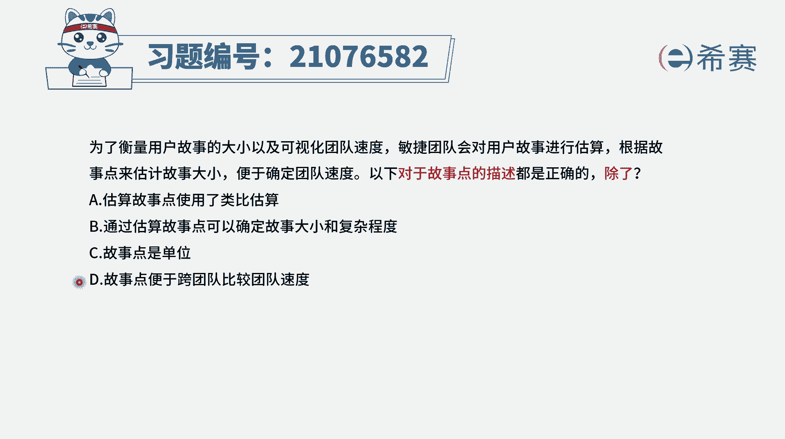
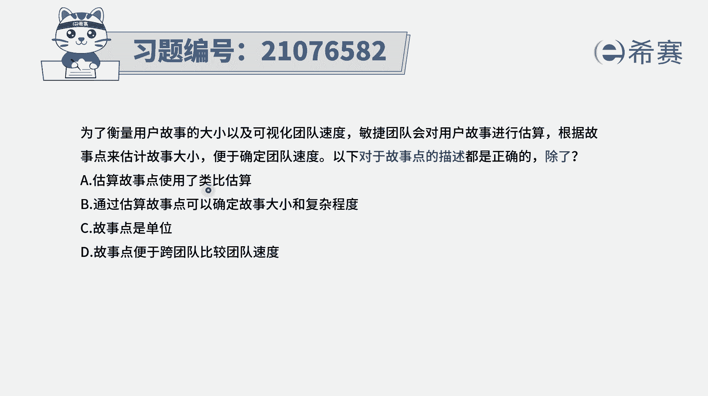
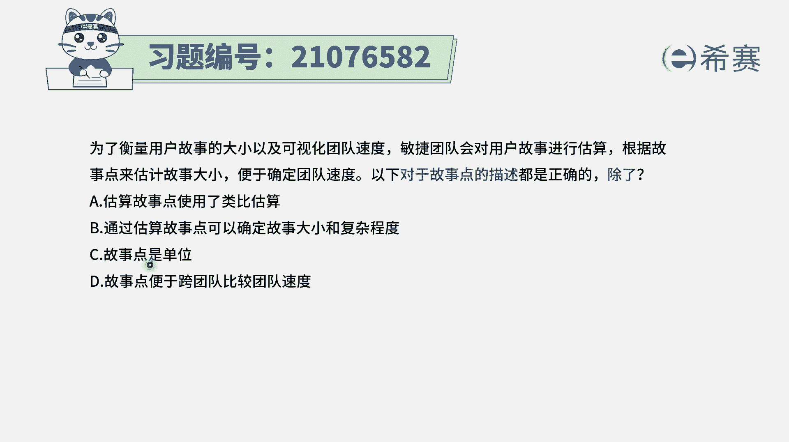
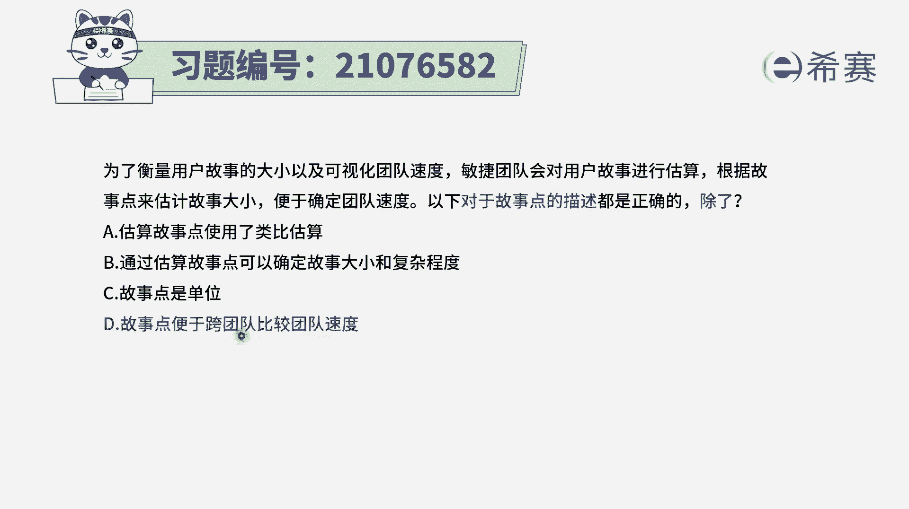
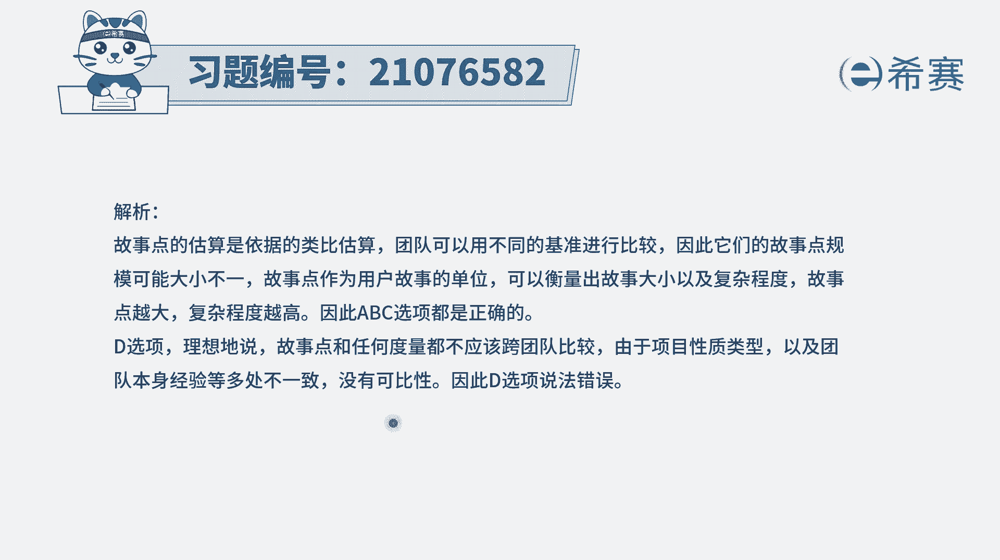

# 24年PMP敏捷-100道零基础付费pmp敏捷模拟题免费观看（答案加解析） - P59：59 - 冬x溪 - BV1Zo4y1G7UP

为了衡量用户故事的大小以及可视化团队速度，敏捷团队会对用户故事进行估算，根据用户故事的点数来估算故事大小，以便于确定团队速度，那么以下关于故事点的描述都是正确的，除了一条，也就是说有三句是正确。

有一句关于故事点的描述是不正确，我们把四句都读完了，选项a估算故事点，使用了类比估算，这个好像不知道正确还是不正确，好像正确又好像不正确，选项b通过估算故事点，可以确定故事大小和复杂程度。

这句话其实有点好像是反过来了，但他这样说也是也可以说得通，选项c故事点是单位，也是我们的估算单位，我们以故事点作为一个基本单位来去看选项，d故事点便于跨团队比较团队速度，诶这一句呢是一个明显的错误选项。

所以这个题目的答案就是选它，为什么呢，因为在敏捷中，我们会强调的是故事是一种相对估值。

也就是说，我们会拎出这个项目中的其中某一个故事点，最小类故事点作为一个参考值，然后基于这样一个参考值，我们去类比，就来去算算其他的故事，比方说我们以装修房子为例，那装修房子的时候呢。

我们拿这样一个个入户花园，或者说一个阳光房来作为一个参考值，因为它是相对来讲装修起来最为简单省事的，拉它作为一个工作量的负债程度为一，那其他的部分分别是多少呢，就拿其他部分来跟这个那个阳光房来进行。

比较的方式，所以他这个估算它是一种相对的估算，并且呢是一个比较的方式来估算，那就刚好是符合了这一条。

符合了这一条，可以算得上是也用到了类比估算的方式呃。

并且呢一般来讲估算的时候，其实我们的这种估算会基于这些用户故事，它本身的规模大小，复杂程度和不确定性的多和少来去估算，那反过来估算值也反向。

能够大概知道一下它的间歇复杂程度啊，故事大小完，所以这个选项也是更正确的，而我们用故事点出来都做单位也是正确的，所以这个题目答案呢只有最后一个。

你需要知道是这个项目，它是以自己的其中的一部分作为一个参考值，作为一来去做估算，那另外一个项目呢。

他会用他自己的某一个用户故事，最小的用户故事作为一来进行估算，那我的这个一和你那个项目的一，他就不一定是同一个一，他们就没有可比较性，所以整个在敏捷中说，这个团队，他每一个迭代周期做了多少个用户故事。

我们那个团队，他每一个迭代周期做了多少个用户故事点数啊，所以我们比他们快，他们比我慢，这种方式是不正确的，没有可比较性，所以你以后你要记得是没有可必要性啊，答案是选这个，这是错误选项。

所以选它那解析。

