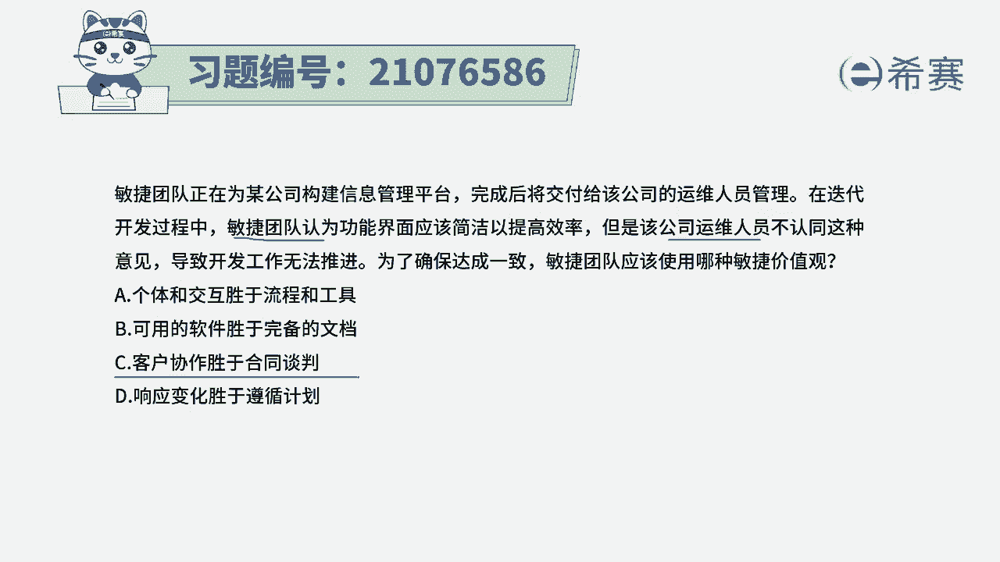
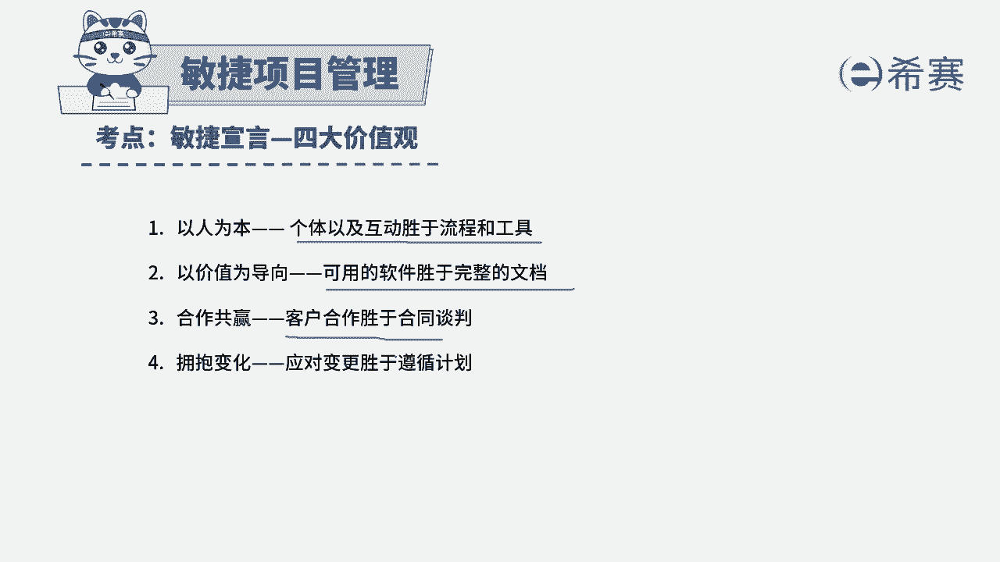
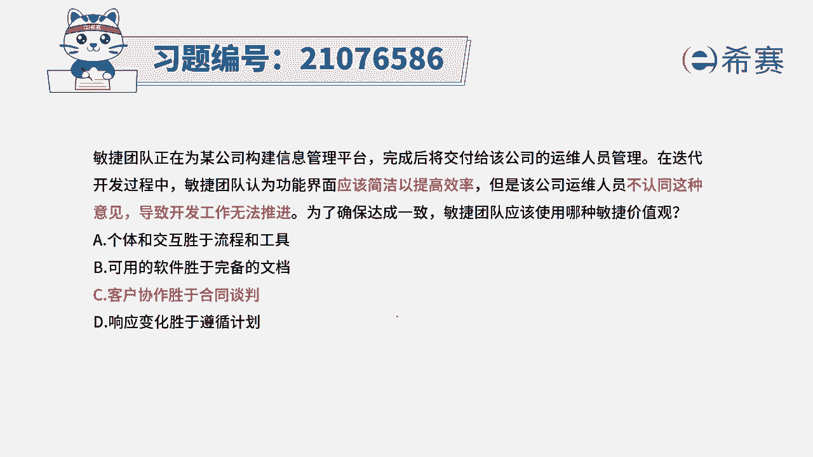
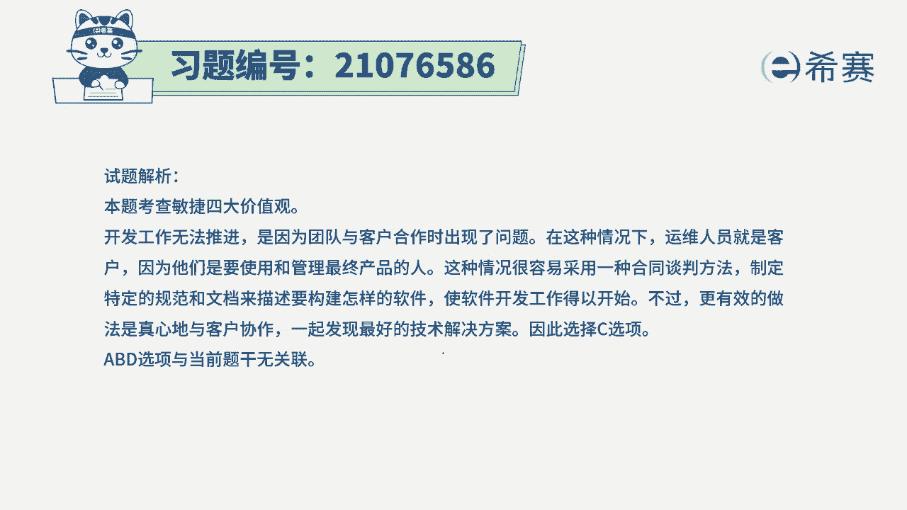

# 24年PMP敏捷-100道零基础付费pmp敏捷模拟题免费观看（答案加解析） - P61：61 - 冬x溪 - BV1Zo4y1G7UP

敏捷团队正在为某公司构建信息管理平台，完成后将交付给该公司的运维人员进行管理，在迭代开发过程中，敏捷团队认为功能界面应该简洁以提高效率，但是该公司的运维人员不认同这种意见，导致开发工作无法推进。

为了确保达成一致，敏捷团队应该使用哪一种价值观，我们来看一下四个选项，选项a个体和互动胜过了流程和工具，那这里会涉及到具体的一些流程和方法，以及人和人的互动吗，好像没有太涉及到关于流程的事情。

所以这个应该是不选的，选项b可用的软件生活完备的文档，这里面会重点强调关于软件文档这些事情吗，好像也没有，它更主要的是什么，是我们公司的人员和运维的人员，然后产生了一些意见不一致。

选项c客户协作胜过了合同谈判，那就是我们在意见不一致的情况下，我们其实是要去沟通商量着来进行，这一条是使用的想象力，响应变化胜过遵循计划，这里没有说到关于原计划是什么样的，现在是什么样的。

所以这个题目答案是选c选项啊，就是敏捷宣言的建议，四大价值观其实也就是我们的敏捷思宣言，关于个体互动胜过的流程工具，可以用的软件胜过完整的文档，客户合作胜过合同谈判以及应对变更。

胜过了遵循计划，而题干中所列的这样一些信息，其实是甲方和乙方之间产生了分歧，那有分歧的时候呢，我们应该是来去合作解决问题。

