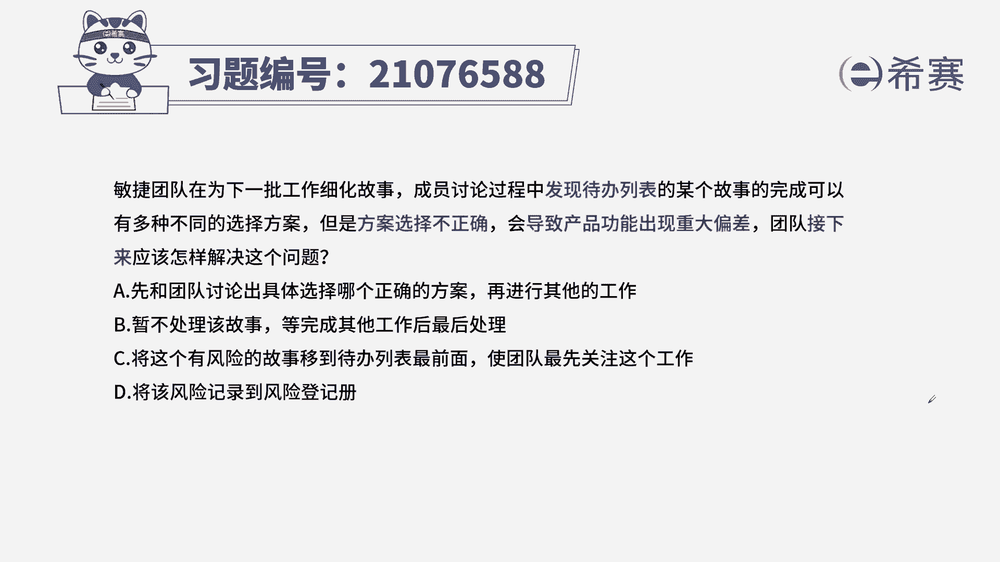
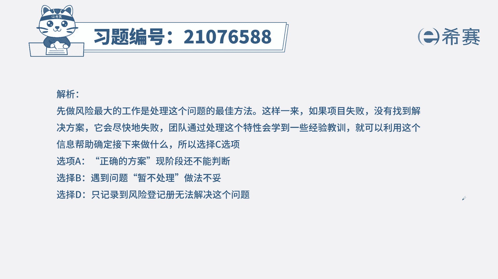
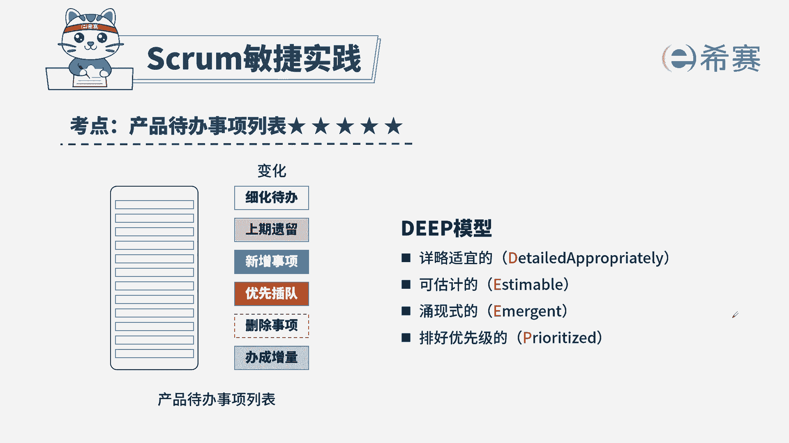

# 24年PMP敏捷-100道零基础付费pmp敏捷模拟题免费观看（答案加解析） - P63：63 - 冬x溪 - BV1Zo4y1G7UP

敏捷团队在为下一批工作细化故事，成员讨论过程中发现，待办列表中的某个故事完成，可能有多种不同的选择方案，但是方案选择不正确，会导致产品功能出现重大偏差，团队接下来应该怎么处理这个问题。

a先和团队讨论出具体选择哪个正确的方案，再进行其他工作，暂不处理该问题，等完成其他工作后最后处理，c将这个有风险的故事移到待办列表最前面，使团队最先关注这个工作，d将该风险进入到风险登记册。

本题考法最佳实践，首先通过题干找到关键信息，题干告诉我们，在我们的待办事项列表中有一个故事，它会影响到我们产品的功能，而且会出现重大偏差，所以它是一个高风险的节点，那针对于高风险的节点。

我们应该是先做还是后做呢，啊一定是先做，因为我们知道在待办列表中，我们的优先级是一方面按照价值排序，一方面按照风险排序好，我们题干中又看到了团队，接下来既然有接下来啊，或者以后题目中会看到。

首先其次紧接着这些，那基本上代表着我们的选项，会出现先后顺序之分，好我们来看一下四个选项，a和团队讨论出具体的哪个正确的方案，再进行其他工作，而这种表述现在也判断不准，我们先放这儿，b站不处理该故事。

等完成其他工作以后再处理，那肯定不会，为什么，因为题干中告诉我们它是一个高风险的工作，因为会影响到其他的工作啊，所以b项不对，c将这个风险故事移到最前面，让团队最先关注，其实这句话的意思就是告诉我们。

它的优先级放到最高先做，这样就不会出现大的风险问题了，好c描述没有问题，我们来看d将风险进入到风险登记册，题干中问的是如何解决，你光记录是解决不了这个问题的啊，所以d不选，我们来区分一下a和c，c表述。

先把优先级调到最高，再根据优先级确定后续的工作，而a呢是直接进行了具体的操作，所以c比a更合适，而且更符合接下来这个词。

所以最佳实践的选项是c选项，这是本题的解析。

大家可以暂停看一下本题的相关知识点，产品待办事项列表，针对这个知识点，我们一定要知道谁负责他这个表的特点是什么，同时我们再要熟悉一下迭代代办时尚列表，这两个知识点同时进行记忆。

这样针对此类型的题目。