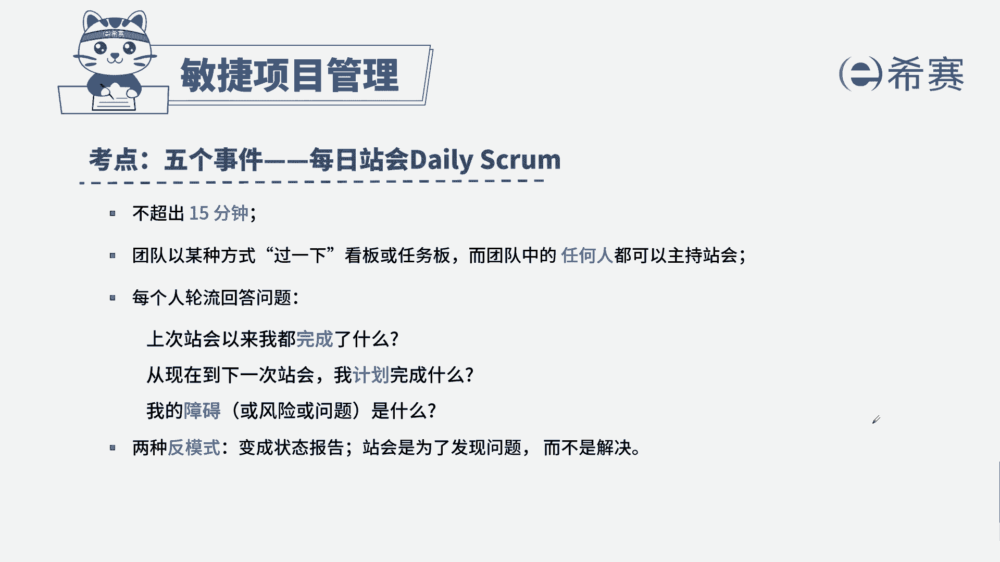

# 24年PMP敏捷-100道零基础付费pmp敏捷模拟题免费观看（答案加解析） - P6：6 - 冬x溪 - BV1Zo4y1G7UP

某团队正在进行一个开发项目，致力满足相关方对产品的需求，一位新加入敏捷团队的团队成员，不明白为什么要开美食展会，团队应该怎么回答，a敏捷教练可以为团队提供指导帮助，b产品负责人可以安排团队工作。

c团队可以讨论问题的解决方案，d团队可以提出问题，实现问题可视化，解题思路，首先通过题干找到关键信息，题干告诉我们新加入了一位成员，为什么要开它，我们是为了避免信息孤岛，帮助我们团队之间进行协调。

工作的这么一个会议，那他如何去开呢，先做了什么，接着要做什么，以及我们遇到了什么呢问题，所以我们选择正确答案d团队可以提出问题，实现问题可视化，我们来看一下其他三个选项，a敏捷教练可以指导团队提供帮助。

a选项的表述是没有问题的，b产品负责人可以安排团队工作，产品负责人不负责安排工作，因为我们团队是自组织团队，c团队可以讨论问题，解决方案，只是让信息同步，而不是为了讨论问题，如果说解决方案。

我们需要另起会议进行解决，这是本题的解析，大家可以暂停看一下。

