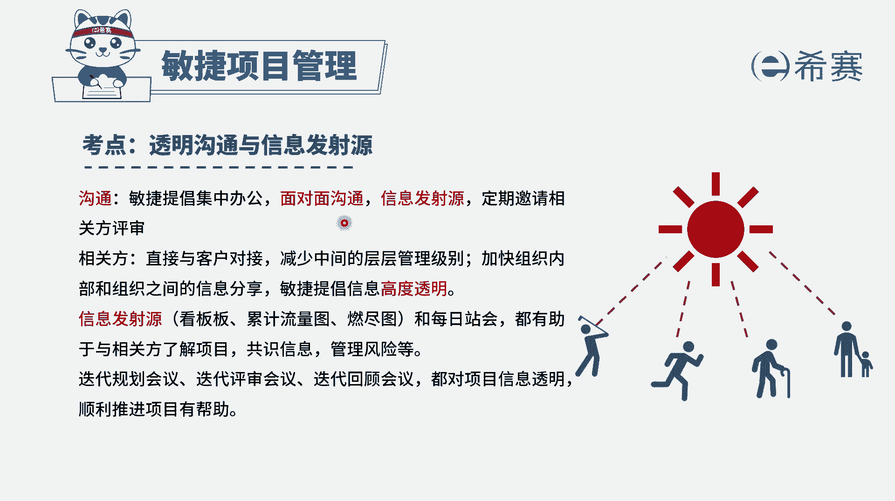
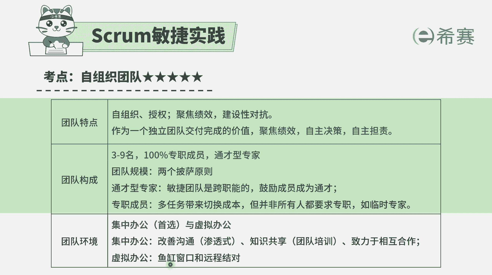
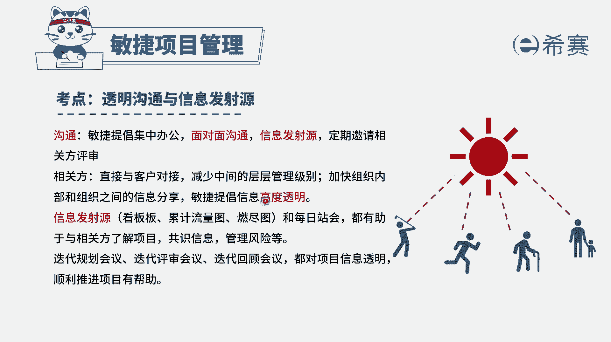
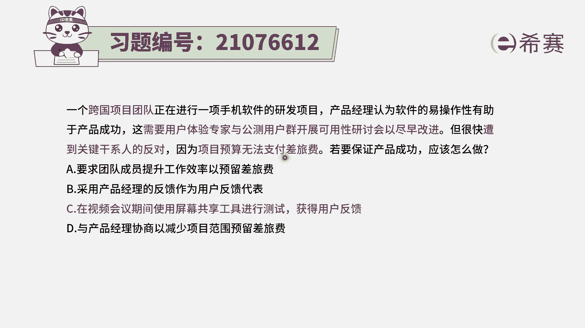
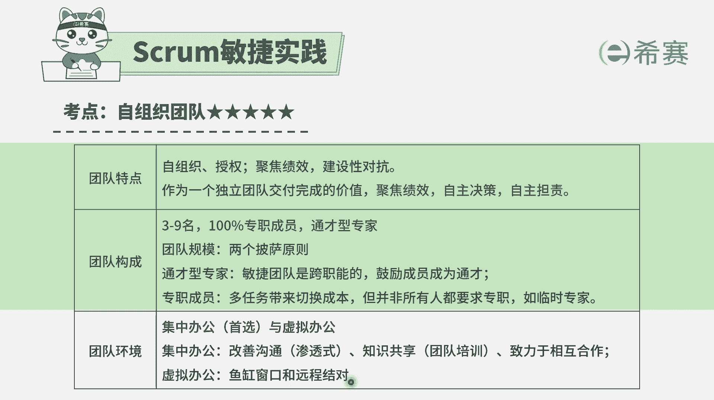
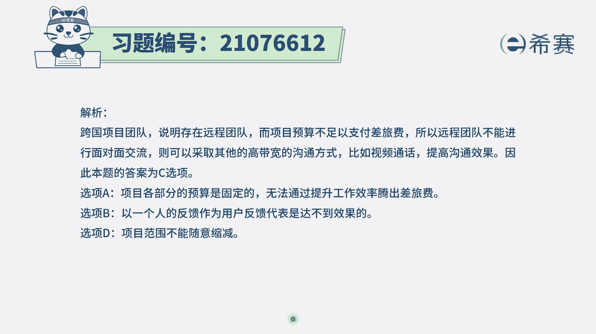

# 24年PMP敏捷-100道零基础付费pmp敏捷模拟题免费观看（答案加解析） - P70：70 - 冬x溪 - BV1Zo4y1G7UP

一个跨国项目团队，正在进行一项手机软件的研发项目，产品经理认为软件的易操作性有助于产品成功，这需要用户体验专家与公测用户群，开展可用性研讨会，以尽早改进，但很快遭到了关键干行人的反对。

因为项目预算无法支持差旅费，若要保证产品成功，应该怎么做，那题干中他首先这是一个跨国的项目团队，那么一定是有虚拟团队的这种方式，然后同时后面又告诉你有一些事情需要去做，但是做这个事情呢。

项目的预算又不够支付这样一个差旅费，那如果不够支付这一差旅费该怎么办呢，其实有一个很好的方式，那就是用虚拟团队的方式来去展开，高贷款的沟通，比方说视频会议的这种方式。

而整个在敏捷中其实会提倡的沟通，最好是能够面对面的沟通。

如果不能面对面，如果是虚拟团的方式呢，这里有个叫鱼缸窗口，远程结对它，其实鱼缸窗口也就是在线视频的方式，就是不断的去连上这个在线视频，能通过这种线上的视频。

来去加强这一沟通和协作，他也就满足了这种信息的透明。

而题目中又需要开这样一个研讨会，所以怎么办呢，那就是用这种线上虚拟会议的方式就比较好了，我们来看一下这四个选项，选项a要求团队成员提升工作效率，已预留出差旅费，你提升一点工作效率。

就能够把这个彩礼费给预留出来吗，通常情况下我们要做的事情，它对应的这一些工作预算，其实都已经比较确定的，所以很难说靠是提升这个光效率，来达到省出差旅费的这个情况，学校b采用产品经理的反馈。

来作为用户的反馈代表，那就是由产品经理这个角色来代表了，所有这些用户的反馈，那就既失去了用户反馈的价值所在，本来我们有很多个人，那么他可以十个人可以给十条反馈，20个人可以给20条反馈。

你现在只需要一个人去给，那可能很难代表大家，所以这个肯定是不合适的，学校，c，在视频会议期间使用屏幕共享工具来进行测试，获得用户反馈，那这种方式就是可行的方式，就是用这种线上的方式来完成这样一个研讨会。

需要去收集信息，所以这个选项是可选的选项，d与产品经理协商，以减少项目范围来预留，这肯定不合适啊，你说少做点事情呗，那这肯定是绝对不可以不允许的，所以这是错误选项，这个呢也是错误选项。

然后这个也是错误选项，只有c可选，所以答案是选c，就是当有跨国团队的时候，又无法支付这个差旅费用的时候，我们就用这种虚拟办公的方式，用这种视频会议期间用屏幕共享的方式。

也刚好就是满足了这样一个像鱼缸，窗口和远程结对的这种方式。

所以答案选c。

