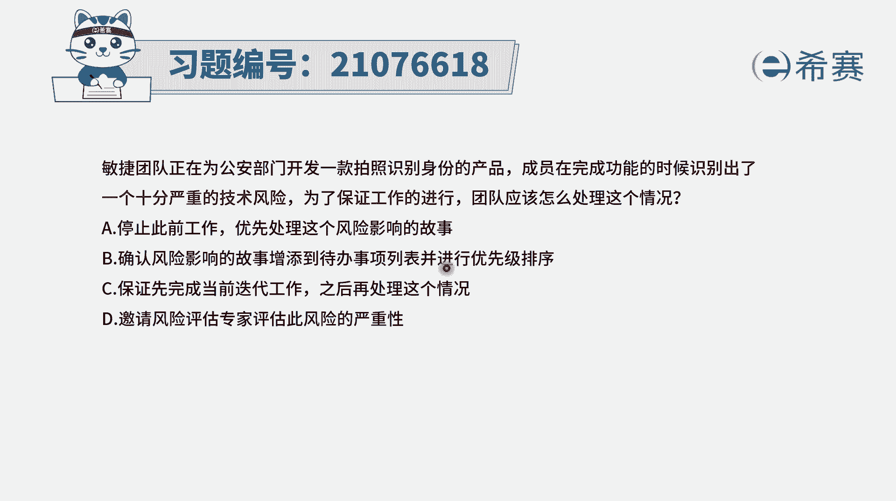
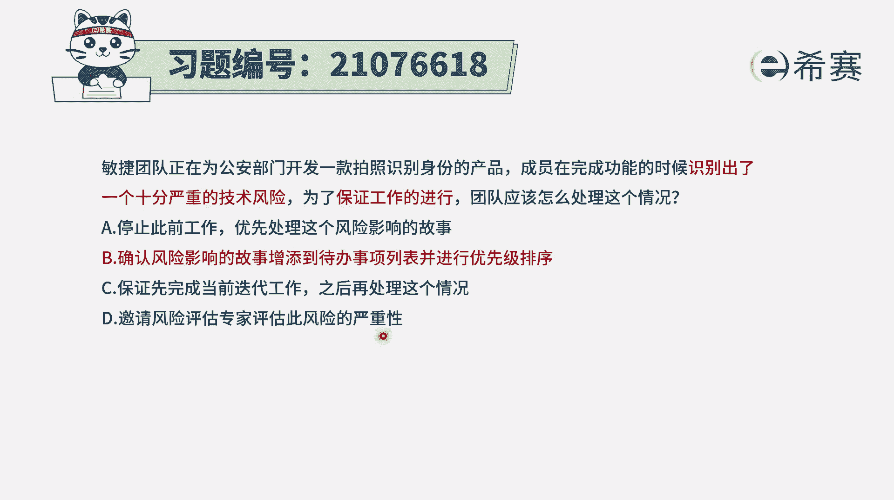
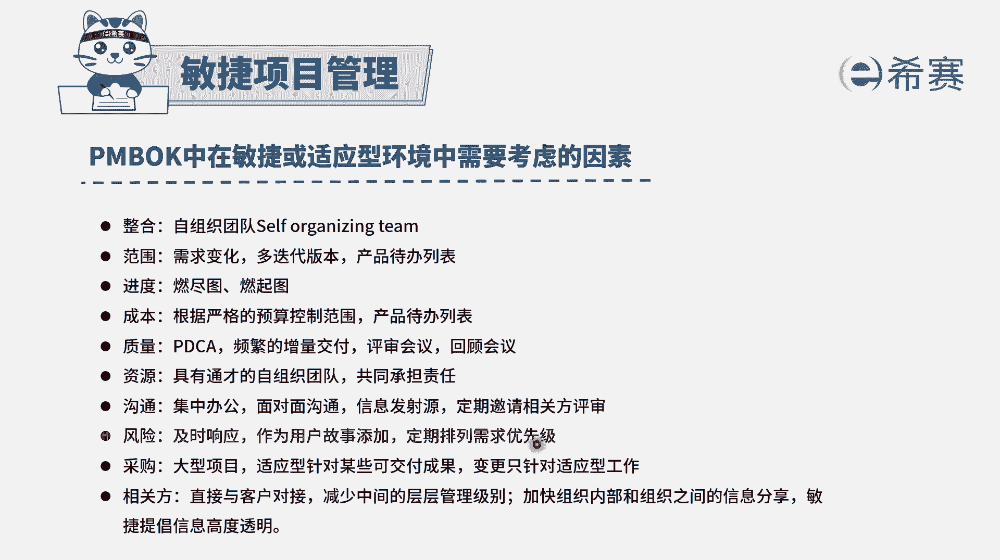
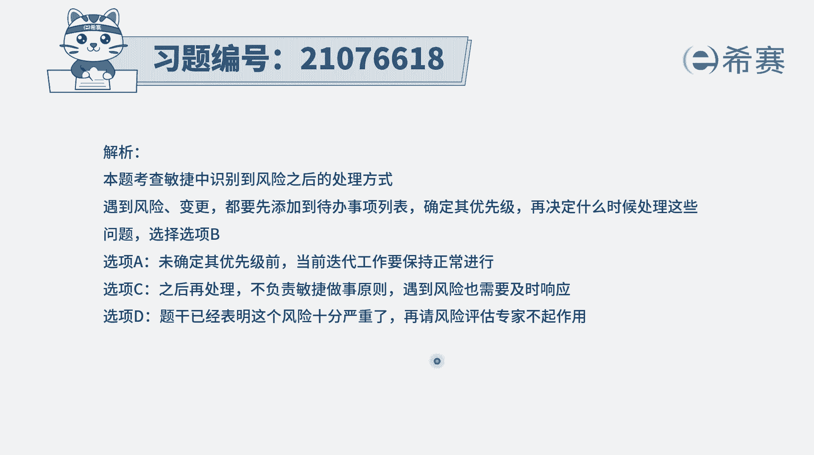

# 24年PMP敏捷-100道零基础付费pmp敏捷模拟题免费观看（答案加解析） - P72：72 - 冬x溪 - BV1Zo4y1G7UP

拍照识别身份的产品，曾经在完成功能时候，识别出了一项十分严重的技术风险，为了保证工作进行，团队应该怎么样去处理这样一个情况，其实这个内容呢你第一想到的应该是刺探，如果说没有刺探，然后再去看别的选项。

那我们来看一下四个选项，选项a停止此前的工作，优先处理这个风险影响的故事，那这种说法肯定是不正确的啊，我们好歹是有个团队呢，团队在做事情肯定不止做一个用户故事啊，是多个用户故事同步开展。

所以但凡这种因为某一个事情而停止整个工作，这都是错误选项，第二个确认风险影响的故事，添加到产品待办事项列表中来。

并进行优先级排序，而这个呢其实符合对于风险的一贯的做法，也就是说当产生风险的时候呢，我们是要去及时响应，尤其是风险比较大的时候呢，我们是单独为它添加这样一个用户故事，因为风险它是一个反价值。

我们的需求是正向价值，而风险的是一个反价值，那房价是它同样的，就是如果你不做，他就会产生损失，这就是叫反价值，它同样的是很重要的，我们是同样需要去处理，所以对于风险在民用。

一般是说可以把它作为一个用户故事添加进来，来进行优先级排序。

按照它的价值来排序啊，所以这个选项的这些可选项，事实上也是正确答案，因为这个题目中，它没有那个刺探的这一条好选项，c确保先完成当前迭代工作，然后再处理，这个就是已经是有点黄，花菜都凉了，万一选项d。

邀请风险评估专家来评估风险的严重性，而在敏捷中，最牛逼的架构需求设计是出自于自组织团队，所以大部分事情应该都是我们团队自己，优先去完成，在实在搞不定的时候再寻求外部的帮助，那你写的要去试一试，对不对。

敏捷他不是说要快，而是要去灵活灵活去应对，然后我们遇到事情的时候，我们去刺探去试一试啊，去用这种技术测试的方式，去快速试错的方式来去试一试。

但这里面没有刺探这个选项，就只有第二个选项，就刚好也是符合这个就对于风险，我们可以把它添加到这个用户故事里面来，然后并且对它的优先级进行排序。

答案选b。

