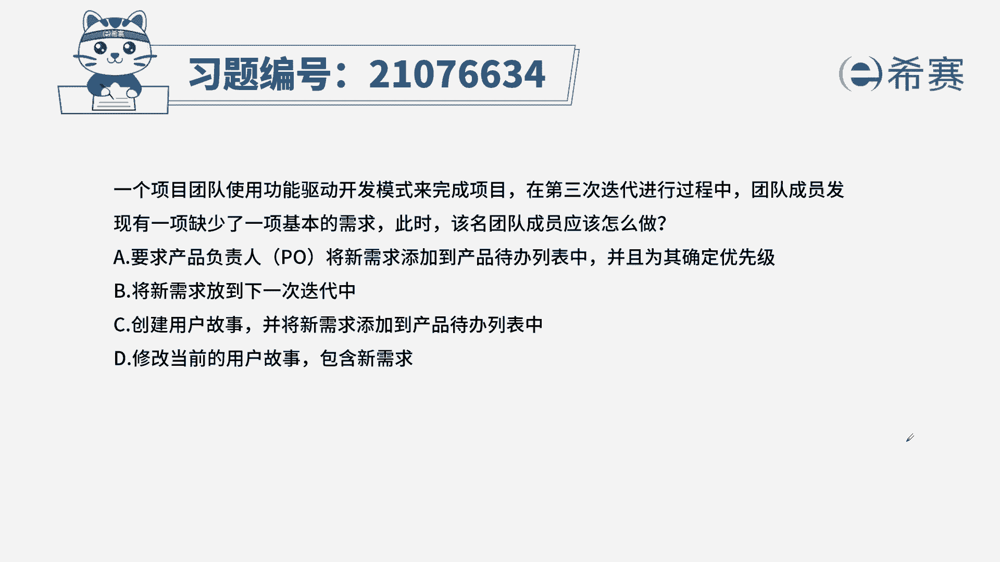
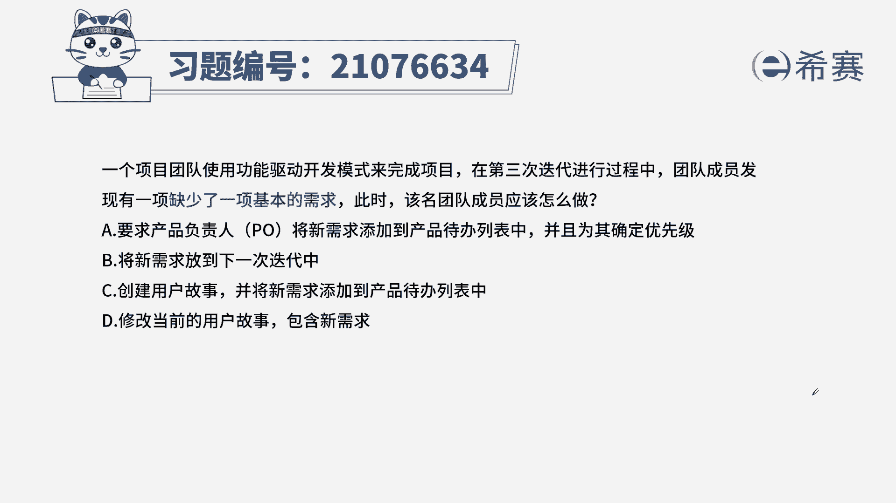
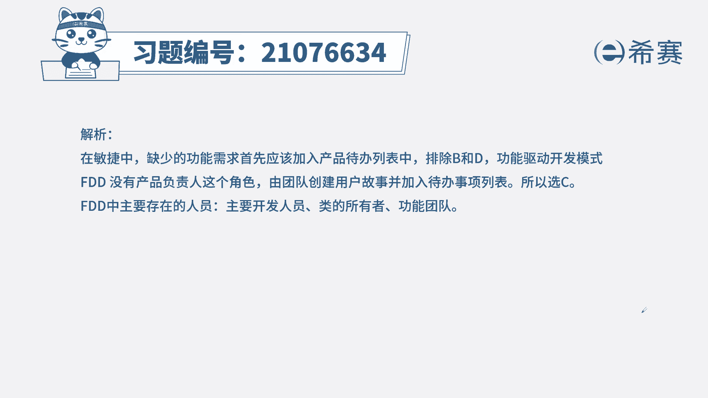
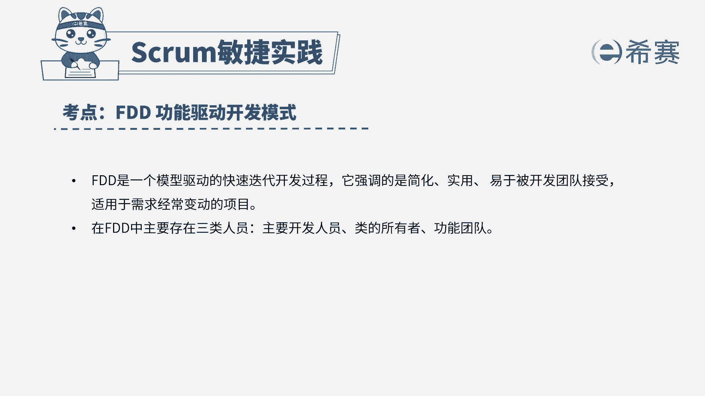

# 24年PMP敏捷-100道零基础付费pmp敏捷模拟题免费观看（答案加解析） - P75：75 - 冬x溪 - BV1Zo4y1G7UP

一个项目团队使用功能驱动开发模式来完成，项目，在第三次迭代进行的过程中。

团队成员发现有一项缺少了一个基本的需求，此时该名团队成员应该怎么做，a要求产品负责人，将新需求添加到产品待办列表中，并为其确定优先级，b将新需求放到下一次迭代中，c创建用户故事。

并将新需求添加到产品待办列表中，d修改当前的用户故事，包含新需求，本题的考法是考内容，考概念，首先通过题干找到关键信息，题干告诉我们少了一份需求，那肯定是把它放到我们的待办列表中，就可以了。

好我们来看选项，a要求产品负责人放到待办列表中，我们驱动开发模式里面，没有产品负责人这个角色，所以a不选，将新需求放到下次阶段，我们一定是先放到产品列表中，再确定是不是放到下次迭代中。

所以b这种操作前面还有步骤在这不合适，c创建用户故事，并将新需求添加到产品待办列表中，而c的描述符合我们刚才的分析，d修改当前的用户故事，包含新需求，我们少的需求放进去就可以了。

不需要修改当前的用户故事。

所以我们选出正确选项为c选项，这是本题的解析。

大家可以暂停看一下本题的相关知识点。

