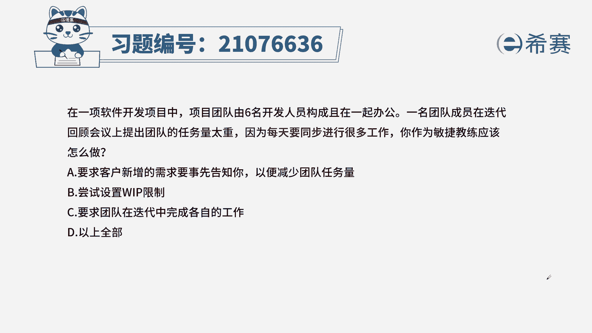
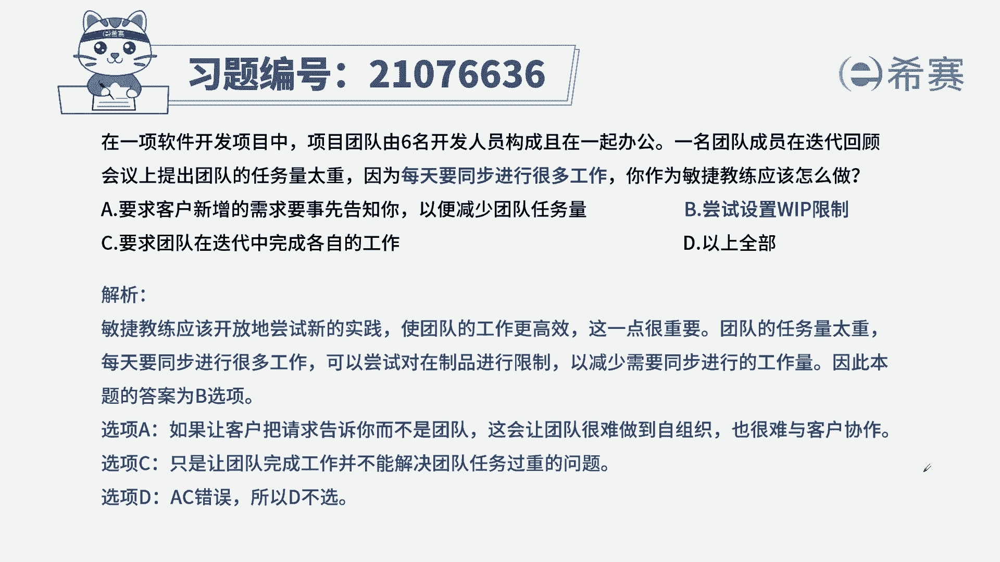
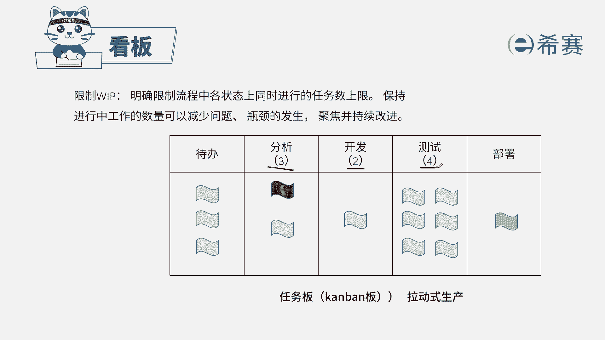

# 24年PMP敏捷-100道零基础付费pmp敏捷模拟题免费观看（答案加解析） - P77：77 - 冬x溪 - BV1Zo4y1G7UP

在一项软件开发项目中，项目团队由六名开发人员构成，贴在一起办公，一名团队成员在迭代回顾会议上提出了，团队的任务量太重，因为每天要同步进行很多工作，你作为敏捷教练应该怎么做。

a要求客户新增的需求要事先告知你，以便减少团队的任务量，b尝试设置在制品限制，c要求团队在迭代中完成各自的工作，d以上全部，本题的考法是最佳实践，首先通过题干找到关键信息，田荣说，团队成员的任务太重了。

原因在于每天同步进行的很多工作，换句话说任务太多卡住了，那既然卡住了，我们作为敏捷教练，需要告知团队，我们相应的工作要相对的减少一些，来看一下四个选项，a客户新增的需求要先告知敏捷教练。

作为敏捷教练的岗位，职责是不具体参与到团队工作中的，他只是帮助团队进行敏捷原则，所以需求的事情，应该是团队或者产品经理来负责，b尝试设置在制品限制，此项是我们看板的一个特性，限制在制品。

是为了帮助我们团队维持一个很好的状态，可持续的改进，减少问题的出现，防止出现瓶颈，所以和题干中表述的问题相似，也能解决我们提纲中说的问题，b尝试设置在制品限制，在制品限制就要想到看板。

而看板的在制品限制，是为了帮助团队维持一个很好的状态，减少问题的出现，防止瓶颈和我们刚才的分析是吻合的，c要求团队在迭代中完成各自的任务，c项内容代表着，我们每次迭代本身就是要完成的内容。

也无法解决题干中给出的情况，d项显然是有问题的，从而我们选出正确选项是b选项。

这是本题的解析。

大家可以暂停看一下，本题的相关知识点，看板看板的一个特性叫限制在制品，它的目的是为了帮助我们减少问题，从而让团队有一个可持续的一个状态，那这里的限制在制品，在我们看板上反映出来的是在这里。

这会标注一个数字，这个数字代表了我们本项任务的上限，只要不超过这个上限，我们的任务就可以可持续的去推进下去，所以称之为限制在制品，针对于此类型的知识点。

