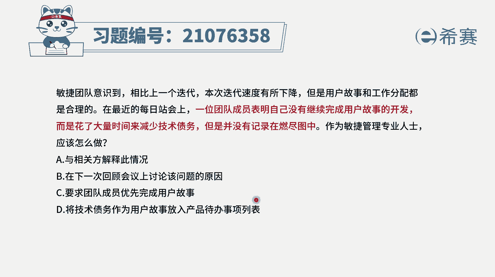
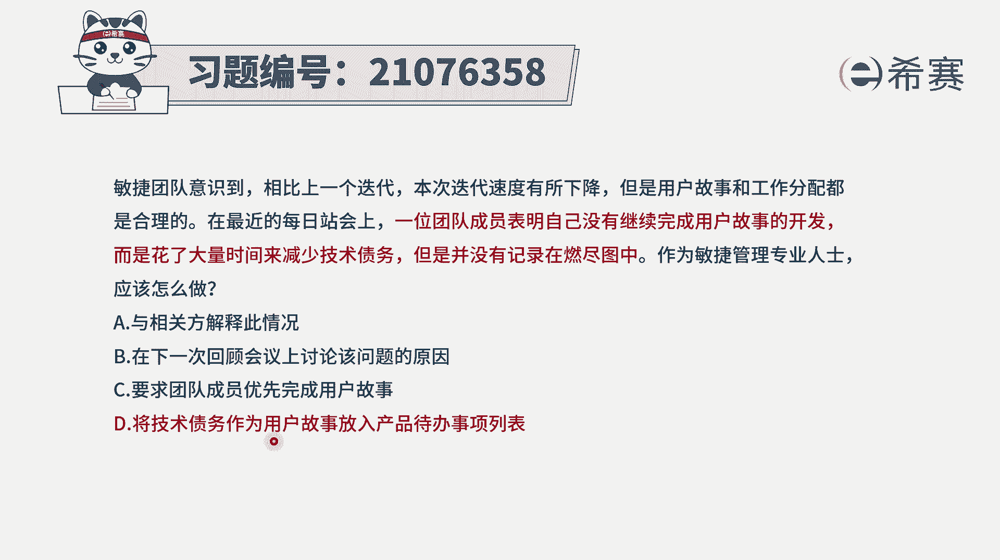

# 24年PMP敏捷-100道零基础付费pmp敏捷模拟题免费观看（答案加解析） - P8：8 - 冬x溪 - BV1Zo4y1G7UP

敏捷团队意识到，相比上一个迭代，本次迭代速度有所下降，但是用户故事和工作分配呢都是合理的，在最近的每日宴会上，一位团队成员表明，自己没有继续去完成用户故事的开发，而是花大量的时间来减少技术债务。

但是并没有记录在燃尽途中，作为敏捷管理专业人士，你应该怎么做，而这里面会介绍几个信息啊，首先一个叫什么叫技术债务，我们知道债务是什么，就是有人欠了另外一个人的东西，那就是负债对吧。

那技术债务呢就是在技术的维度上，有一些东西没有被解决，其实应该要解决，但是没有解决，那这一部分呢，我们就可以把它简单理解叫技术债务，而这部分东西要不要做，肯定是需要去做的，然后还有呢就是在敏捷中。

我们每一天都开，我们会把这些用户故事拆分到比较小的，这些任务，为什么要这样去拆分，他就是为了避免说如果一个用户故事比较大，那每一天都说啊进行中进行中进行中，假如说要做五天才完成。

那前面四天每一天都是进行中，这种感觉其实会非常沮丧，他不能够有效的去激励团队成员，所以才会把它呃采集的比较小，如果说团队他每一天做的事情，都不能够从这个看板上，从这个迭代燃尽图燃起图上面展现出来呃。

其实是不利于去激发团队的热情，有了这样一些信息以后呢，我们大概知道，我们来看一下四个选项，选项a与相关方来解释这样一个情况，那这个时候他还犯不着吧，通常情况就是你团队内部的事情。

你团队内部需要去做什么样的一些事，一些事情你要做到什么样一个程度，然后是应该是自组织，然后选项b在下一次的回顾会议上，来讨论该问题，那这里面已经告诉你，在某一次迭代上，就已经是把这个问题给暴露出来。

暴露出来以后，其实最好的方式就是再单独开一个会议，就来讨论这个事情，就这个事情要去讨论会更好一点，因为你等到回顾会议的时候呢就太久了，选项c要求团队成员优先完成用户故事，那这里有一个问题。

就是技术债务本身也是很重要，如果他没有完成的话呢，对后续做这一个迭代，整个其实会有问题的，所以也不能说是只完成那个用户故事，而不去做这个技术债务肯定也是要做的，那最后一个选项，将技术债务作为用户故事。

放入到产品待办事项列表中来，也就是说我们要去解决的事情，也作为一个用户故事展现出来，这样的话我们我们每一天都能够跟进，在这一部分都做了哪些，也就是我刚刚讲过的，就是把东西都能够可视化的方式。

能够让大家看到自己的成果，这样的话有效的去激励团队，所以事实上这个题目的答案呢就是选最后一个，至于说能否把一些新的东西插入到产品。

待办事项列表中，我们给大家看一张图，其实一般来讲啊，产品待办事项列表，它是对于这样一些用户故事的一个集中，这里面呢既可以插入新的用户故事进来，也可以删掉一些不要脸的用户故事，就置换掉一些不要的用户故事。

同时也可以对用户故事进行排序，因为有可能之前的一个优先级排序，后来发现了一些改变以后呢，可以调整，同时也可以把那些用户故事来去做细分，分得更细，所以在这里其实可以去插入新的东西。

到这个产品待办事项列表中来，也就是我们经常所谓的叫拥抱变化，如果客户提了一些新的需求，我们可以通过这个拥抱变化的方式，把这个新的需求，然后做一个新的用户故事，然后插入到产品待办事项列表当中来。

这个是可行的，所以基于以上的这样一个说法呢，这个题目答案呢是d选项，就是我们要去将这个技术债务，也作为一个用户故事，它可以展现出来，能够让大家可以看见我们每一天的这样一个，劳动成果解析。

