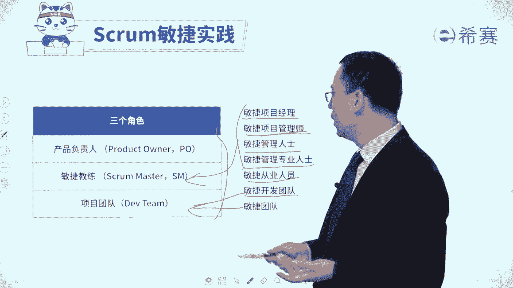

# 24年PMP敏捷-零基础pmp项目管理敏捷部分精讲视频，免费观看！ - P41：35产品负责人-上 - 冬x溪 - BV1Kg4y1c79a

大家好，接下来我们一起来分享的是敏捷scron，实践中的三个角色。

那这三个角色呢都很重要，考试也考的比较多，所以我们三个就是会分开来讲，首先看到的是第一个角色叫产品负责人。

叫product owner，当然第二个角色叫敏捷教练scremaster，第三个角色是项目的开发团队，或者敏捷开发团队，有的时候呢可能会叫strong team。

有的时候可能会叫development team啊，都说的是这个开发团队啊，那其实我们在整个考试过中。

你可能会遇到一些陌生的名词，比方说可能叫敏捷项目经理啊，敏捷项目管理专业专业人士啊，敏捷项目管理师啊，敏捷管理专家呀，敏捷项目管理人士啊，呃等等，这些东西，你都可以把它理解为到这样一个敏捷教练。

还有敏捷的从业人员呢。

那就是这些都是敏捷的开发团队呀，是这个敏捷团队呢。

有的时候你可以把它理解为说是这个development team，有的时候米集团内如果往大了说。

有的时候也会把它包含在这个，所以你要看他的这个意图里面。

是把这些个p o包含进来，还是呃和敏捷教练包含进来，还是不包含进来。

但一般情形下，我们其实不把它包含进来，因为产品负责人，他不只是在做这个项目上的事情。

他更多的是去提一些需求呀，然后定一些这种完整定义呀，以及包括说去做验收啊，做这些事情为主，但他可以还做别的一些事情。

那敏捷教练呢更多是去给团队敏捷做一些支撑。

而具体开发工作室团队自己来完成好，我们一起来看一下啊，首先看到第一个角色叫产品负责人。

product owner，这个角色，有的时候呢考试也经常会把它缩写成p o。

那产品负责人这个角色呀，他有几个重要的事情，这里面给大家提供了三个关键词，一个关键词叫代言人，他是谁的代言人呢，他是客户的代言人，他不是客户，他是你们自己团队内部的，但它是能够代表客户的。

客户说哪些需求要加进来，他加进来，客户说有哪些需求更重要，他就把他的优先级抬高，客户觉得说那个什么样的才才算是验收通过，那么他就是对应的桌，那个什么叫验收通过，所以他是一个客户的代言人。

他能够去替客户说话的，当然了，如果说客户自己本身在，那么就是啊他就可以直接让客户来说话，如果客户不在，他就去代表客户，这是第一个，第二个词呢叫掌舵者，掌舵者，也就是我们整个这一个敏捷团队要做什么东西。

或者说是这一轮迭代我们要做什么东西，都是由他来说了算，第三个呢叫验收者，就是这一轮迭代做完的结果，到底是验收通过还是不通过呢，也是由他来说了算，我们来看一下仔细的内容啊，首先第一条产品负责人po。

他要去负责指导产品的开发方向，也就是接下来重点是什么，其次才是什么，然后再是什么，那么这个整体的这个思路，方向节奏由谁来去把控呢，由po来去把控，第二个，那产品负责呢，它是根据商业价值来对任务进行排序。

什么叫对任务进行排序呢，我们开始简单过了一眼对吧，所以有一个词叫那个product backlog，叫产品的代办事项列表，那那个产品待办事项列表，你可以把它简单理解为是一个需求池。

需求池里面有那么多需求，到底哪些重要，哪些不重要，谁来确定呢，由po来定，他怎么定的呢，它根据这些东西的商业价值来定，哪些东西及其有价值优先放在前面一些，然后再后这样的一种方式来去放产品负责人。

他会跟团队来去开展一些日常的合作，提供一些产品反馈，包括说日常的时候可以给反馈，以及在验收的时候可以给予反馈，为开发东西设定方向，以及为开发下一个功能来设定方向，也就是说本轮迭代要做什么东西，他说了算。

我们在这一轮迭代快要结束的时候说啊，下一轮我们重点要做什么东西，也是由他来提出，他是代表客户的好，第三个就是产品负责人，他可以会会跟各路神仙来合作，来去定义产品开发的方向，所以其实有些时候呢。

并不是说他自己他说什么就是什么，他也会需要去借助一些外力，他能够去跟客户啊，跟相关方呢以及跟团队一起来讨论交流，来去确定这个方向，而整个在敏捷过程中，他们讨论了以后，确定要做什么事情以后呢。

他会负责来去创建待办列表，ok创建整个产品待办事项列表，以及迭代代办列表这些东西，当然他不是自己一个人做，他一般来讲是跟团队一起来做，就跟团队来去共同创建这样一个代办列表。

那代办列表中就列出了我们要做什么东西，不做什么东西，累积放在前面，累计放到后面，就是按照价值来排序，怎么样做才能够交付更多的价值，并且呢它还会列出来这些个要做的东西，也就是我们所谓的这样一个需求。

需要指令的这样一些需求，这些用户故事他怎么样做才能够达到标准呢，这个标准也是由他和团队一起来共同定义，所以是他来负责确定产品的功能和要求，它的最标准，还有就是什么东西要加进来，什么东西应该要减出去。

什么东西要优先往前面排，什么东西要往后面乘，这东西也是由他说的算，所以他po他来去维护这个产品待办列表，他的话语权比较重，它来去指定一下我们要做的东西，要交付的内容。

以及他能去接受这个结果或者拒绝这个结果，所以就是验收，所以你会发现他是能够去代表客户来去确定，哪些东西要做，哪些东西不做，他能够去对整个内容来去进行把关，本轮以及下一轮，他是作为一个掌舵者。

以及他就是要对结果来进行验收。