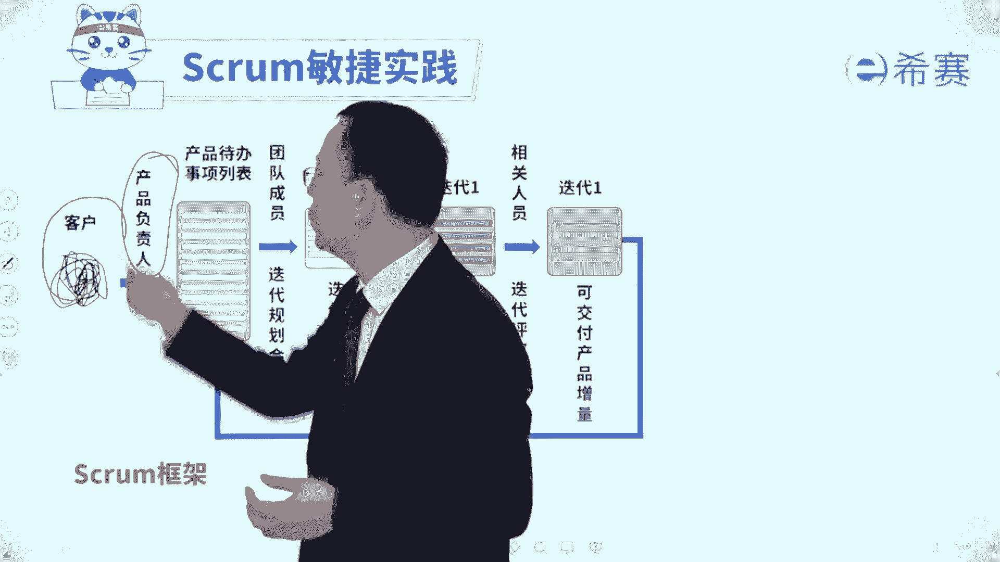
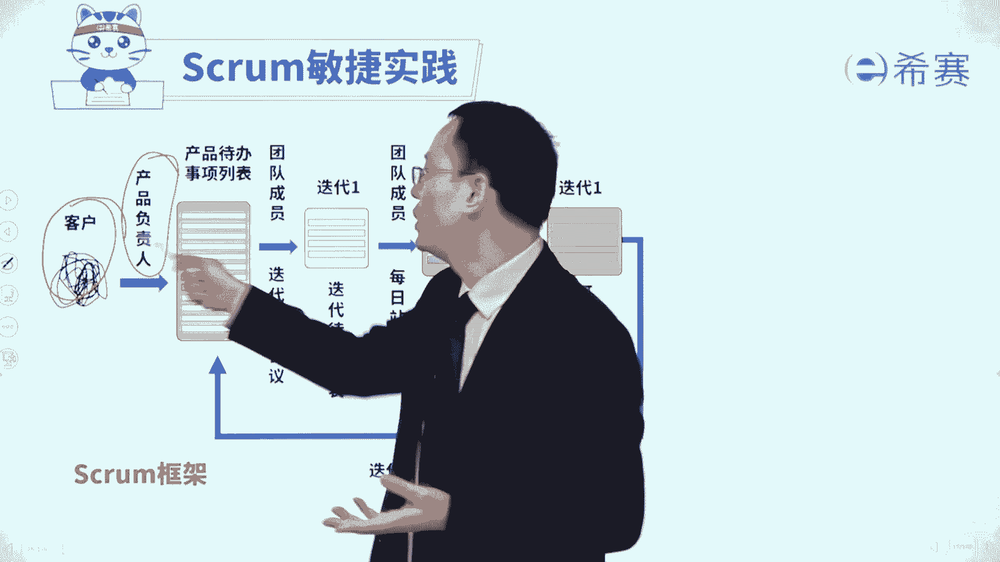
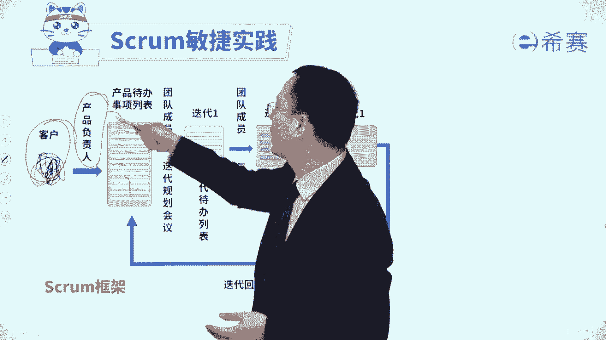
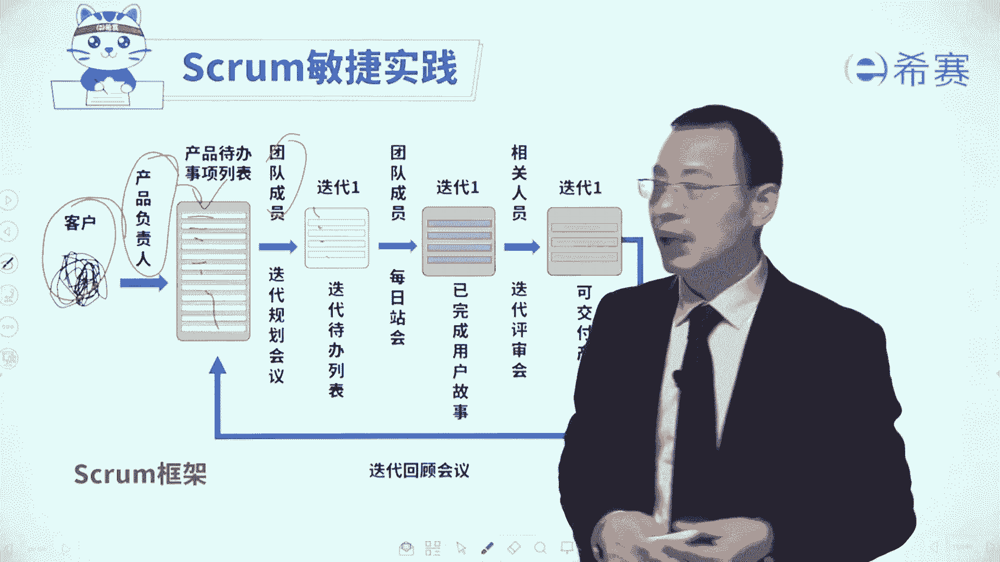
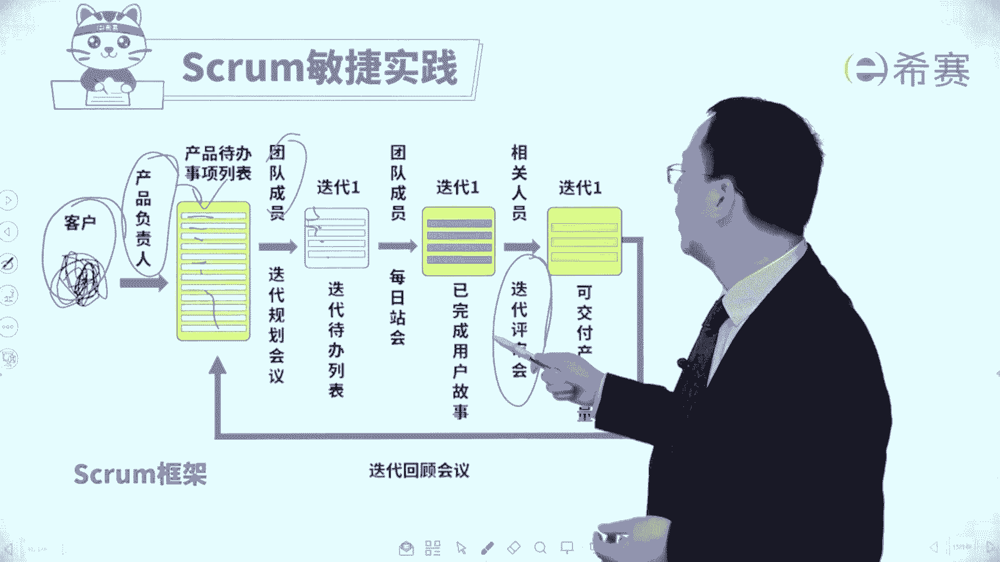
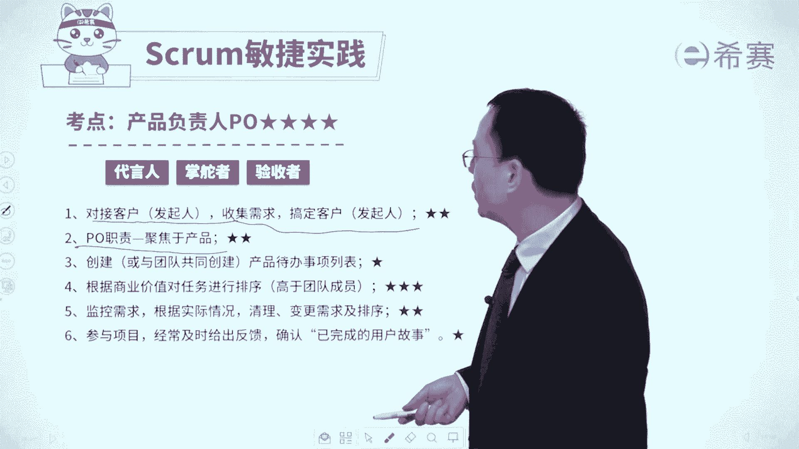

# 24年PMP敏捷-零基础pmp项目管理敏捷部分精讲视频，免费观看！ - P42：36产品负责人-下 - 冬x溪 - BV1Kg4y1c79a

那么什么样的人才能够去做这个po啊，我们来去简单认识一下，一般来讲它的要求是，首先他应该是要具备相关的这些工作背景，他能够去懂得这些专业知识，行业知识，这是基础，其次呢它应该是能够比较强。

对很多东西有一些商业的嗅觉，商业的敏捷就是不仅仅只是说要去做哪些事情，他还知道哪些事情更重要，而价值更大，这样的话他才能够去充当这个事情，当然了，有的时候呢他并不是所有的东西都亲力亲为。

他也可以去借助别人的帮助，比方说他可以去找一些专业的架构师啊，呃找一些专业的这些产品经理啊，或者是找一些专门的这样一些专家来去支撑啊，都是可以的，那你可以看到他来去对接客户。

来去获取客户的需求，同时他要做客户的代言人，说哪些东西放在这里。

那些人放这里这里这里这里啊按顺序来排，它来去负责去创建这个产品待办事项列表。

以及跟团队成员一起来去创建这个迭代列表，来去定向哪哪些要做。

还有就是这些要做的东西，它的那个验收的标准准则是什么，也是由他来说得上，最后我们再做一个迭代评审会议的时候。

团队完成的东西累一些，可以通过验收来一些不行，也是由他来去负责来说了算，那对于考试呢有这样一些点你需要了解一下，首先第一个他要去对接发起人来去收集需求，搞定发起人，那如果说是在题干中会涉及到有客户发钱。

提了一些新的需求功能等等，由谁来对接呢，应该是由产品负责po，他来负责进行对接好，第二个呢他的职责应该是聚焦于产品本身，如果说他的职责是说啊，这个功能该怎么做呀，就是那种细节具体的。

那么这个其实是有问题的，因为永远都要有人对整体内容来进行把关，有人负责去做一些微观的具体的细节的事情，而po他就是那个对整个大内容来进行把关的，所以它是对整个东西来进行掌握。

而不要去聚焦于某一个细节的内容，那但凡是涉及到说，他没有关注在那个产品本身上面，而是在关注一些其他的事情上面的时候呢，那敏捷教练就需要去给他做一个题型，然后把它给掰正回来，是这样的一个逻辑好。

如还有就是他要去创建产品待办事项列表。

它可以是自己来创建，也可是借助团队的力量跟团队一起来共同创建，这是他要做的事情，并且他对于产品待办事项列表中的这些个内容，会来进行排序，他排序的资格比谁都大，他那个排序的资格是最大的。

高于团队成员以及高于一些主题专家，当然它是基于什么排序的呢，它是基于商业价值来对这些任务，对这些用户故事，对这些需求进行排序的，所以如果说题干涉及到关于对于需求的优先级，排序要高低呀，谁来做呢。

由po来去负责好，还有就是他会去根据一些具体的情况说，要去加薪的需求进来捋清楚一些需求，对需要进行变更进行排序，这都是由po来说了算啊，最后还有一条就是他要去参与到整个项目，以及对于已经完成这个部分。

是由他来进行确认的，是由p o来进行确认，所以谁才有资格说这个东西是做好呢，做完成的呢，p o啊，由产品复制成product owner这个角色，他才有资格，所以如果题干中有出现说啊。

谁说是那个什么标准不合格呀，不接受呀，啊验收有问题呀什么之类的，那么理论上来讲，应该是po和团队一起来去定制一个完成的定义，叫definition of dd o d，并且呢最后的验收是谁来负责验收呢。

如果说客户在当客户验收，如果客户不在，就是由po来去负责验收啊，所以整个关于产品负责人product owner这个角色，他有三个关键词，你记住了吗，一个是代言人，他是客户的代言人。

他来去收集客户的需求，对接客户，然后去把那些客户的东西放进来啊，第二个呢他是掌舵者，他来确定要做什么东西，整个产品待办事项列表中有什么东西，按照什么优先级来进行排序，这一轮迭代我们要做什么。

下一轮迭代又要做什么，是掌舵者，第三个，他是一个验收者，这是对于最后做完的结果来进行验收，是谁说了算呢，如果有客户在，就客户说了算，如果客户不在呢，那就由po来说来算好，我们看了这么多以后。

接下来我们来去做一些关于po的题目，通过题目来去帮你巩固一下。