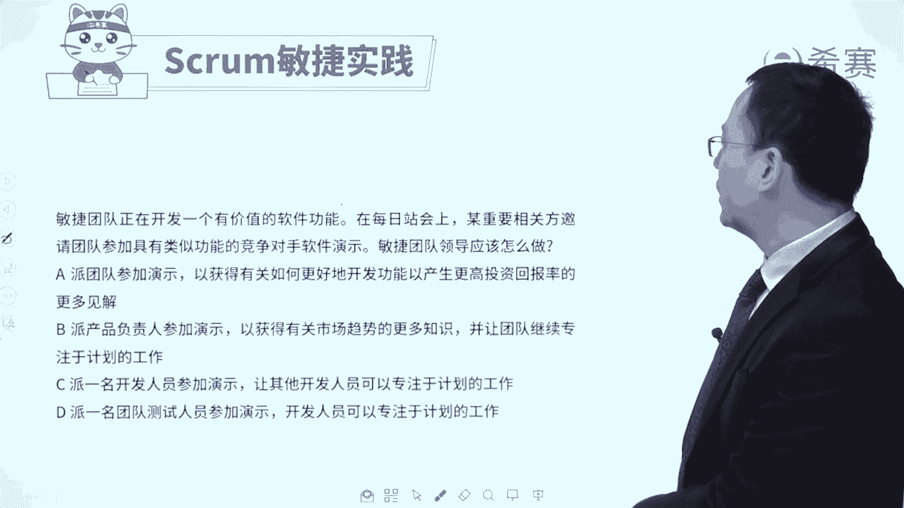

# 24年PMP敏捷-零基础pmp项目管理敏捷部分精讲视频，免费观看！ - P43：37产品负责人习题讲解 - 冬x溪 - BV1Kg4y1c79a

大家好，我们在前面已经是看过了关于产品负责人po，他的这些个知识点内容，接下来我们会通过几道题目来去帮大家去巩固，这样一个知识点内容，看他考试可能会怎么考，那通过这一题来去反向支撑。

让我们对于po有更深的认知，我们先来看到有这样一道题，那敏捷团队呢正在开发一个有价值的软件功能。

其重要相关方邀请团队参加具有某类似功能的，竞争对手软件的演示，敏捷团的领导应该怎么做，请注意，竞争对手有一些软件我们为什么要去参加呀，我们去参加他这个演示，其实是想要去了解一下，竞争对手的这样一些情况。

从而能够去对这个我们后续的一些事情，来进行把关，决定要加什么内容进来减掉什么东西，或者说是就是做一个竞品分析对吧，那么这个事情通常是谁来做的，尚为主呢，我们来看一下四个选项，选项a派团队参加演示而来。

获取有关如何更好的开发功能，以及产生这些高的投资回报率的，这样一些个更多的见解，这个呢你觉得可不可行，其实也不是说不可行，但是我们在敏捷中会有一个词叫专注，等会后面会看到啊。

就是整个在敏捷的33355中会看到专注，其实尽量是让团队呢能够专注在手头的事情上，减少一些被其他事情的干扰，是这样一个调性，所以如果有更好的选项，就选更好的，没有更好的可以选它好。

第二个派产品负责人来参加演示，以获得有关市场的趋势的更多的知识，而让团队呢技术专注于计划的工作哇，这个简直就是为答案而生对吧，由你来去做这个事情。

你来去了解这些趋势情况，你来去定一下，我们现在要做什么东西，下一步可能要加什么东西进来，那来团队呢，团队开始专注着做自己手头上的工作，所以呢他肯定是比a更好，所以这个时候a就不选了。

c选项，派一名开发人员来去参加演示，让其他的开发人员可以专注的做计划的工作，而这种方式呢可不可行，也不是不可行，但是你要知道，通常情形下，我们说谁的，这样一个对东西的感知能力会更强呢。

一般情况下一定是一个某个领导角色，因为他见多识广嘛，所以他这个位置的人，比起这个位置的人可能会更合适一些。

它能够对于东西的把控感会更强一些，要不然他就不会成为一个领导呀，他也不会成为一个产品负责人呢，对不对，所以他很显然不如b选项，最后一个派一名团队测试员，这就更加不用说了。

你因为我们很多时候去了解竞争对手。

其实就是对未来进行一些把关，所以呢这个题目的答案呢是选第二个，就是让团队的这个产品负责人，来去对竞争对手的产品有所了解，从而能够去确定未来的趋势可能是什么，而让团队成员可以专注在自己手头上的事情。

那么这个要点是什么呢，就是由产品负责，你来负责去对接客户，你来去了解一下外部的一些需求呀，趋势啊什么之类的，包括说啊一些客户搞定客户的事情，也应该是由你来去负责来去完成好，我们再来看一道题目呃。

自项目开始以来，产品负责人在规划期间，不断地询问每一次产品迭代的预算，产品负责人似乎对于成本更感兴趣，他对成本感兴趣，而不是产品本身，那么这说明他的关注焦点其实有一点点偏差，对吧。

那么项目经理呢应该更早地做些什么，来改变产品负责人的这样一个行为，其实也就是说，他目前所做的这个方式不是那么好，如果有更好的方式让他关注他自己，焦点上就更好了，来看一下四个选项，选项a。

与产品负责人一起，来明确他们在敏捷项目中的角色，以及敏捷规划的范围，就说你该要知道你自己的角色是什么，你要定义清楚你的角色是关注于产品本身，关注于这个产品的功能啊，性能啊，这些东西为主诶。

这个就是合适的对，这就是合适的好，第二个进一个沟通管理计划报告，每一次迭代中花了多少多少东西，那这就是完全去满足他的这个需求，但是却并没有把这个焦点拉回来，第三个选项，制定一个固定价格的合同。

将产品所有者的注意力转移到价值，而不是金钱上，可是我们知道说在整个敏捷中，它其实不会用固定价格合同，我们在如果说你之前有学过偏僻课程的话呢，你知道就是一般只有在范围比较确定的情况下。

我们才会签订一个固定价格合同，或者固定总价合同，而在敏捷中更多的是这种框架合同，或者是他会是以工作量的方式来去定的，而不会是以这样一个呃呃结果来决定，因为范围本身一直会发生变化。

所以本身这一套它就不适合这种敏捷的方式，就是错误的好，最后一个采用不同的估算方法，来去确定每一个产品的这个增量所花费的成本，它的教育还是会关注你关注成本，我就关注成本，不是的啊。

而这个po你应该要关注的是产品本身，所以你要了解po的职责是聚焦于产品本身，产品具有什么功能，什么性能以及能够创造什么价值，提供什么价值，这才是你po需要去关心的，所以答案是选a选项。

跟产品负责人一起来去明确，他在整个敏捷项目中的角色，ok我们再来看一道题目，产品负责人认为，某一个用户故事对于迭代呢至关重要。

但是一名团队的主题专家，他却不这么同意，而这样的话导致他们就有冲突，而这个冲突呢会影响到团队的士气，那么这个时候敏捷教练该怎么做，当然我们稍微提前先认识一下啊，敏捷教练呢他就是能够去给团队去提供支持。

以及帮团队能够去清除障碍，但遇到某些挑战和问题的时候呢，他能够去引导大家去解决一些问题，应该是这么一个角色啊，好有了这个前提条件以后，我们再来看这个点选项。

一在回顾会议中来陈述这样一个问题，要求团队来确定这个东西是不是加还是减，就说某一个需求，某一个用户故事是刘进留下来还是不要了，有谁来定呢，由团队定，真的有他定吗，没有资格啊。

好第二个选项询问那个产品负责人的意见，但解释说该主题专家会做出最终决定，那主题专家对于要还是不要。

他有更大的话语权对吗，不对啊，第三个与该主题专家和产品负责呢去单独开会，一减轻分析你为什么要单独开会，你就不能够把它们放到一起来去开这个会议吗，好最后一个询问该主题专家的意见，但解释说，产品负责人。

他负责定义产品待办事项列表的优先级，所以是谁的话语权比较大，产品负责人的话语权比较大，而这个呢事实上就是他的这个角色所赋予他的，这样一些权利，而答案就是这一个不是由团队来去定，也不是由主题专家来定。

而是由产品负责人你来去定，ok所以是产品负责，他根据商业价值来对任务进行排序，它这个排序的权限是高于团队成员。

