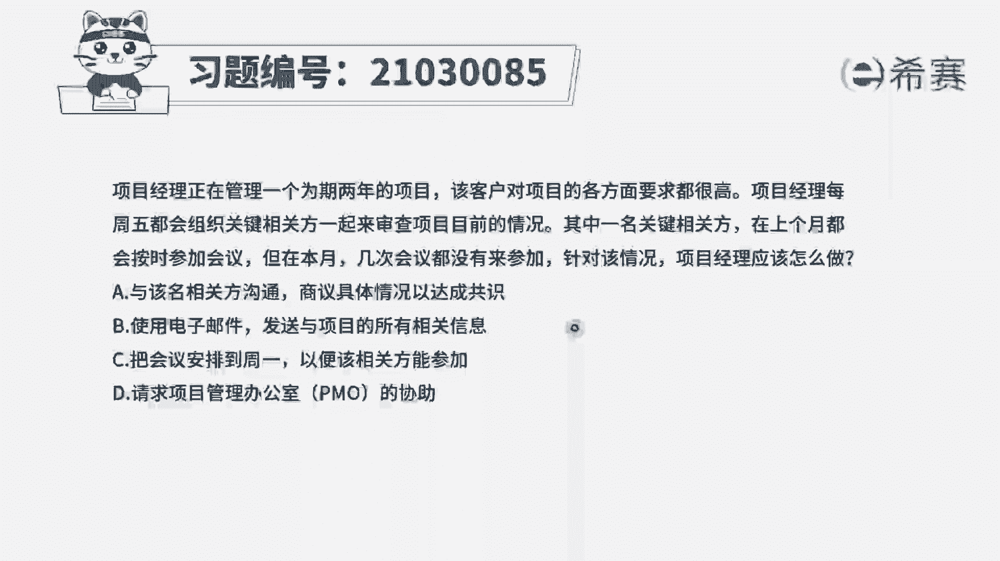
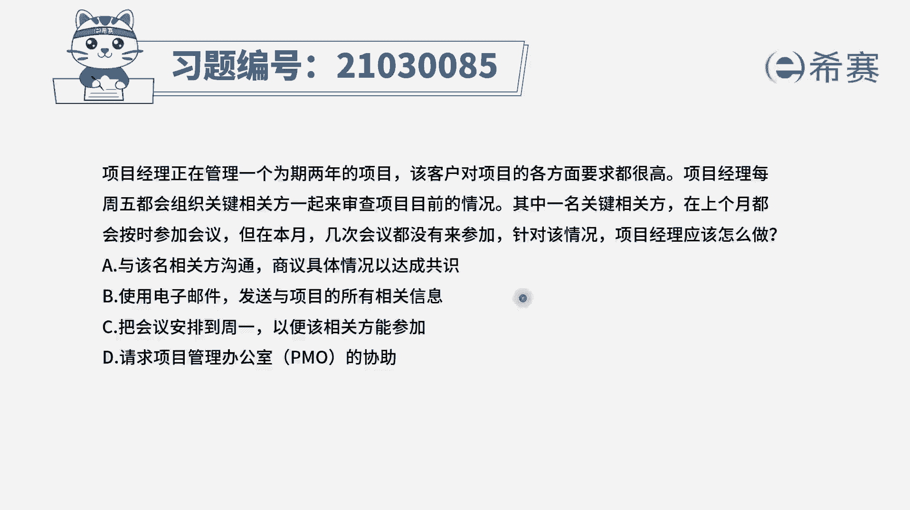
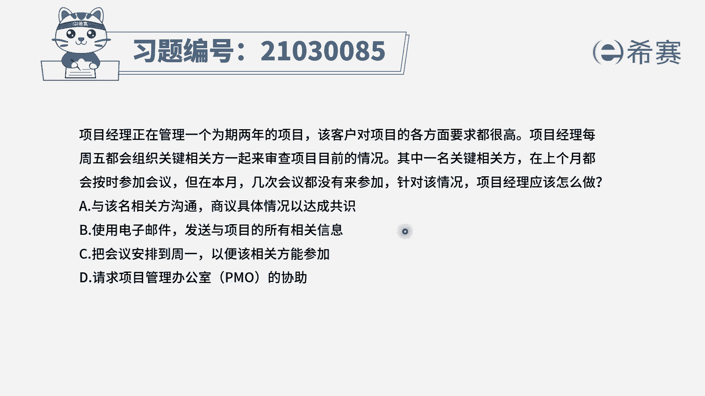
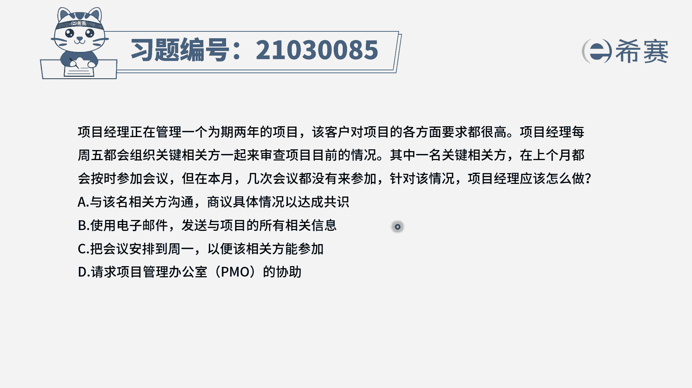
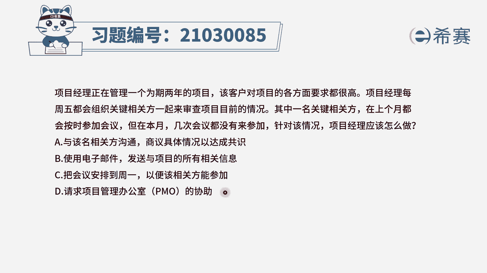
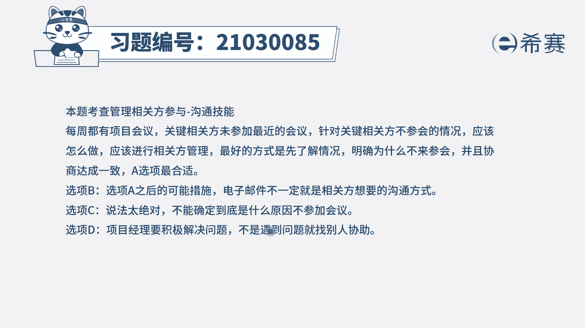
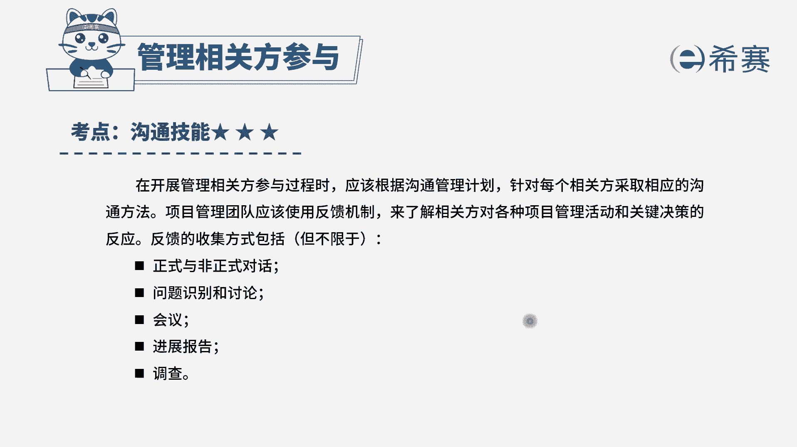

# 24年PMP模拟题-PMP付费模拟题100道免费视频新手教程-从零开始刷题 - P100：100 - 冬x溪 - BV1Fs4y137Ya

项目经理正在管理一个为期2年的项目，该客户对项目的各方面要求都很高。

项目经理每周五都会组织关键项目方。

一起来审查项目目前的情况，其中一名关键相关方在上个月都按时参加会议。

但在本月几次会议都没有来参加，针对该情况，项目经理应该怎么做，选项a与该名相关方沟通，商议具体情况已达成共识，选项b，使用电子邮件发送与项目有关的所有信息，选项c把会议安排到周一一遍，该相关方能参加。

选项d请求项目管理办公室天猫的协助好，我们先来找一下题干的关键词，是不是原计划每周五都会开展一个会议，而一名关键相关方之前都按时参会，但是在这个月几次会议都没有来参加，为什么没有来参加呢。

相关方参会情况出现异常，我们首先最好是跟他去沟通，详细的了解他的情况，先要明确他为什么不参会，然后再针对性的进行一个解决，看一下选项a选项与该名相关方沟通，商议具体情况已达成共识。

这是不是就是我们刚刚说的出现问题，先沟通，然后再解决，因此a选项是正确的，再来看其他选项，b选项是使用电子邮件，发送与项目的有关的所有信息，b选项它是a之后可能采取的措施。

我们首先还是要了解交官方的具体情况，如果是这个相关方，他要改变信息传递的形式，要使用电子邮件，那么才可能会有b选项这个动作，要不然的话不能因为他一个人不参会，我们就直接改变这个沟通方式，看一下c选项。

把会议安排到周一一遍，该相关方能参加这个信息，是不是没有在题干中体现啊，我们不知道是不是因为他时间冲突，所以不再会，首先还是得先跟他沟通，所以c选项也是h后可能的一个做法。

最后d选项请求项目管理办公室pmo的协助，这个选项肯定不是优先选，项目经理要积极主动地解决问题，项目管理办公室偏猫一般是提供一些培训模板，一些组织过程资产不会帮你来解决具体的问题。

所以四个选项中正确答案为a选项。

大家可以看一下文字解析。

