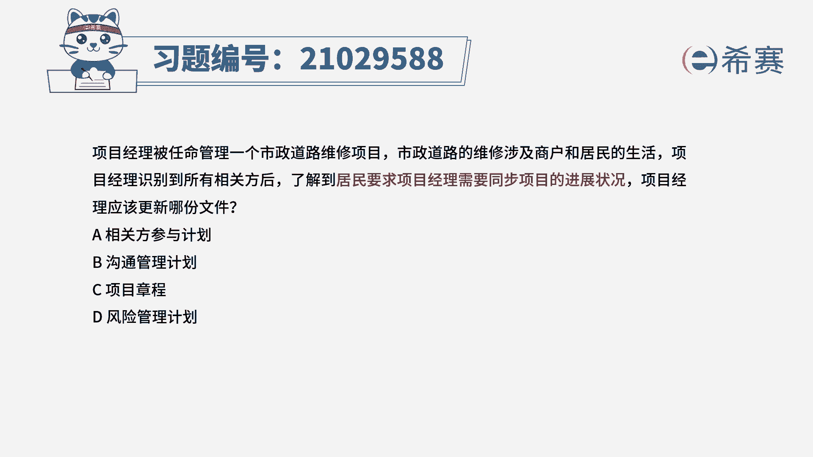
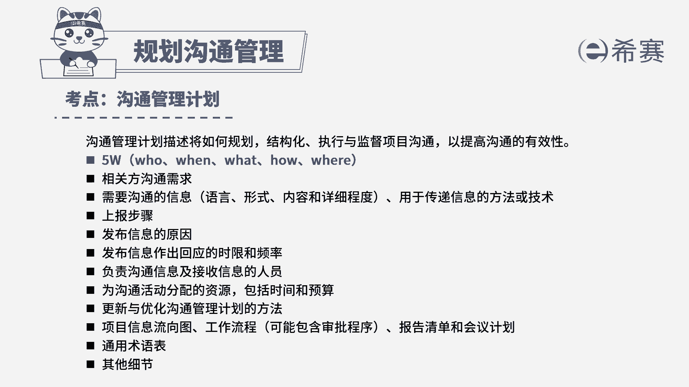

# 24年PMP模拟题-PMP付费模拟题100道免费视频新手教程-从零开始刷题 - P10：10 - 冬x溪 - BV1Fs4y137Ya

项目经理被任命管理一个市政道路维修项目，市政道路的维修涉及商户和居民的生活，项目经理识别到所有相关方后，了解到，居民要求项目经理需要同步项目的进展状况，项目经理应该更新哪份文件，a相关方参与计划。

b沟通管理计划c项目章程d风险管理计划，读完题目，我们可以找到题干中的关键句，居民要求项目经理需要同步项目的进展状况，所以居民是道路维修的相关方，并且要求及时更新项目的进展。

也就是说相关方想要同步项目的信息，这就是属于相关方的沟通需求，自然就要更新到沟通管理计划中，所以b选项正确，我们再看其他选项，我们先看a选项，a选项说的是相关方参与计划。

相关方参与计划是运用相关方管理的策略，去指导管理相关方参与的，但是这里并不是相关方参与度的问题，所以a不选，我们再看c选项，c选项说的是项目章程，但是项目章程中都是包含的高层级内容。

不会记录相关方详细的沟通需求，所以c也不选，最后我们看d选项，d选项说的是风险管理计划，风险管理计划是指导管理风险的指南性文件，这里沟通需求跟风险没有直接关系，所以d也不选。

因此我们本题最佳的答案就是b选项。

本题考察的内容是项目沟通管理中规划。

