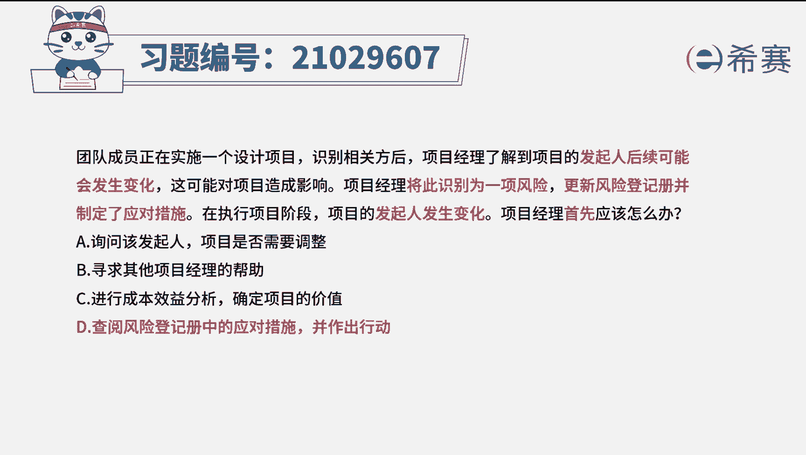
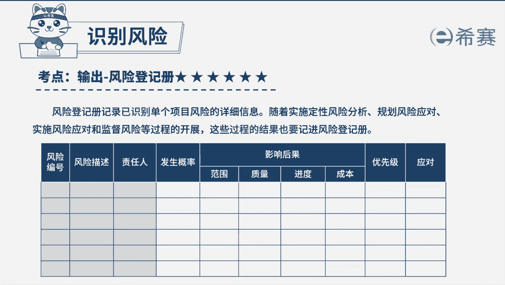

# 24年PMP模拟题-PMP付费模拟题100道免费视频新手教程-从零开始刷题 - P12：12 - 冬x溪 - BV1Fs4y137Ya

团队成员正在实施一个设计项目，识别相关方后，项目经理了解到，项目的发起人后续可能会发生变化，这可能会对项目造成影响，项目经理将其识别为以下风险定性风险登记册，并制定了应对措施，在执行项目阶段。

项目的发起人发生变化，项目经理首先应该怎么做，a询问该发起人项目是否需要调整，b寻求其他项目经理的帮助，确定项目的价值，d查阅风险登记册中的应对措施，并作出行动，好读完题目，我们先来看一下问题。

项目经理首先应该怎么办好，再回到题干中，可以看到一些关键词项目的发起人，后续可能会发生变化，已经被识别成为一项风险，更新了风险登记册，并制定了应对措施啊，然后现在发起人发生了变化，说明此风险已经发生。

对于以识别的风险发生，我们需要实施风险应对，首先应该去审查风险登记册，根据之前制定的应对措施来应对风险，所以这道题的最佳选项就应该是d选项好，那我们也来看看其他选项选项a，这可能是一项应对的措施。

但是需要先审查登记册后，才知道有没有这个措施，唉我们再去做，要注意题干问的是首先也就是第一步需要干嘛，所以选项a还不合适，选项b寻求其他项目经理的帮助，诶，过于消极了，不能体现我们作为项目经理的重要性。

如果遇到问题就去找别人帮忙，那老板为什么不直接请那个人呢，好选项c这个跟选项a一样，是属于先审查登记册后可能会做的一些措施，而不是首先要做的好，这道题我们就先讲解到这里。

大家可以自行参考一下相关的文字解析，整个题目讲解下来，我们可以知道本题考察的知识点，就是以识别的危险发生时。

