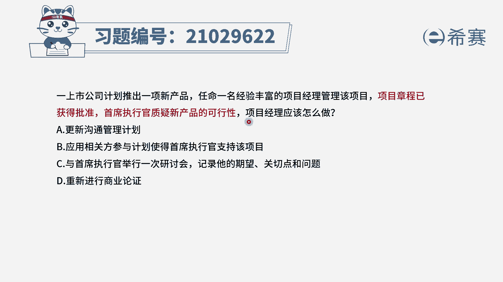
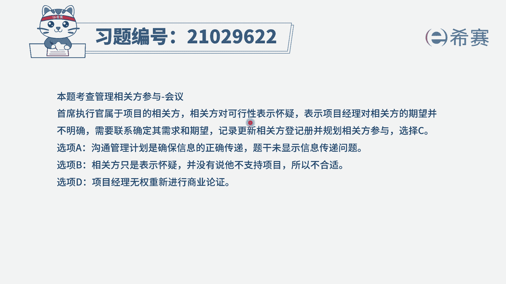
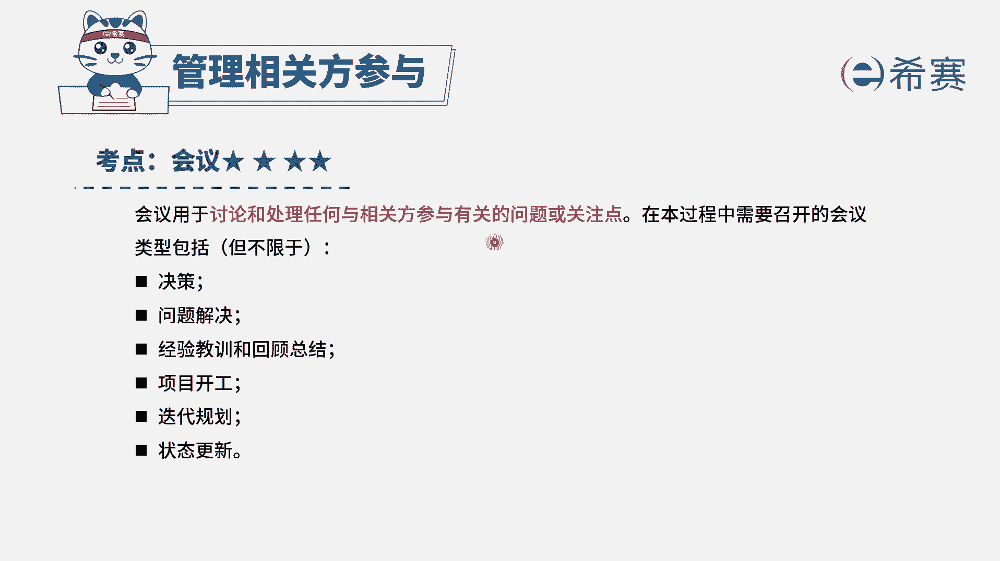

# 24年PMP模拟题-PMP付费模拟题100道免费视频新手教程-从零开始刷题 - P13：13 - 冬x溪 - BV1Fs4y137Ya

以上市公司计划推出一项新产品，任命一名经验丰富的项目经理管理该项目，项目章程已获得批准，首席执行官质疑新产品的可行性，项目经理应该怎么做，选项a更新沟通管理计划，选项b应用相关方参与计划。

使得首席执行官支持该项目，选项c与首席执行官举行一次研讨会，记录他的期望关切点和问题，选项d重新进行商业论证，好我们先来看现在的时间节点，是不是项目章程刚刚获得批准。

这个时候首席执行官执行新产品的一个可行性，这种情况下，我们首先要做什么呢，我们看一下选项可以优先排除掉d选项，a选项更新沟通管理计划，沟通管理计划强调的是信息的传递，在这个题干中是没有相关依据的。

是个干扰选项，而d选项大家看到可行性，可能会联想到商业论证，如果这个题目是把商业论证给这个首席观看，那么我们可能还能考虑这个选项，但是d选项说的是重新进行商业论证，商业论证通常是发起人负责制定和维护的。

项目经理是没有权限再去改动它的，因此我们首先排除a d选项，那么在剩余的bc选项中看一下b选项，应用相关方参与计划，使得首席执行官支持该项目，这个选项看上去没有问题，但是大家要注意一下时间节点。

项目章程刚刚批准，我们才进入规划阶段，这个时候都不一定有这个相关方参与计划，因此b选项它并不一定可行，c选项与首席执行官举行一次研讨会，记录他的期望，关键点和问题是不是刚好就针对题干在解决啊。

因为首席执行官他质疑新产品的可行性，我们首先肯定要去了解他，为什么会有这样的想法，对不对，因此本题答案为c选项。

大家可以看一下文字解析。

