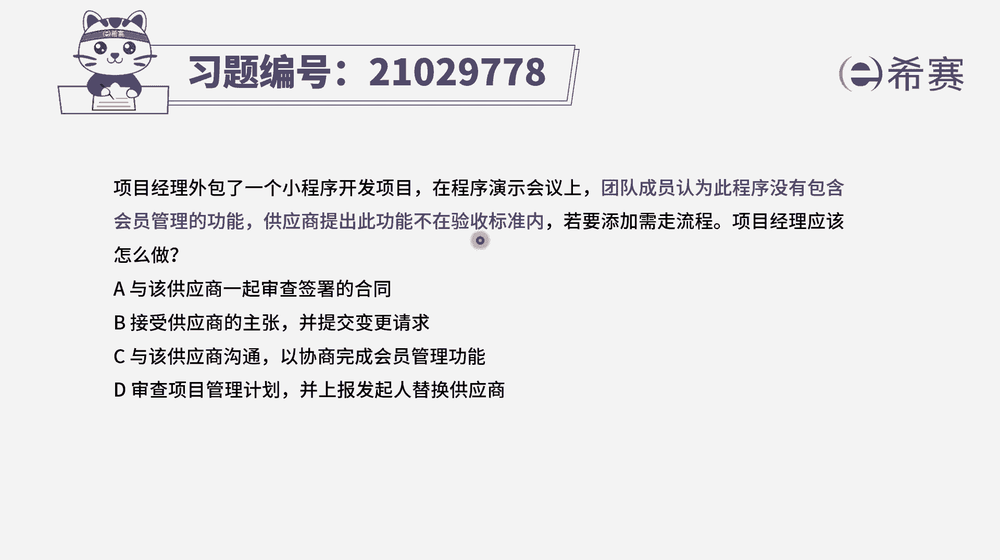
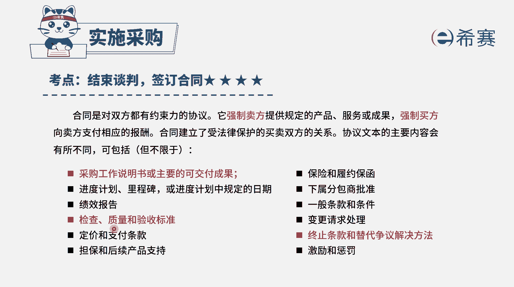
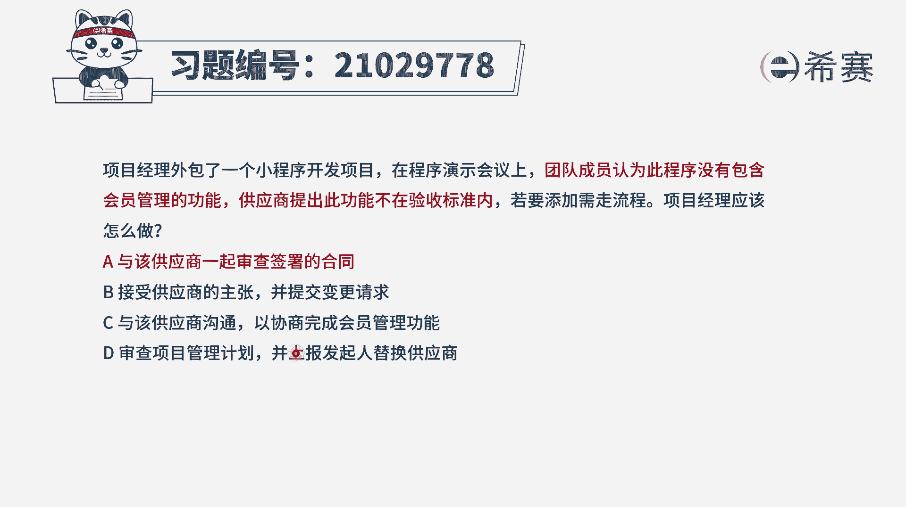
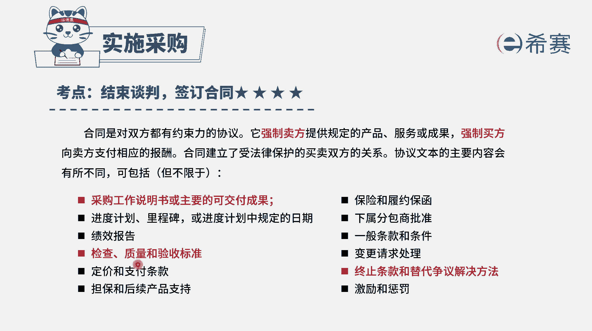
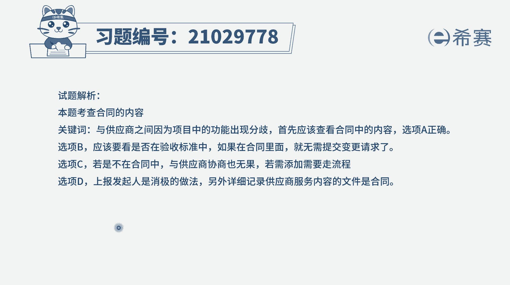

# 24年PMP模拟题-PMP付费模拟题100道免费视频新手教程-从零开始刷题 - P18：18 - 冬x溪 - BV1Fs4y137Ya

项目经理外包了一个小程序开发项目，在程序演示会议上，团队成员认为此程序没有包含会员管理的功能，供应商提出此功能不在验收标准内，若要添加，需要去走流程，那项目经理应该怎么办呢，其实这个题目呀。

它的这个特点，就是说我们觉得说应该包含什么功能，然后供应商说不包含什么功能，那到底是包含还是不包含呢。

总要有个地方可以说清楚，在哪个地方可以说清楚，在合同里面，合同它里面会明确说出我们这一次要做的事情，包含什么，主要的可交付成果，以及关于这样一些可交付成果，它的这些质量标准以及它的验收标准。

所以如果说我们觉得应该包含，然后对方觉得不应该包含，那我们就需要去审查合同，所以这个题目的话，我们来看一下四个选项有没有审查合同，选项a与该供应商一起来去审查签署的合同，这肯定就是一个正确答案了。

答案就是选a，至于其他几个选项，我们一起来看一下，选项必须说是接受供应商的主张，并提交变更请求，他这个其实有个什么前提条件，它的默认就是说供应商说的是对的，确实这个东西没有包含在这个合同类。

可事实上我们觉得应该包含，他觉得没有包含，我们还没搞清楚呢，所以就直接走流程吗，肯定是不正确的啊，选项c与该供应商进行沟通与协商，完成会员管理的功能，那这个跟他沟通来协商完成不清不楚。

如果说这个功能本来就包含了，那就是供应商它应该完成的，如果说这个功能本来本来没有包含，那如果我们需要它完成的话呢，就需要去走变更流程，所以这个不清不楚的方式肯定也是不对的，选项地审查项目管理计划。

并上报发起人，替换供应商，一般来讲大事情小事情直接就是善报发起，那个选项都是错误的啊，95%的这种善报发起的选项都是错的，除非题干中你能够明确地感知到，这个事情是项目经理完全hold不住。

搞不定的人需要发起来去除面，否则一般情况下都应该是由项目经理来去解决，这样一个事情，所以这个是错误选项，那就只有a选项了，也就是我们再来回顾一下这些考察，其实关于合同的内容啊。

如果说有人觉得合同里面应该包含什么东西，有人觉得不应该包含什么东西。

我们就可以通过看合同看得一清二楚，合同里面已经明确写出来应该包含什么，不应该包含什么，以及这些包含内容，它的验收标准，它的质量标准。

所以答案是选a选项。

